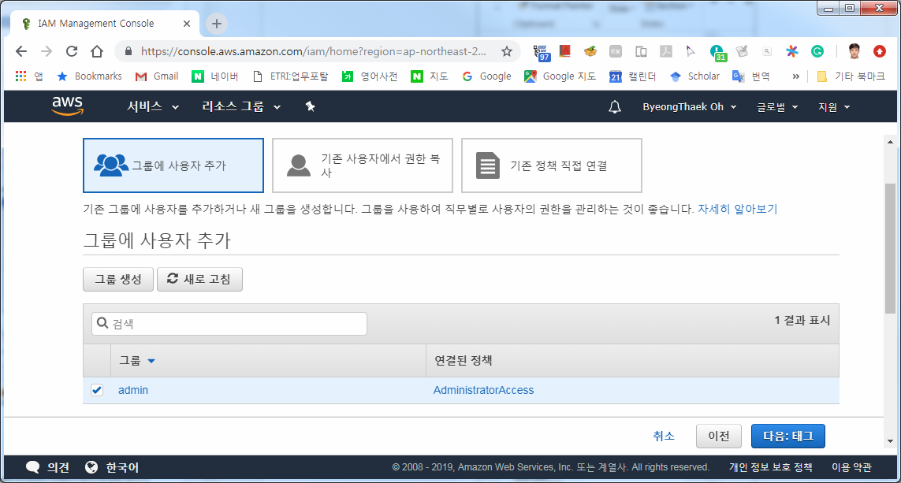
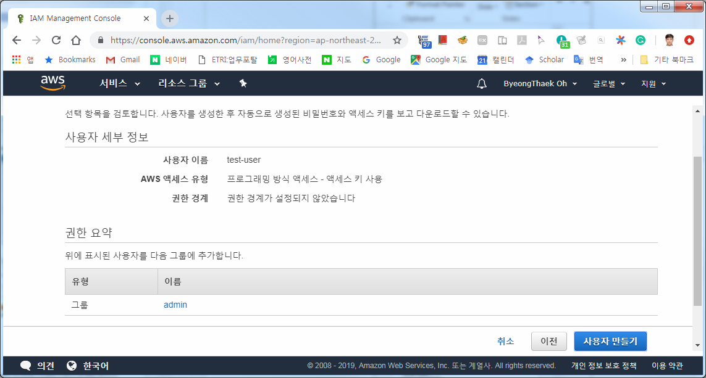
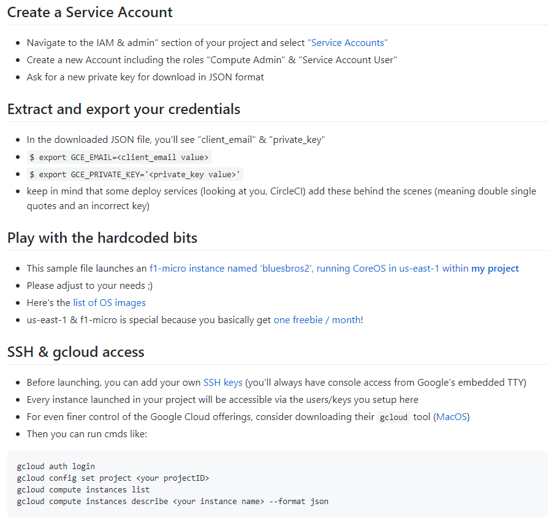
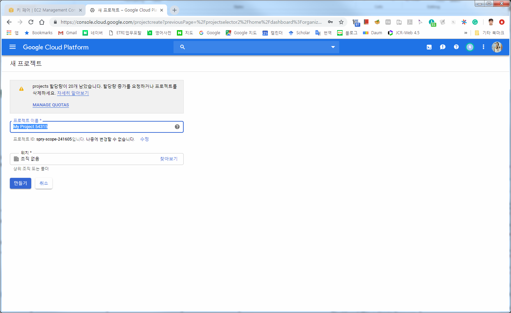

# cb-tumblebug (Multi-Cloud Infra Service Management)
Proof of Concepts for the Cloud-Barista Multi-Cloud Project.

***

## [목차]

1. [설치 개요](#설치-개요)
2. [설치 절차](#설치-절차)
3. [설치 & 실행 상세 정보](#설치--실행-상세-정보)

***

## [설치 개요]
- 설치 환경: Ubuntu 18.04

## [설치 절차]

- Go 설치 & Git 설치
- 환경 변수 설정
- MCISM 소스 다운로드 (Git clone MCISM)
- 의존 라이브러리 다운로드
  - Cloud-Barista alliance 설치(cb-store)
  - 클라우드 Go 클라이언트 라이브러리
  - 기타 라이브러리
- 클라우드 인증 키 생성 및 설정
  - AWS 인증 키 생성 및 설정
  - GCE 인증 키 생성 및 설정
  - Azure 인증 키 생성 및 설정
- etcd 설치 및 실행
- mcism_server 환경 설정
- mcism 빌드
  - mcism_agent 빌드
  - mcism_server 빌드
- mcism_server 실행

## [설치 & 실행 상세 정보]
- Go 설치 & Git 설치
  - https://golang.org/doc/install
  - `# apt install git`
- 환경 변수 설정
  - `~/.bashrc` (또는 `~/.zshrc`) 하단에 아래 내용 추가
  ```Shell
  export PATH=$PATH:/usr/local/go/bin
  export GOPATH=$HOME/go
  export PATH=$PATH:$HOME/go/src/github.com/protobuf/bin
  export MCISM_SERVER=~/go/src/github.com/cloud-barista/cb-tumblebug/mcism_server
  export AZURE_AUTH_LOCATION=~/.azure/azure.auth
  ```
> 1행: Go 를 Ubuntu 패키지로 설치한다면 필요 없을 것임  
2행: Go 를 Ubuntu 패키지로 설치한다면 필요 없을 것임  
3행: golang-goprotobuf-dev 를 Ubuntu 패키지로 설치한다면 필요 없을 것임

- `.bashrc` 에 기재한 내용을 적용하기 위해, 다음 중 하나를 수행
  - logoff 후 다시 login
  - `source ~/.bashrc`
  - `. ~/.bashrc`

- MCISM 소스 다운로드
  - `# go get github.com/cloud-barista/cb-tumblebug`
  > 다음과 같은 메시지가 나오기는 함:  
  `“package github.com/cloud-barista/cb-tumblebug: no Go files in /root/go/src/github.com/cloud-barista/cb-tumblebug”`

  > `# go get github.com/cloud-barista/cb-tumblebug` 명령을 실행하면, 다음의 명령들을 실행한 것과 같은 효과를 냄  
  > `# mkdir ~/go/src/github.com/cloud-barista`  
  > `# cd ~/go/src/github.com/cloud-barista`  
  > `# git clone https://github.com/cloud-barista/cb-tumblebug.git`

- 의존 라이브러리 다운로드
  - etcd 설치 및 실행
  ```Shell
  # apt install etcd-server
  # etcd --version
  # ETCD_IP=<ETCD-Host-IPAddress>
  # etcd --name etcd-01 --initial-advertise-peer-urls http://$ETCD_IP:2380 --listen-peer-urls http://$ETCD_IP:2380 --listen-client-urls http://$ETCD_IP:2379,http://127.0.0.1:2379 --advertise-client-urls http://$ETCD_IP:2379 --initial-cluster-token "etcd-cluster-1" --initial-cluster etcd-01=http://$ETCD_IP:2380 --initial-cluster-state new  &
  ```
  - Cloud-Barista alliance 설치(cb-store)
  https://github.com/cloud-barista/cb-store
  README를 참고하여 설치 및 설정
  - 클라우드 Go 클라이언트 관련 라이브러리
  ```Shell
  # go get -u -v github.com/aws/aws-sdk-go
  # go get -u -v cloud.google.com/go
  # go get -u -v github.com/Azure/azure-sdk-for-go
  # go get -u -v github.com/Azure/go-autorest/autorest
  ```
  - 기타 라이브러리 다운로드
  ```Shell
  # go get -u -v github.com/revel/revel
  # go get -u -v go.etcd.io/etcd/clientv3
  # go get -u -v github.com/bramvdbogaerde/go-scp
  # go get -u -v github.com/dimchansky/utfbom github.com/mitchellh/go-homedir
  # go get -u -v golang.org/x/oauth2 gopkg.in/yaml.v3
  # go get -u -v github.com/labstack/echo
  # go get github.com/google/uuid
  ```

### 클라우드 인증 키 생성 및 설정
#### AWS 인증 키 생성 및 설정
- 참고: https://docs.aws.amazon.com/ko_kr/sdk-for-go/v1/developer-guide/setting-up.html

- AWS 콘솔 접속. https://console.aws.amazon.com/iam/home?region=ap-northeast-2#
- IAM 사용자 추가 및 인증 키 (.csv) 다운로드





- `~/.aws/credentials` 파일 생성
```
[default]
aws_access_key_id = <YOUR_ACCESS_KEY_ID>
aws_secret_access_key = <YOUR_SECRET_ACCESS_KEY>
```

- VM SSH 접속을 위한 키 생성
  - https://ap-northeast-2.console.aws.amazon.com/ec2/v2/home?region=ap-northeast-2#KeyPairs:sort=keyName
  - ~/.aws/ 에 vm ssh 접속 키 저장
- Security Group 생성 시, TCP 2019번 포트를 0.0.0.0/0 에 대해 개방

#### GCE 인증 키 생성 및 설정
- 관련 정보: https://github.com/danackerson/googleComputeEngine

- 프로젝트 생성
  - https://console.cloud.google.com/projectselector2/home/dashboard?organizationId=0&supportedpurview=project&authuser=2

- API 접속을 위한 서비스 계정 생성
  - 프로젝트 설정으로 이동
  - IAM 및 서비스계정 -> 서비스 계정 선택
  - https://console.cloud.google.com/iam-admin/serviceaccounts?authuser=2&project=your-project-name&supportedpurview=project
  
  - 키 생성 및 다운로드
    - 예: `~/.gcp/gcp-etri-jhseo-test-ed06e580674a.json`
- VM SSH 접속을 위한 키 생성
```Shell
# ssh-keygen -t rsa -f ~/.gcp/gce-vm-key -C <username>
# chmod 400 ~/.gcp/gce-vm-key
# cat ~/.gcp/gce-vm-key.pub
```
- 해당 퍼블릭 키를 GCE에 등록

- 에이전트 통신을 위한 방화벽 추가
  - https://console.cloud.google.com/networking/firewalls/list?authuser=2&project=[my-project-name]&supportedpurview=project&firewallTablesize=50
  
  

#### Azure 인증 키 생성 및 설정
- Azure CLI 인증 키 설정
```Shell
# curl -sL https://aka.ms/InstallAzureCLIDeb | sudo bash
# az login
# mkdir ~/.azure
# cd ~/.azure
# az ad sp create-for-rbac --sdk-auth > azure.auth
```

- VM SSH 접속 키
```Shell
# cp ~/.gcp/gce-vm-key ~/.azure/azure-vm-key
# cp ~/.gcp/gce-vm-key.pub ~/.azure/azure-vm-key.pub
# ssh -i “~/.azure/azure-vm-key" <username>@<VM IP addr>
```

### mcism_server 환경 설정 (개인 환경에 맞춰 설정)
- `~/go/src/github.com/cloud-barista/cb-tumblebug/mcism_server/conf/config.yaml` 파일을 수정

```YAML
#### Config for mcism PoC ####

# Infos of etcd server
#etcdserverport: "<ETCD-Host-IPAddress>:2379"

## Config for AWS ##
aws:

# Infos of Region
  region: ap-northeast-2
# Infos for creating Instnaces
  imageid: ami-02c9728b733d27242 # Ubuntu Server 18.04 LTS (HVM), SSD Volume Type
  instancenameprefix: jhseo-test  # EC2's Tag Name for group instances' ID
  instancetype: t2.nano
  securitygroupid: sg-08bd014b5e4301625 # jhseo-test
  subnetid: subnet-da654b97
# for VM
  username: ubuntu
  keyname: ETRI-jhseo-key
  keyfilepath: /root/.aws/ETRI-jhseo-key.pem


## Config for GCP ##
gcp:

# for credential
  credentialfile: /root/.gcp/gcp-etri-jhseo-test-ed06e580674a.json
# Infos of Region
  region: asia-northeast2
  zone: asia-northeast2-a
# Project & Prefix for GCP
  projectid: etri-jhseo-test
  prefix: https://www.googleapis.com/compute/v1/projects/etri-jhseo-test
# Infos for creating Instnaces
  imageid: projects/ubuntu-os-cloud/global/images/ubuntu-1804-bionic-v20190530
  instancenameprefix: jhseo-test
  instancetype: https://www.googleapis.com/compute/v1/projects/etri-jhseo-test/zones/asia-northeast2-a/machineTypes/f1-micro
  subnetid: https://www.googleapis.com/compute/v1/projects/etri-jhseo-test/regions/asia-northeast2/subnetworks/default
  networkname: https://www.googleapis.com/compute/v1/projects/etri-jhseo-test/global/networks/default
  serviceAccoutsMail: default
# for VM
  username: jhseo
  keyname: empty
  keyfilepath: /root/.gcp/gce-vm-key


## Config for AZURE ##
azure:

# for credential
  credentialfile: /root/.azure/azure.auth

  groupname: VMGroupName
  location: koreasouth
  virtualnetworkname: virtualNetworkName
  subnet1name: subnet1Name
  subnet2name: subnet2Name
  networksecuritygroupname: nsgName
#  ipname: "ipName"
#  nicname: "nicName"

  basename: azurejhseo
  username: jhseo
  password:
  keyfilepath: /root/.azure/azure-vm-key
  publickeyfilepath: /root/.azure/azure-vm-key.pub
```

### mcism 빌드
- mcism_agent 빌드
```Shell
# apt install golang-goprotobuf-dev
# bash ~/go/src/github.com/cloud-barista/cb-tumblebug/1.agent_protoc_build.sh
```
- mcism_server 빌드
```Shell
# cd ~/go/src/github.com/cloud-barista/cb-tumblebug/mcism_server
# go build
```
> 패키지 관련 오류 발생 시, `go get` 명령을 통해 부족한 패키지를 추가

### mcism_server 실행
- 만약 AWS 관련 작업 시 에러가 발생하면 다음을 실행
```Shell
# sudo apt-get --yes install ntpdate
# sudo ntpdate 0.amazon.pool.ntp.org
```

- 만약 `“panic: /debug/requests is already registered. You may have two independent copies of golang.org/x/net/trace in your binary, trying to maintain separate state. This may involve a vendored copy of golang.org/x/net/trace.”` 에러가 발생하면 다음을 실행 (mcism_server rebuild 가 필요할 수도 있음)
```Shell
# rm -rf $GOPATH/src/go.etcd.io/etcd/vendor/golang.org/x/net/trace
```

- `# ./mcism_server` (또는 `# go run mcism_server.go`)
  - API server가 실행됨

