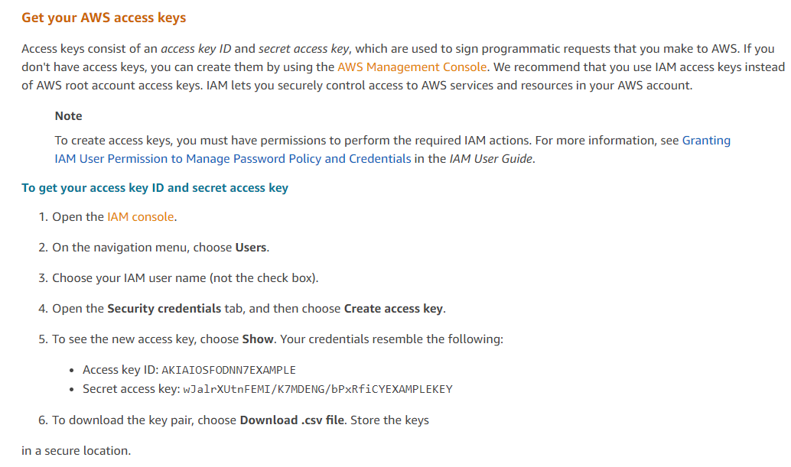
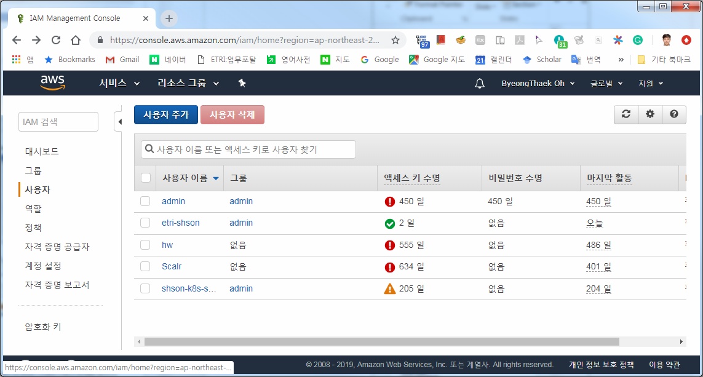
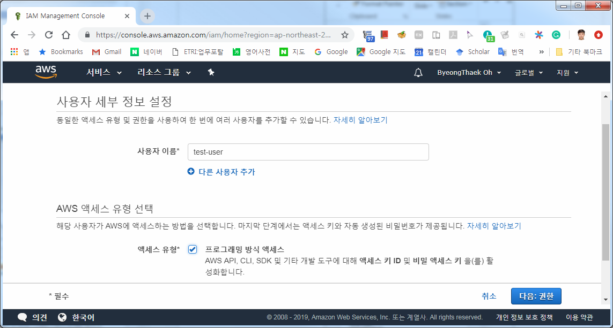
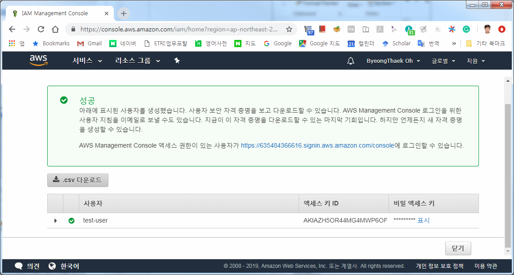
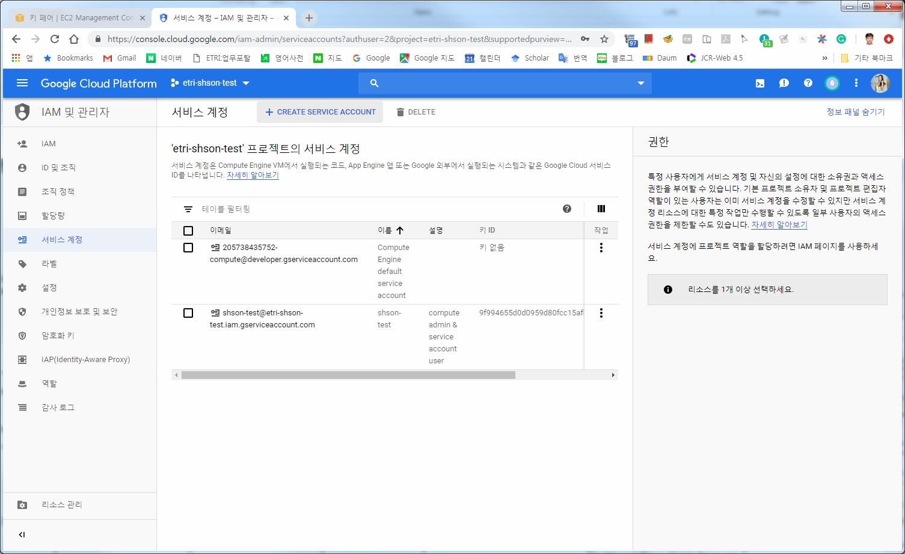
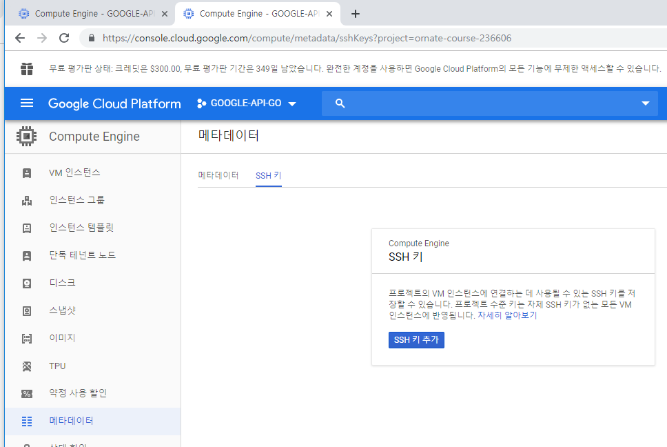
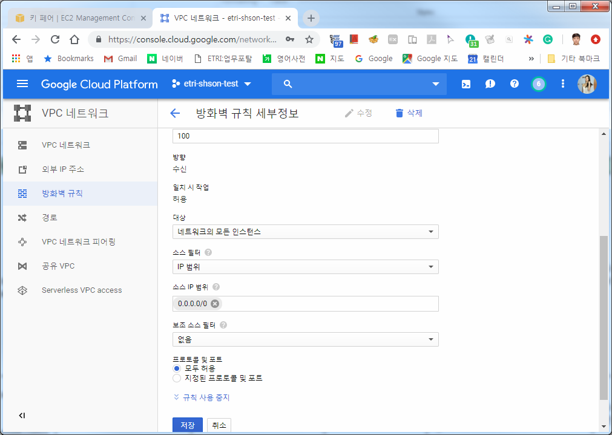

# PoC-Farmoni
Proof of Concepts for the Cloud-Barista Multi-Cloud Project.

***

## [목차]

1. [설치 개요](#설치-개요)
2. [설치 절차](#설치-절차)
3. [설치 & 실행 상세 정보](#설치--실행-상세-정보)
4. [결과 확인](#결과-확인)

***

## [설치 개요]
- 설치 환경: Ubuntu 18.04

## [설치 절차]

- Go 설치 & Git 설치
- 환경 변수 설정
- Farmoni 소스 다운로드 (Git clone Farmoni)
- 의존 라이브러리 다운로드
  - 클라우드 Go 클라이언트 라이브러리
  - 기타 라이브러리
- 클라우드 인증 키 생성 및 설정
  - AWS 인증 키 생성 및 설정
  - GCE 인증 키 생성 및 설정
  - Azure 인증 키 생성 및 설정
- etcd 설치 및 실행
- farmoni_master 환경 설정
- farmoni 빌드
  - farmoni_agent 빌드
  - farmoni_master 빌드
- farmoni_master 실행

## [설치 & 실행 상세 정보]
- Go 설치 & Git 설치
  - https://golang.org/doc/install
  - `# apt install git`
- 환경 변수 설정
  - `~/.bashrc` (또는 `~/.zshrc`) 하단에 아래 내용 추가
```Shell
export PATH=$PATH:/usr/local/go/bin
export GOPATH=$HOME/go
export PATH=$PATH:$HOME/go/src/github.com/protobuf/bin
export FARMONI_MASTER=~/go/src/github.com/cloud-barista/poc-farmoni/farmoni_master
export AZURE_AUTH_LOCATION=~/.azure/azure.auth
```
> 1행: Go 를 Ubuntu 패키지로 설치한다면 필요 없을 것임  
2행: Go 를 Ubuntu 패키지로 설치한다면 필요 없을 것임  
3행: golang-goprotobuf-dev 를 Ubuntu 패키지로 설치한다면 필요 없을 것임

- `.bashrc` 에 기재한 내용을 적용하기 위해, 다음 중 하나를 수행
  - logoff 후 다시 login
  - `source ~/.bashrc`
  - `. ~/.bashrc`

- Farmoni 소스 다운로드
  - `# go get github.com/cloud-barista/poc-farmoni`
> 다음과 같은 메시지가 나오기는 함:  
`“package github.com/cloud-barista/poc-farmoni: no Go files in /root/go/src/github.com/cloud-barista/poc-farmoni”`

> `# go get github.com/cloud-barista/poc-farmoni` 명령을 실행하면, 다음의 명령들을 실행한 것과 같은 효과를 냄  
> `# mkdir ~/go/src/github.com/cloud-barista`  
> `# cd ~/go/src/github.com/cloud-barista`  
> `# git clone https://github.com/cloud-barista/poc-farmoni.git`


- 의존 라이브러리 다운로드
  - 클라우드 Go 클라이언트 관련 라이브러리
```Shell
# go get -u -v github.com/aws/aws-sdk-go
# go get -u -v cloud.google.com/go
# go get -u -v github.com/Azure/azure-sdk-for-go
# go get -u -v github.com/Azure/go-autorest/autorest
```

  - 기타 라이브러리 다운로드
```Shell
# go get -u -v github.com/revel/revel
# go get -u -v go.etcd.io/etcd/clientv3
# go get -u -v github.com/bramvdbogaerde/go-scp
# go get -u -v github.com/dimchansky/utfbom github.com/mitchellh/go-homedir
# go get -u -v golang.org/x/oauth2 gopkg.in/yaml.v3
# go get -u -v github.com/labstack/echo
```

### 클라우드 인증 키 생성 및 설정
#### AWS 인증 키 생성 및 설정
- 참고: https://docs.aws.amazon.com/ko_kr/sdk-for-go/v1/developer-guide/setting-up.html

- AWS 콘솔 접속. https://console.aws.amazon.com/iam/home?region=ap-northeast-2#
- IAM 사용자 추가 및 인증 키 (.csv) 다운로드





- `~/.aws/credentials` 파일 생성
```
[default]
aws_access_key_id = <YOUR_ACCESS_KEY_ID>
aws_secret_access_key = <YOUR_SECRET_ACCESS_KEY>
```

- VM SSH 접속을 위한 키 생성
  - https://ap-northeast-2.console.aws.amazon.com/ec2/v2/home?region=ap-northeast-2#KeyPairs:sort=keyName
  - ~/.aws/ 에 vm ssh 접속 키 저장
- Security Group 생성 시, TCP 2019번 포트를 0.0.0.0/0 에 대해 개방

#### GCE 인증 키 생성 및 설정
- 관련 정보: https://github.com/danackerson/googleComputeEngine

- 프로젝트 생성
  - https://console.cloud.google.com/projectselector2/home/dashboard?organizationId=0&supportedpurview=project&authuser=2

- API 접속을 위한 서비스 계정 생성
  - 프로젝트 설정으로 이동
  - IAM 및 서비스계정 -> 서비스 계정 선택
  - https://console.cloud.google.com/iam-admin/serviceaccounts?authuser=2&project=your-project-name&supportedpurview=project
  
  - 키 생성 및 다운로드
    - 예: `~/.gcp/gcp-etri-jhseo-test-ed06e580674a.json`
- VM SSH 접속을 위한 키 생성
```Shell
# ssh-keygen -t rsa -f ~/.gcp/gce-vm-key -C <username>
# chmod 400 ~/.gcp/gce-vm-key
# cat ~/.gcp/gce-vm-key.pub
```
- 해당 퍼블릭 키를 GCE에 등록

- 에이전트 통신을 위한 방화벽 추가
  - https://console.cloud.google.com/networking/firewalls/list?authuser=2&project=[my-project-name]&supportedpurview=project&firewallTablesize=50
  
  

#### Azure 인증 키 생성 및 설정
- Azure CLI 인증 키 설정
```Shell
# curl -sL https://aka.ms/InstallAzureCLIDeb | sudo bash
# az login
# mkdir ~/.azure
# cd ~/.azure
# az ad sp create-for-rbac --sdk-auth > azure.auth
```

- VM SSH 접속 키
```Shell
# cp ~/.gcp/gce-vm-key ~/.azure/azure-vm-key
# cp ~/.gcp/gce-vm-key.pub ~/.azure/azure-vm-key.pub
# ssh -i “~/.azure/azure-vm-key" <username>@<VM IP addr>
```

### etcd 설치 및 실행
```Shell
# apt install etcd-server
# etcd --version
# ETCD_IP=<ETCD-Host-IPAddress>
# etcd --name etcd-01 --initial-advertise-peer-urls http://$ETCD_IP:2380 --listen-peer-urls http://$ETCD_IP:2380 --listen-client-urls http://$ETCD_IP:2379,http://127.0.0.1:2379 --advertise-client-urls http://$ETCD_IP:2379 --initial-cluster-token "etcd-cluster-1" --initial-cluster etcd-01=http://$ETCD_IP:2380 --initial-cluster-state new  &
```

### farmoni_master 환경 설정 (개인 환경에 맞춰 설정)
- `~/go/src/github.com/cloud-barista/poc-farmoni/farmoni_master/conf/config.yaml` 파일을 수정

```YAML
#### Config for farmoni PoC ####

# Infos of etcd server
etcdserverport: "<ETCD-Host-IPAddress>:2379"

## Config for AWS ##
aws:

# Infos of Region
  region: ap-northeast-2
# Infos for creating Instnaces
  imageid: ami-02c9728b733d27242 # Ubuntu Server 18.04 LTS (HVM), SSD Volume Type
  instancenameprefix: jhseo-test  # EC2's Tag Name for group instances' ID
  instancetype: t2.nano
  securitygroupid: sg-08bd014b5e4301625 # jhseo-test
  subnetid: subnet-da654b97
# for VM
  username: ubuntu
  keyname: ETRI-jhseo-key
  keyfilepath: /root/.aws/ETRI-jhseo-key.pem


## Config for GCP ##
gcp:

# for credential
  credentialfile: /root/.gcp/gcp-etri-jhseo-test-ed06e580674a.json
# Infos of Region
  region: asia-northeast2
  zone: asia-northeast2-a
# Project & Prefix for GCP
  projectid: etri-jhseo-test
  prefix: https://www.googleapis.com/compute/v1/projects/etri-jhseo-test
# Infos for creating Instnaces
  imageid: projects/ubuntu-os-cloud/global/images/ubuntu-1804-bionic-v20190530
  instancenameprefix: jhseo-test
  instancetype: https://www.googleapis.com/compute/v1/projects/etri-jhseo-test/zones/asia-northeast2-a/machineTypes/f1-micro
  subnetid: https://www.googleapis.com/compute/v1/projects/etri-jhseo-test/regions/asia-northeast2/subnetworks/default
  networkname: https://www.googleapis.com/compute/v1/projects/etri-jhseo-test/global/networks/default
  serviceAccoutsMail: default
# for VM
  username: jhseo
  keyname: empty
  keyfilepath: /root/.gcp/gce-vm-key


## Config for AZURE ##
azure:

# for credential
  credentialfile: /root/.azure/azure.auth

  groupname: VMGroupName
  location: koreasouth
  virtualnetworkname: virtualNetworkName
  subnet1name: subnet1Name
  subnet2name: subnet2Name
  networksecuritygroupname: nsgName
#  ipname: "ipName"
#  nicname: "nicName"

  basename: azurejhseo
  username: jhseo
  password:
  keyfilepath: /root/.azure/azure-vm-key
  publickeyfilepath: /root/.azure/azure-vm-key.pub
```

### farmoni 빌드
- farmoni_agent 빌드
```Shell
# apt install golang-goprotobuf-dev
# bash ~/go/src/github.com/cloud-barista/poc-farmoni/1.agent_protoc_build.sh
```
- farmoni_master 빌드
```Shell
# cd ~/go/src/github.com/cloud-barista/poc-farmoni/farmoni_master
# go build
```
> 패키지 관련 오류 발생 시, `go get` 명령을 통해 부족한 패키지를 추가

### farmoni_master 실행
- 만약 AWS 관련 작업 시 에러가 발생하면 다음을 실행
```Shell
# sudo apt-get --yes install ntpdate
# sudo ntpdate 0.amazon.pool.ntp.org
```

- 만약 `“panic: /debug/requests is already registered. You may have two independent copies of golang.org/x/net/trace in your binary, trying to maintain separate state. This may involve a vendored copy of golang.org/x/net/trace.”` 에러가 발생하면 다음을 실행 (farmoni_master rebuild 가 필요할 수도 있음)
```Shell
# rm -rf $GOPATH/src/go.etcd.io/etcd/vendor/golang.org/x/net/trace
```

- `# ./farmoni_master` (또는 `# go run farmoni_master.go`)
  - Argument 없이 실행하여 Interactive mode 로 사용하면 됨
  - 아래는 Argument-passing style 사용 예시
```Shell
# ./farmoni_master -addvm-aws=10
# ./farmoni_master -addvm-gcp=5
# ./farmoni_master -addvm-azure=5
# ./farmoni_master -listvm
# ./farmoni_master -monitor
# ./farmoni_master -delvm-aws
# ./farmoni_master -delvm-gcp
# ./farmoni_master -delvm-azure
```
## [결과 확인]
### Interactive 모드 ( `0` 옵션으로 API-server를 실행. API server는 실험적 옵션임)
`$ ./farmoni_master`

> [Select opt (0:API-server, 1:create-vm, 2:delete-vm, 3:list-vm, 4:monitor-vm]  
Your section : <font color=red>1</font>  
1  
[Select cloud service provider (1:aws, 2:gcp, 3:azure, 4:TBD]  
Your section : <font color=red>1</font>  
[Provide the number of VM to create (e.g., 5)  
Your section : <font color=red>2</font>  
Create VM(s) in aws  
######### addVMaws....  
Successfully tagged instance:aws-etri-shson0  
Successfully tagged instance:aws-etri-shson1

`$ ./farmoni_master`
> [Select opt (0:API-server, 1:create-vm, 2:delete-vm, 3:list-vm, 4:monitor-vm]  
Your section : <font color=red>3</font>  
3  
connected to etcd - 10.0.2.15:2379  
######### all server list....(2)  
[CSP] aws	/ [VmID] i-0f6733dc8455fb3ac	/ [IP] <IP>:2019  
[CSP] aws	/ [VmID] i-0e3b84c8cecba48a2	/ [IP] <IP>:2019


### API SERVER 실행 시, 클라이언트에서 TEST 방법
- 서비스 생성  
`$ curl -X POST   -H 'Content-Type: application/json'   -d '{"name":"service-name07","csp":"aws","num":2}}'   localhost:1323/svcs | json_pp`
```JSON
{
   "num" : 2,
   "csp" : "aws",
   "name" : "service-name07",
   "id" : 1560324735351
}
```

- 모든 서비스 조회  
`$ curl localhost:1323/svcs | json_pp`
```JSON
{
   "timestamp" : "2019-06-12T07:36:28.577639732Z",
   "random" : 1000,
   "service" : [
      {
         "name" : "service-name07",
         "id" : 1560324735351,
         "server" : [
            {
               "vmid" : "i-0ad6533ff5c66f542",
               "csp" : "aws",
               "ip" : "52.78.198.213:2019"
            },
            {
               "vmid" : "i-00c530be08225b24c",
               "csp" : "aws",
               "ip" : "52.79.158.225:2019"
            }
         ]
      },
      {
         "id" : 1560324644709,
         "server" : [
            {
               "csp" : "aws",
               "vmid" : "i-0c3d01f99c34e509d",
               "ip" : "52.79.160.123:2019"
            },
            {
               "vmid" : "i-08ff23437046535c1",
               "csp" : "aws",
               "ip" : "13.125.54.91:2019"
            }
         ],
         "name" : "service-name03"
      }
   ],
   "response" : "Sent via Cloud-Barista"
}
```

- 모든 서비스 삭제  
`$ curl -X DELETE localhost:1323/svcs | json_pp`

### Non interactive 모드
`$ go run farmoni_master.go -addvm-aws=3`
```
## examples ##
go run farmoni_master.go -addvm-aws=10
go run farmoni_master.go -addvm-gcp=5
go run farmoni_master.go -addvm-azure=5

go run farmoni_master.go -listvm
go run farmoni_master.go -monitor

go run farmoni_master.go -delvm-aws
go run farmoni_master.go -delvm-gcp
go run farmoni_master.go -delvm-azure

######### addVMaws....
Successfully tagged instance:aws-etri-shson0
Successfully tagged instance:aws-etri-shson1
Successfully tagged instance:aws-etri-shson2
==============> 54.180.134.106
==============> 52.78.23.193
==============> 52.78.80.176
Couldn't establisch a connection to the remote server  dial tcp 54.180.134.106:22: connect: connection refused
connected to etcd - 10.0.2.15:2379
######### addServer....54.180.134.106:2019
added a 54.180.134.106:2019 into the Server List...

######### addServer....52.78.23.193:2019
added a 52.78.23.193:2019 into the Server List...

######### addServer....52.78.80.176:2019
added a 52.78.80.176:2019 into the Server List...
```

`$ ./farmoni_master -listvm`
```
connected to etcd - 10.0.2.15:2379
######### all server list....(4)
52.231.161.155:2019
52.78.80.176:2019
54.180.134.106:2019
52.78.23.193:2019
```

`$ ./farmoni_master –monitor`
```
######### monitoring all servers....
connected to etcd - 10.0.2.15:2379
[azureshson0]
2019-05-24 14:07:59.110989 I |   [CPU USG] C0:0.96%
2019-05-24 14:07:59.110997 I |   [MEM USG] TOTAL: 646MB, USED: 244MB, FREE: 97MB
2019-05-24 14:07:59.111000 I |   [DSK RAT]/dev/sda1: R/s:   82812928, W/s:   621621248	/dev/sdb1: R/s:   0, W/s:   0	
-----------
[ip-172-31-4-191]
2019-05-24 14:07:59.138355 I |   [CPU USG] C0:1.59%
2019-05-24 14:07:59.138368 I |   [MEM USG] TOTAL: 983MB, USED: 96MB, FREE: 525MB
2019-05-24 14:07:59.138375 I |   [DSK RAT]/dev/xvda1: R/s:   286658048, W/s:   244248576	/dev/loop0: R/s:   3213312, W/s:   0	/dev/loop1: R/s:   3756032, W/s:   0	
-----------
[ip-172-31-4-246]
2019-05-24 14:07:59.163055 I |   [CPU USG] C0:5.21%
2019-05-24 14:07:59.163063 I |   [MEM USG] TOTAL: 983MB, USED: 97MB, FREE: 520MB
2019-05-24 14:07:59.163065 I |   [DSK RAT]/dev/xvda1: R/s:   289209856, W/s:   244568064	
-----------
[ip-172-31-0-32]
2019-05-24 14:07:59.178435 I |   [CPU USG] C0:3.94%
2019-05-24 14:07:59.178478 I |   [MEM USG] TOTAL: 983MB, USED: 94MB, FREE: 523MB
2019-05-24 14:07:59.178488 I |   [DSK RAT]/dev/xvda1: R/s:   289177088, W/s:   244695040	
-----------
==============================
connected to etcd - 10.0.2.15:2379
[azureshson0]
2019-05-24 14:08:00.224434 I |   [CPU USG] C0:1.79%
2019-05-24 14:08:00.224442 I |   [MEM USG] TOTAL: 646MB, USED: 244MB, FREE: 97MB
2019-05-24 14:08:00.224445 I |   [DSK RAT]/dev/sda1: R/s:   0, W/s:   4096	/dev/sdb1: R/s:   0, W/s:   0	
-----------
[ip-172-31-4-191]
2019-05-24 14:08:00.241459 I |   [CPU USG] C0:0.00%
2019-05-24 14:08:00.241482 I |   [MEM USG] TOTAL: 983MB, USED: 96MB, FREE: 524MB
2019-05-24 14:08:00.241489 I |   [DSK RAT]/dev/xvda1: R/s:   0, W/s:   4096	/dev/loop0: R/s:   0, W/s:   0	/dev/loop1: R/s:   0, W/s:   0	
-----------
[ip-172-31-4-246]
2019-05-24 14:08:00.260265 I |   [CPU USG] C0:0.00%
2019-05-24 14:08:00.260272 I |   [MEM USG] TOTAL: 983MB, USED: 97MB, FREE: 520MB
2019-05-24 14:08:00.260275 I |   [DSK RAT]/dev/xvda1: R/s:   0, W/s:   4096	
-----------
[ip-172-31-0-32]
2019-05-24 14:08:00.280212 I |   [CPU USG] C0:0.00%
2019-05-24 14:08:00.280228 I |   [MEM USG] TOTAL: 983MB, USED: 94MB, FREE: 523MB
2019-05-24 14:08:00.280286 I |   [DSK RAT]/dev/xvda1: R/s:   0, W/s:   4096	
-----------
==============================
```

`$ ./farmoni_master -delvm-aws`
```
######### delete all servers in AWS....
connected to etcd - 10.0.2.15:2379
connected to etcd - 10.0.2.15:2379
######### delete aws all Server....
deleted all aws server list...
```
