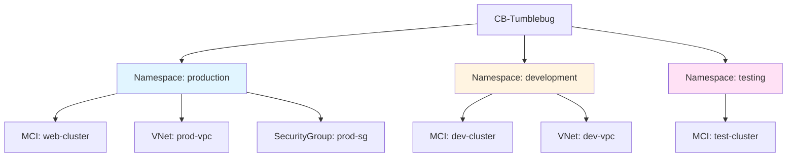
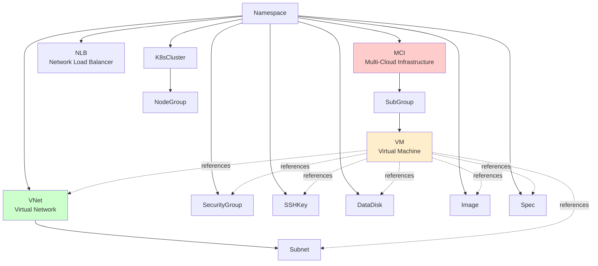
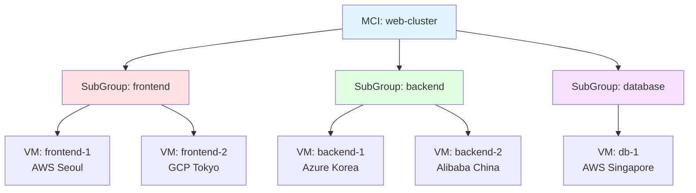
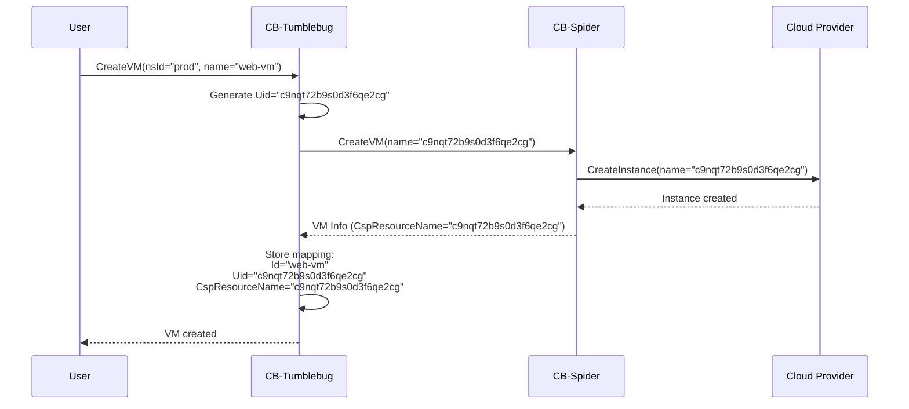
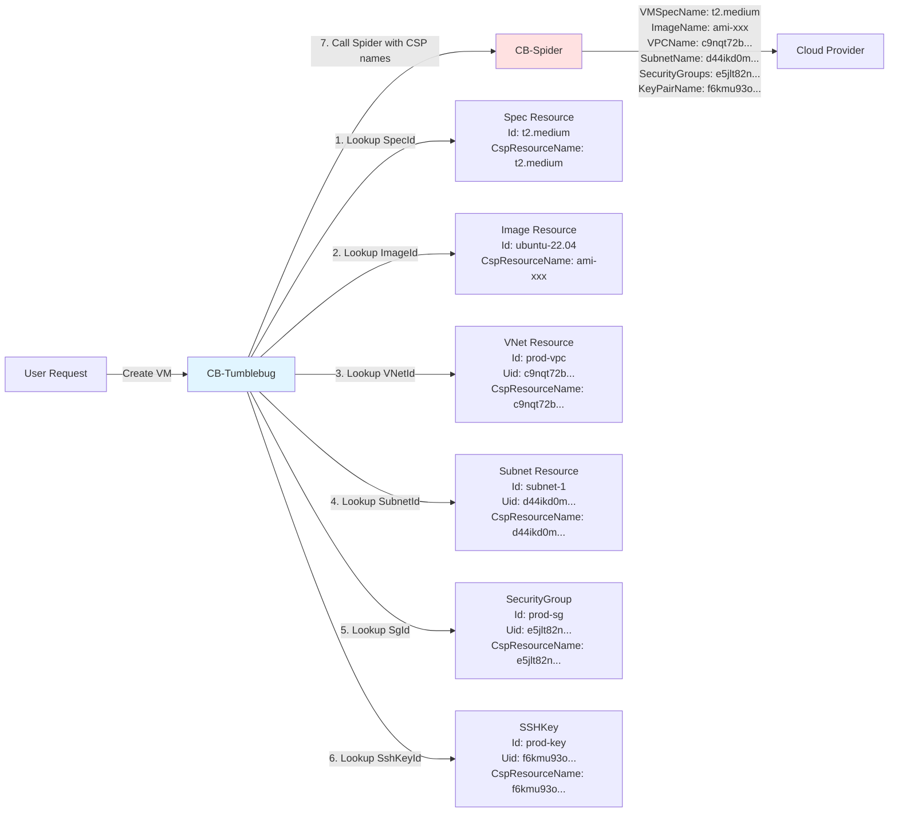
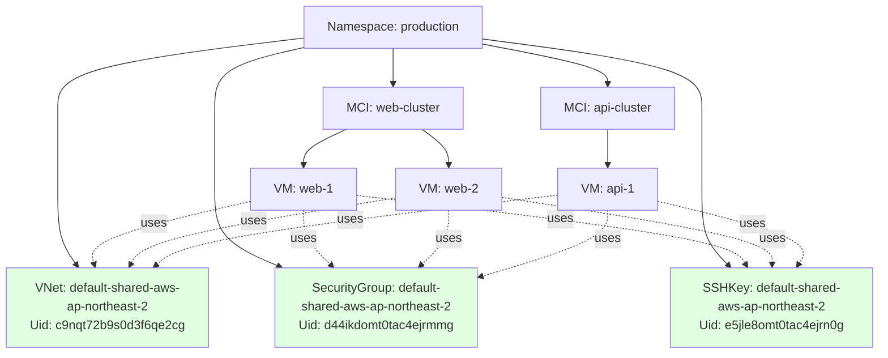
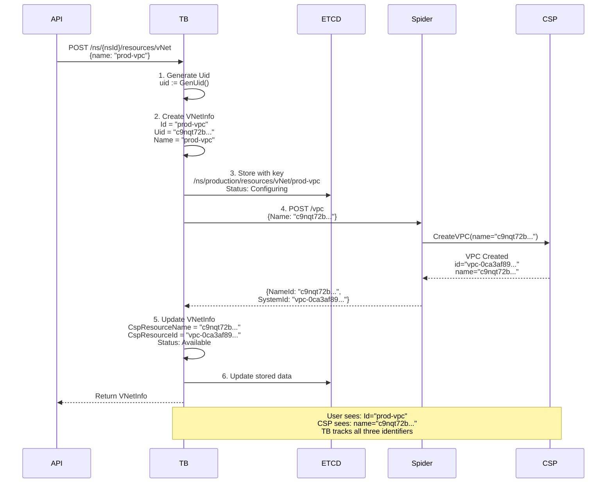
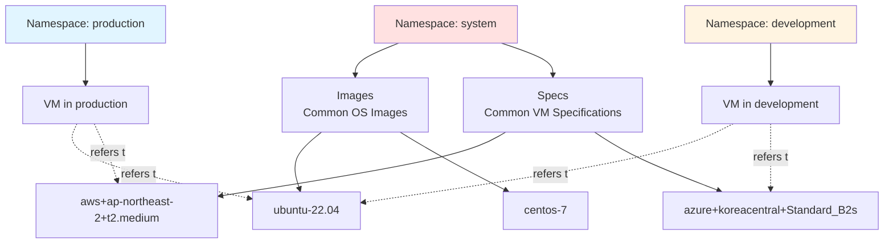

# CB-Tumblebug Namespace and Resource Identity Management

## Overview

CB-Tumblebug uses a **Namespace-based logical isolation** and **UID-based identification system** to manage resources in multi-cloud environments. This document explains the namespace concept and resource identification mechanisms in CB-Tumblebug.

## The Role of Namespace

### 1. Logical Resource Isolation

A Namespace is the **primary logical boundary** that isolates resources in CB-Tumblebug. It serves as an independent workspace where you can organize and manage cloud resources without interference from other namespaces.

**Key Use Cases:**
- **Environment Separation**: `production`, `staging`, `development`
- **Team Isolation**: `team-alpha`, `team-beta`, `team-gamma`
- **Project Boundaries**: `project-web`, `project-mobile`, `project-analytics`
- **Customer Segregation**: `customer-a`, `customer-b` (multi-tenancy)



### 2. Namespace Independence: Same IDs in Different Namespaces

Resources in different namespaces are completely isolated, allowing you to use **identical resource IDs** across namespaces without conflicts.

```mermaid
graph TB
    subgraph NS_PROD["Namespace: production"]
        MCI_PROD["MCI<br/>Id: web-cluster<br/>Uid: c9nqt72b9s0d"]
        VM_PROD_1["VM<br/>Id: frontend-1<br/>Uid: d44ikdom"]
        VM_PROD_2["VM<br/>Id: backend-1<br/>Uid: e5jle8om"]
        VNET_PROD["VNet<br/>Id: main-vpc<br/>Uid: f6kmu93o"]
        
        MCI_PROD --> VM_PROD_1
        MCI_PROD --> VM_PROD_2
        VM_PROD_1 -.uses.-> VNET_PROD
        VM_PROD_2 -.uses.-> VNET_PROD
    end
    
    subgraph NS_DEV["Namespace: development"]
        MCI_DEV["MCI<br/>Id: web-cluster<br/>Uid: g8pov15q9t2e"]
        VM_DEV_1["VM<br/>Id: frontend-1<br/>Uid: h9qpw26r0u3f"]
        VM_DEV_2["VM<br/>Id: backend-1<br/>Uid: i0rqx37s1v4g"]
        VNET_DEV["VNet<br/>Id: main-vpc<br/>Uid: j1sry48t2w5h"]
        
        MCI_DEV --> VM_DEV_1
        MCI_DEV --> VM_DEV_2
        VM_DEV_1 -.uses.-> VNET_DEV
        VM_DEV_2 -.uses.-> VNET_DEV
    end
    
    subgraph NS_TEST["Namespace: testing"]
        MCI_TEST["MCI<br/>Id: web-cluster<br/>Uid: k2tsz59u3x6i"]
        VM_TEST_1["VM<br/>Id: frontend-1<br/>Uid: l3uta60v4y7j"]
        VNET_TEST["VNet<br/>Id: main-vpc<br/>Uid: m4vub71w5z8k"]
        
        MCI_TEST --> VM_TEST_1
        VM_TEST_1 -.uses.-> VNET_TEST
    end
    
    style NS_PROD fill:#e1f5ff
    style NS_DEV fill:#fff4e1
    style NS_TEST fill:#ffe1f5
    
    style MCI_PROD fill:#ffcccc
    style MCI_DEV fill:#ffcccc
    style MCI_TEST fill:#ffcccc
```



**Key Observations:**
- ✅ **Same IDs allowed**: All three namespaces use MCI Id `web-cluster`, VM Id `frontend-1`, VNet Id `main-vpc`
- ✅ **Different UIDs**: Each resource has a unique Uid ensuring no conflict at the CSP level
- ✅ **Independent lifecycles**: Deleting `web-cluster` in `production` doesn't affect `development` or `testing`
- ✅ **Isolated configurations**: Same logical structure can be deployed with different settings per namespace

### 3. Namespace Structure

```go
type NsInfo struct {
    ResourceType string   // "ns"
    Id           string   // Namespace ID (user-defined)
    Uid          string   // Unique identifier (auto-generated)
    Name         string   // Display name
    Description  string   // Description
}
```

**Key Characteristics:**
- **Id**: User-defined namespace identifier (e.g., `production`, `dev-team-a`)
- **Uid**: Globally unique identifier automatically generated by the system
- **System Namespace**: `system` - Stores common resources (image, spec, etc.)

> **Note:** The `Id` field is derived from the user-provided `Name` during resource creation. When you create a namespace with `Name: "production"`, the system sets `Id: "production"` as well. This pattern applies consistently across all resource types in CB-Tumblebug (VNet, MCI, VM, SecurityGroup, etc.).

## Resource Hierarchy

### 1. Overall Resource Hierarchy



### 2. MCI Internal Structure

MCI (Multi-Cloud Infrastructure) is a container that logically groups VMs from multiple clouds.



## Resource Identification System

### 1. Three-Level Identifiers

Every resource in CB-Tumblebug has three identifiers:

| Identifier | Purpose | Created When | Example |
|--------|------|-----------|------|
| **Id** | CB-Tumblebug internal identification (user-defined) | Resource creation request | `web-vm-01` |
| **Uid** | Globally unique identifier (for CSP resource name) | Auto-generated on creation | `c9nqt72b9s0d3f6qe2cg` |
| **CspResourceName** | CSP native resource name | After CSP resource creation | `c9nqt72b9s0d3f6qe2cg` |

### 2. Uid Generation Mechanism

```go
// GenUid generates a globally unique identifier
func GenUid() string {
    return uid.New().String()  // Uses rs/xid library
}
```

**Uid Characteristics:**
- **Length**: 20-character Base32 encoded string
- **Composition**: timestamp(4 bytes) + machine ID(3 bytes) + process ID(2 bytes) + counter(3 bytes)
- **Global Uniqueness**: Prevents collision by combining time, machine, and process
- **Examples**: `c9nqt72b9s0d3f6qe2cg`, `d44ikdomt0tac4ejrmmg`

### 3. Why Use Uid as CSP Resource Name?

**Problem:**
- CB-Tumblebug's Namespace concept doesn't exist in CB-Spider or Terrarium (OpenTofu)
- Multiple Namespaces can use the same resource Id (e.g., `web-vm` in `prod`, `web-vm` in `dev`)
- This can cause resource name conflicts at the CSP level

**Solution:**


**Code Example (VNet Creation):**

```go
// CreateVNet in src/core/resource/vnet.go
func CreateVNet(nsId string, vNetReq *model.VNetReq) (model.VNetInfo, error) {
    // 1. Generate Uid for TB internal use
    uid := common.GenUid()
    vNetInfo.Uid = uid
    vNetInfo.Id = vNetReq.Name        // User-defined name
    vNetInfo.Name = vNetReq.Name
    
    // 2. Create subnets with their own Uids
    for _, subnetInfo := range vNetReq.SubnetInfoList {
        vNetInfo.SubnetInfoList = append(vNetInfo.SubnetInfoList, model.SubnetInfo{
            Id:   subnetInfo.Name,
            Uid:  common.GenUid(),      // Each subnet gets unique Uid
            // ...
        })
    }
    
    // 3. Call Spider with Uid as resource name
    spReqt := spiderCreateVPCRequest{}
    spReqt.ReqInfo.Name = vNetInfo.Uid  // ← Use Uid, not user-defined name!
    
    // Subnet names also use Uid
    for _, subnetInfo := range vNetInfo.SubnetInfoList {
        spReqt.ReqInfo.SubnetInfoList = append(..., spiderAddSubnetRequestInfo{
            Name: subnetInfo.Uid,  // ← Use Uid
            // ...
        })
    }
    
    // 4. Spider creates VPC with Uid as name in CSP
    // 5. CSP returns the created resource name (which is the Uid)
    vNetInfo.CspResourceName = spResp.IId.NameId  // This will be the Uid
    
    return vNetInfo, nil
}
```

## KeyValue Store Structure

### 1. Resource Key Generation Patterns

```go
// GenResourceKey generates ETCD key for resources
func GenResourceKey(nsId string, resourceType string, resourceId string) string {
    // Pattern: /ns/{nsId}/resources/{resourceType}/{resourceId}
    return "/ns/" + nsId + "/resources/" + resourceType + "/" + resourceId
}

// GenMciKey generates ETCD key for MCI and VMs
func GenMciKey(nsId string, mciId string, vmId string) string {
    if vmId != "" {
        return "/ns/" + nsId + "/mci/" + mciId + "/vm/" + vmId
    } else if mciId != "" {
        return "/ns/" + nsId + "/mci/" + mciId
    } else if nsId != "" {
        return "/ns/" + nsId
    }
    return ""
}
```

### 2. ETCD Key Structure

```mermaid
graph TB
    ROOT[ETCD Root]
    
    ROOT --> NS1[/ns/production]
    ROOT --> NS2[/ns/development]
    ROOT --> SYS[/ns/system]
    
    NS1 --> RES1[/resources]
    NS1 --> MCI1[/mci]
    
    RES1 --> VNET1[/vNet/prod-vpc]
    RES1 --> SG1[/securityGroup/prod-sg]
    RES1 --> SSH1[/sshKey/prod-key]
    RES1 --> DISK1[/dataDisk/prod-disk]
    
    MCI1 --> MCIOBJ1[/web-cluster]
    MCIOBJ1 --> VM1[/vm/frontend-1]
    MCIOBJ1 --> VM2[/vm/backend-1]
    
    SYS --> SYSRES[/resources]
    SYSRES --> IMG1[/image/ubuntu-22.04]
    SYSRES --> SPEC1[/spec/t2.medium]
    
    style NS1 fill:#e1f5ff
    style NS2 fill:#fff4e1
    style SYS fill:#ffe1e1
```

**Actual Key Examples:**
```
/ns/production/resources/vNet/prod-vpc
/ns/production/resources/securityGroup/prod-sg
/ns/production/resources/sshKey/prod-key
/ns/production/mci/web-cluster
/ns/production/mci/web-cluster/vm/frontend-1
/ns/production/mci/web-cluster/vm/backend-1
/ns/system/resources/image/ubuntu-22.04
/ns/system/resources/spec/aws+ap-northeast-2+t2.medium
```

## Resource Reference Relationships

### 1. Resource References During VM Creation



### 2. Resource Creation Code Example

```go
// From src/core/infra/provisioning.go
func createVM(nsId string, vmInfoData *model.VmInfo) error {
    // 1. Lookup Spec's CSP resource name
    requestBody.ReqInfo.VMSpecName, err = resource.GetCspResourceName(
        nsId, model.StrSpec, vmInfoData.SpecId)
    
    // 2. Lookup VNet's CSP resource name (this is Uid)
    requestBody.ReqInfo.VPCName, err = resource.GetCspResourceName(
        nsId, model.StrVNet, vmInfoData.VNetId)
    
    // 3. Lookup Subnet's CSP resource name (this is Uid)
    subnetInfo := ... // Get subnet info
    requestBody.ReqInfo.SubnetName = subnetInfo.CspResourceName  // Uid
    
    // 4. Lookup SecurityGroup's CSP resource name (Uid)
    for _, sgId := range vmInfoData.SecurityGroupIds {
        cspSgName, err := resource.GetCspResourceName(
            nsId, model.StrSecurityGroup, sgId)
        requestBody.ReqInfo.SecurityGroupNames = append(..., cspSgName)
    }
    
    // 5. Lookup SSHKey's CSP resource name (Uid)
    requestBody.ReqInfo.KeyPairName, err = resource.GetCspResourceName(
        nsId, model.StrSSHKey, vmInfoData.SshKeyId)
    
    // 6. Call CB-Spider with all CSP resource names (Uids)
    // Spider doesn't know about TB's namespace or user-defined names
    err = callSpider(requestBody)
    
    return err
}
```

## Shared Resources

### 1. Shared Resource Concept

Network resources shared by multiple VMs have the `-shared-` suffix.

```go
const StrSharedResourceName string = "-shared-"

// Example: "default-shared-aws-ap-northeast-2"
```

### 2. Shared Resource Pattern



**Shared Resource Characteristics:**
- **Reusability**: Shared by VMs on the same Connection
- **Auto-creation**: Automatically created during MCI Dynamic creation
- **Naming Convention**: `{nsId}-shared-{connectionName}`
- **CSP Resource Name**: Uses Uid (e.g., `c9nqt72b9s0d3f6qe2cg`)

## Resource Lifecycle and Identifiers

### 1. Resource Creation Flow



### 2. Identifier Mapping Table

| TB Internal ID | TB Global ID | CSP Resource Name | CSP System ID |
|-------------|-------------|-----------|--------------|
| Id: `prod-vpc` | Uid: `c9nqt72b9s0d3f6qe2cg` | CspResourceName: `c9nqt72b9s0d3f6qe2cg` | CspResourceId: `vpc-0ca3af89d65a3b478` |
| Id: `web-vm-01` | Uid: `d44ikdomt0tac4ejrmmg` | CspResourceName: `d44ikdomt0tac4ejrmmg` | CspResourceId: `i-0d6c7d2a0f4d0ba2a` |
| Id: `prod-sg` | Uid: `e5jle8omt0tac4ejrn0g` | CspResourceName: `e5jle8omt0tac4ejrn0g` | CspResourceId: `sg-04dcc53ef58a49869` |

## Identifier Application by Resource Type

### 1. VNet and Subnet

```go
type VNetInfo struct {
    ResourceType    string         // "vNet"
    Id              string         // User-defined: "prod-vpc"
    Uid             string         // Generated: "c9nqt72b9s0d3f6qe2cg"
    Name            string         // Same as Id: "prod-vpc"
    CspResourceName string         // CSP uses this: "c9nqt72b9s0d3f6qe2cg"
    CspResourceId   string         // CSP internal ID: "vpc-0ca3af89..."
    SubnetInfoList  []SubnetInfo   // Child subnets
    // ...
}

type SubnetInfo struct {
    ResourceType    string         // "subnet"
    Id              string         // User-defined: "subnet-1"
    Uid             string         // Generated: "d44ikd0mt0tac4ejrml0"
    Name            string         // Same as Id
    CspResourceName string         // CSP uses this: "d44ikd0mt0tac4ejrml0"
    // ...
}
```

### 2. MCI, SubGroup, VM

```go
type MciInfo struct {
    ResourceType string         // "mci"
    Id           string         // User-defined: "web-cluster"
    Uid          string         // Generated
    Name         string         // Same as Id
    Vm           []VmInfo       // All VMs across subgroups
    // ...
}

type VmInfo struct {
    ResourceType    string         // "vm"
    Id              string         // User-defined or auto: "frontend-1"
    Uid             string         // Generated: "d44ikdomt0tac4ejrmmg"
    Name            string         // Same as Id
    SubGroupId      string         // Parent subgroup: "frontend"
    CspResourceName string         // CSP uses this: "d44ikdomt0tac4ejrmmg"
    CspResourceId   string         // CSP internal: "i-0d6c7d2a0f4d0ba2a"
    
    // Resource references (by Id)
    VNetId              string     // "prod-vpc"
    SubnetId            string     // "subnet-1"
    SecurityGroupIds    []string   // ["prod-sg"]
    SshKeyId            string     // "prod-key"
    DataDiskIds         []string   // ["data-disk-1"]
    SpecId              string     // "aws+ap-northeast-2+t2.medium"
    ImageId             string     // "ubuntu-22.04"
    // ...
}
```

### 3. SecurityGroup

```go
type SecurityGroupInfo struct {
    ResourceType    string         // "securityGroup"
    Id              string         // User-defined: "prod-sg"
    Uid             string         // Generated: "e5jle8omt0tac4ejrn0g"
    Name            string         // Same as Id
    CspResourceName string         // CSP uses: "e5jle8omt0tac4ejrn0g"
    CspResourceId   string         // CSP internal: "sg-04dcc53ef58a49869"
    // ...
}
```

### 4. SSHKey

```go
type SshKeyInfo struct {
    ResourceType    string         // "sshKey"
    Id              string         // User-defined: "prod-key"
    Uid             string         // Generated: "f6kmu93omt0tac4ejrnpg"
    Name            string         // Same as Id
    CspResourceName string         // CSP uses: "f6kmu93omt0tac4ejrnpg"
    CspResourceId   string         // CSP internal key name
    // ...
}
```

### 5. DataDisk

```go
type DataDiskInfo struct {
    ResourceType    string         // "dataDisk"
    Id              string         // User-defined: "data-disk-1"
    Uid             string         // Generated
    Name            string         // Same as Id
    CspResourceName string         // CSP uses Uid
    CspResourceId   string         // CSP volume ID
    // ...
}
```

### 6. Image and Spec (System Resources)

```go
type ImageInfo struct {
    ResourceType    string         // "image"
    Id              string         // CSP image name: "ami-0e87051b5808b3155"
    Uid             string         // Generated
    Name            string         // User-friendly name
    CspResourceName string         // Original CSP image ID
    // Stored in /ns/system/resources/image/{id}
    // ...
}

type SpecInfo struct {
    ResourceType    string         // "spec"
    Id              string         // "aws+ap-northeast-2+t2.medium"
    Uid             string         // Generated
    Name            string         // "t2.medium"
    CspResourceName string         // CSP spec name: "t2.medium"
    // Stored in /ns/system/resources/spec/{id}
    // ...
}
```

## Special Cases

### 1. System Namespace



**System Namespace Characteristics:**
- Images and Specs are stored in the `system` namespace
- Shared across all namespaces
- Spec Id format: `{provider}+{region}+{specName}`
- Images use CSP native IDs directly

### 2. K8sCluster

```go
type K8sClusterInfo struct {
    ResourceType    string           // "k8s"
    Id              string           // User-defined
    Uid             string           // Generated
    Name            string
    CspResourceName string           // CSP cluster name (Uid)
    CspResourceId   string           // CSP cluster ID
    NodeGroupList   []K8sNodeGroupInfo
    // ...
}

type K8sNodeGroupInfo struct {
    // Node groups also have Uid
    Uid             string
    CspResourceName string
    // ...
}
```

### 3. Job Scheduler (Namespace-Independent)

```go
// Jobs are not bound to namespaces
// Stored as /scheduledJob/{jobId}

type ScheduleJobStatus struct {
    JobId  string    // "registerCspResources-1730188800"
    NsId   string    // Target namespace (for resource registration)
    // Jobs are managed globally, NsId is for target specification
}
```

**Key Structure:**
```
/scheduledJob/registerCspResources-1730188800
    → NOT /ns/{nsId}/scheduledJob/...
```

## Summary

### Core Principles

1. **Namespace-Based Isolation**
   - All resources are isolated within a Namespace
   - System namespace stores common resources

2. **Three-Level Identifiers**
   - **Id**: User-defined (TB internal use)
   - **Uid**: System-generated global unique ID (CSP resource name)
   - **CspResourceName**: Name recognized by CSP (usually Uid)

3. **Using Uid as CSP Resource Name**
   - Communicates with lower-level systems (Spider, Terrarium) that lack Namespace concept
   - Prevents resource name conflicts
   - Guarantees global uniqueness

4. **Hierarchical Resource Structure**
   - Namespace → Resources (VNet, SG, SSH, Disk)
   - Namespace → MCI → SubGroup → VM
   - VMs reference other resources (by Id, using CspResourceName when calling)

5. **KeyValue Store Patterns**
   - `/ns/{nsId}/resources/{type}/{id}` - General resources
   - `/ns/{nsId}/mci/{mciId}` - MCI
   - `/ns/{nsId}/mci/{mciId}/vm/{vmId}` - VM

Through this system, CB-Tumblebug safely isolates resources in multi-tenant environments and prevents name collisions when communicating with lower-level systems.
