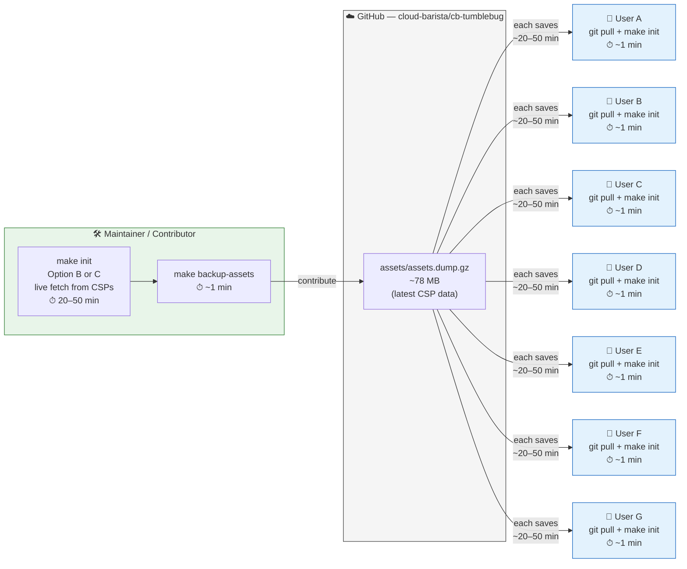
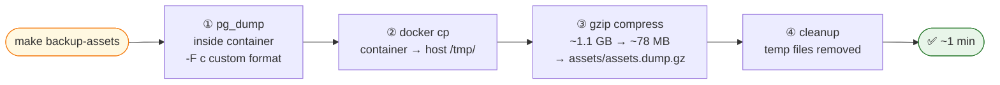
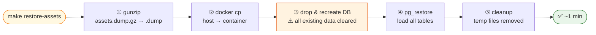

# Assets Backup & Restore

CB-Tumblebug stores VM specs, OS images, and pricing data in PostgreSQL. Fetching this from all cloud providers takes 20–50 minutes. A pre-built backup reduces that to **~1 minute**.

## Time Comparison

| Method | Time |
|--------|------|
| **Restore from backup** | **~1 min** |
| Fetch from CSPs (no Azure) | ~20–30 min |
| Fetch from ALL CSPs | ~40–50 min |

---

## Quick Start

```bash
# Backup current database
make backup-assets

# Restore from backup
make restore-assets

# Restore from specific file
make restore-assets FILE=./backups/postgres/tumblebug_db_20240115.dump.gz
```

---

## How the Backup Ecosystem Works

The backup file (`assets/assets.dump.gz`) is committed to the GitHub repository. Maintainers keep it up-to-date; all users benefit from it automatically on `git pull`.



---

## Backup Flow



## Restore Flow



> Restore replaces all data in PostgreSQL. It does **not** affect etcd (namespaces, MCI state, credentials).

---

## What Gets Backed Up

**Included (PostgreSQL):** VM specs, OS images, pricing, region info

**Not included (stored in etcd):** Running MCIs, namespaces, credentials

---

## Contributing an Updated Backup

```bash
make init                          # Option B or C — live fetch
make backup-assets                 # capture to assets/assets.dump.gz
git add assets/assets.dump.gz
git commit -m "chore: update assets database — $(date +%Y-%m-%d)"
# open a Pull Request
```

---

## File Locations

```
cb-tumblebug/
├── assets/
│   └── assets.dump.gz     # committed to Git — shared via GitHub
├── backups/postgres/
│   └── *.dump.gz          # local manual backups (git-ignored)
└── scripts/
    ├── backup-assets.sh
    └── restore-assets.sh
```

---

## Troubleshooting

| Problem | Fix |
|---------|-----|
| `container is not running` | `make up` |
| `backup file not found` | check path or run `make backup-assets` first |
| skip confirmation prompt | `RESTORE_SKIP_CONFIRM=yes ./scripts/restore-assets.sh` |

---

## Related

- [`make init` Workflow](make-init-workflow.md)
- [Resource Template Management](resource-template-management.md)
