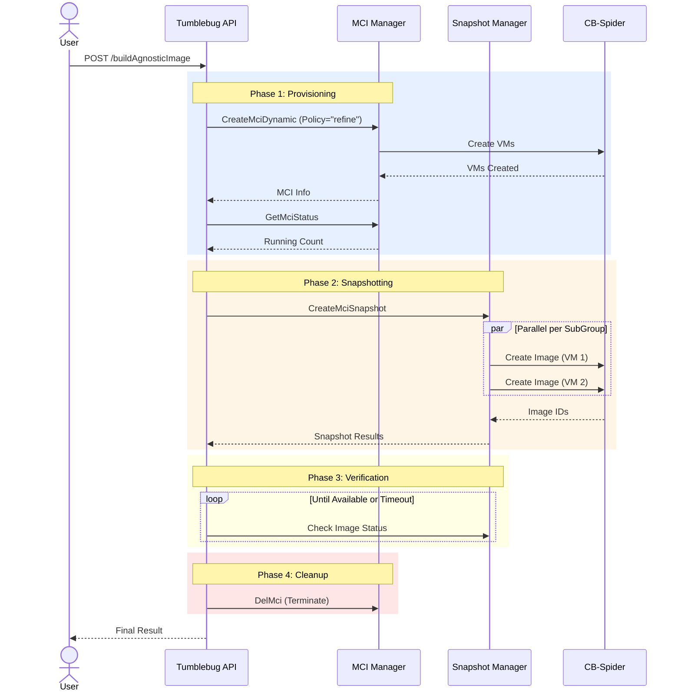
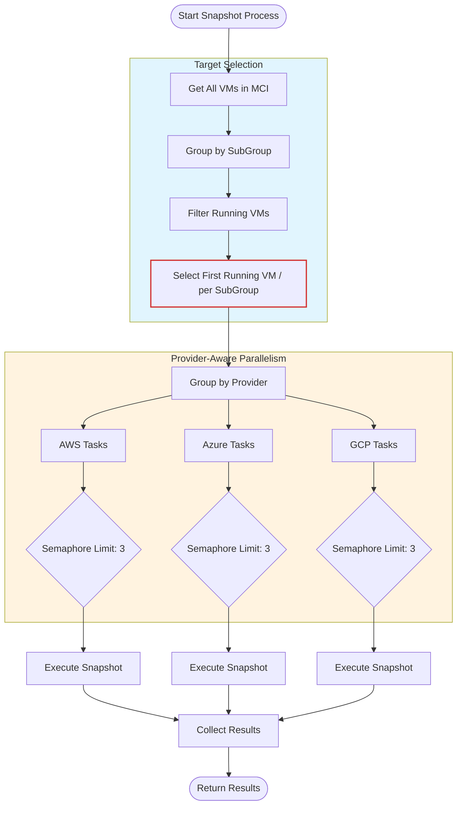
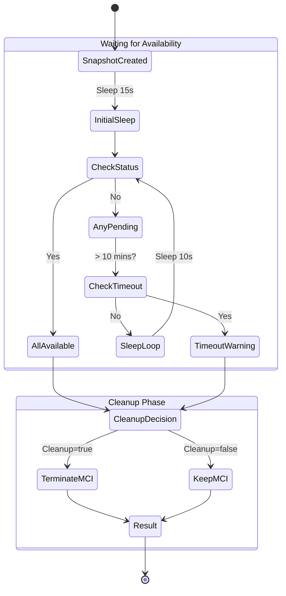
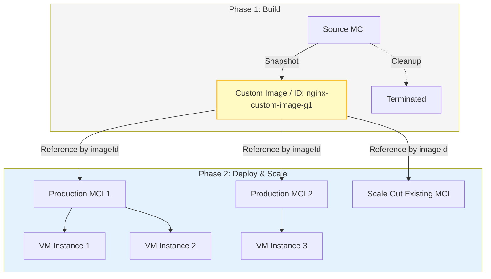

# Cloud-Agnostic Image

Comprehensive guide for automated CSP-agnostic custom image creation using CB-Tumblebug

## 📑 Table of Contents

1. [Overview](#overview)
2. [Key Features](#key-features)
3. [Workflow Architecture](#workflow-architecture)
4. [API Reference](#api-reference)
5. [Usage Scenarios](#usage-scenarios)

---

## Overview

### What is Cloud-Agnostic Image?

**Cloud-Agnostic Image** is a high-level workflow in CB-Tumblebug that automates the entire lifecycle of creating custom machine images (snapshots) across multiple cloud providers. It handles infrastructure provisioning, software installation (via post-commands), snapshot creation, and resource cleanup in a single API call.

### Why Use Cloud-Agnostic Image?

**Problem:**
- Creating custom images manually involves multiple steps: Provision VM → Install Software → Verify → Stop VM → Create Image → Delete VM.
- Doing this across multiple clouds (AWS, Azure, GCP, etc.) requires different tools and procedures.
- Managing the timing (waiting for VM to be ready, waiting for image to be available) is complex and error-prone.

**Solution:**
- **One-Click Automation**: Define your infrastructure and software once, and Tumblebug handles the rest.
- **CSP Agnostic**: Works uniformly across all supported cloud providers.
- **Resource Efficiency**: Automatically cleans up expensive compute resources after the image is secured.

### Key Highlights

✅ **End-to-End Automation**: From empty state to ready-to-use custom image in one request.
✅ **Parallel Processing**: Creates snapshots for multiple VMs (subgroups) simultaneously.
✅ **Smart Cleanup**: Automatically terminates temporary VMs only after images are confirmed "Available".
✅ **Error Handling**: Uses "Refine" policy to handle partial provisioning failures gracefully.
✅ **Status Tracking**: Monitors image creation progress and ensures availability before cleanup.

---

## Key Features

### 1. Automated Workflow

The system executes a strictly ordered sequence of operations:

1. **Provisioning**: Creates a temporary MCI (Multi-Cloud Infrastructure) based on your specifications.
2. **Configuration**: Executes post-deployment commands (e.g., `apt install nginx`) to set up the software environment.
3. **Snapshotting**: Triggers CSP-native snapshot mechanisms for each running VM.
4. **Verification**: Actively polls image status until it transitions to `Available`.
5. **Cleanup**: Terminates the temporary MCI to prevent unnecessary costs (optional but recommended).

### 2. Parallel Snapshot Creation

- Identifies the first running VM in each SubGroup.
- Executes snapshot requests in parallel across different providers.
- Uses provider-specific semaphores to prevent API rate limiting.

### 3. Safety Mechanisms

- **Wait-for-Available**: The system does not delete the source VM until the created image is fully registered and available.
- **Partial Failure Handling**: If some VMs fail to provision, the system proceeds with snapshotting the successful ones.
- **Cleanup Protection**: If snapshot creation fails completely, cleanup can still be enforced to avoid zombie resources.

---

## Workflow Architecture

### 1. Overall Execution Sequence

The following sequence diagram illustrates the interaction between the user, Tumblebug components, and the underlying CB-Spider layer.



### 2. Smart Snapshot Strategy

Tumblebug optimizes the snapshot process by selecting representative VMs and managing API concurrency limits per provider.



### 3. Verification and Cleanup Logic

The system ensures images are usable before destroying the source infrastructure.



### State Transitions

| Stage | Description | Typical Duration |
|-------|-------------|------------------|
| **Provisioning** | Creating VMs and installing software | 2 - 10 mins |
| **Snapshotting** | Triggering CSP snapshot APIs | 1 - 5 mins |
| **Waiting** | Waiting for cloud provider to finalize image | 5 - 20 mins |
| **Cleanup** | Terminating resources | 1 - 3 mins |

### 4. Lifecycle: Build Once, Deploy Many

Once a custom image is created, it becomes a reusable asset within Tumblebug. You can use the generated `imageId` to spawn multiple identical VM instances, enabling rapid scaling and consistent deployments.



**How to Reuse:**
Simply use the `imageId` returned from the build process in your standard MCI creation request:

```json
{
  "vm": [
    {
      "imageId": "nginx-custom-image-g1",
      "specId": "aws-t3-small",
      "name": "prod-vm-01"
    }
  ]
}
```

---

## API Reference

### Create Agnostic Image

**Endpoint:** `POST /ns/{nsId}/buildAgnosticImage`

**Request Body:**
```json
{
  "sourceMciReq": {
    "name": "build-image-mci",
    "vm": [
      {
        "subGroupSize": "1",
        "name": "base-vm",
        "imageId": "ubuntu-22.04",
        "specId": "aws-t3-small",
        "vmUserPassword": "mypassword"
      }
    ],
    "postCommand": {
      "command": [
        "sudo apt-get update",
        "sudo apt-get install -y nginx"
      ]
    }
  },
  "snapshotReq": {
    "name": "nginx-custom-image",
    "description": "Ubuntu 22.04 with Nginx pre-installed"
  },
  "cleanupMciAfterSnapshot": true
}
```

**Parameters:**

| Parameter | Type | Required | Default | Description |
|-----------|------|----------|---------|-------------|
| `sourceMciReq` | object | Yes | - | Standard MCI creation request with VM specs and post-commands |
| `snapshotReq` | object | Yes | - | Configuration for the resulting images (name, description) |
| `cleanupMciAfterSnapshot` | boolean | No | `true` | Whether to delete the MCI after successful image creation |

**Response:** `200 OK`
```json
{
  "namespace": "default",
  "mciId": "build-image-mci",
  "mciStatus": "Terminated",
  "mciCleanedUp": true,
  "totalDuration": "12m45s",
  "message": "Successfully created 1 custom images from MCI build-image-mci and cleaned up infrastructure",
  "snapshotResult": {
    "mciId": "build-image-mci",
    "successCount": 1,
    "failCount": 0,
    "results": [
      {
        "subGroupId": "g1",
        "vmId": "base-vm-01",
        "status": "Success",
        "imageId": "nginx-custom-image-g1",
        "imageInfo": { ... }
      }
    ]
  }
}
```

---

## Usage Scenarios

### 1. Golden Image Pipeline
Create a standardized "Golden Image" with security patches and compliance tools pre-installed.
- **Input**: Base OS image (e.g., Ubuntu 22.04)
- **Post-Command**: Security hardening scripts, monitoring agent installation
- **Output**: Hardened custom image ready for production deployment

### 2. Application Pre-baking
Pre-install complex application stacks to reduce boot time for scaling groups.
- **Input**: Base OS
- **Post-Command**: `docker install`, `git clone app`, `npm install`
- **Output**: Application-ready image that starts serving traffic immediately upon boot

### 3. Cross-Cloud Replication
(Requires running the workflow for each CSP)
- Define one `BuildAgnosticImage` request structure.
- Change only the `specId` and `imageId` for the target cloud (AWS, Azure, GCP).
- Execute to get functionally identical images across different clouds.

---

## Testing based on GUI

### request


### result


