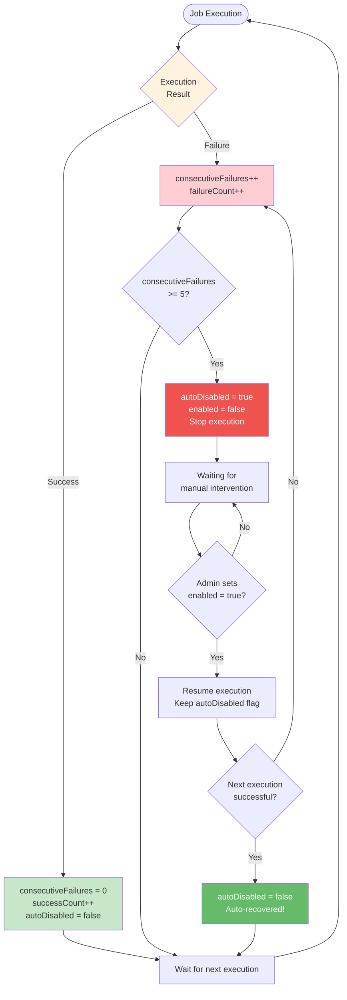
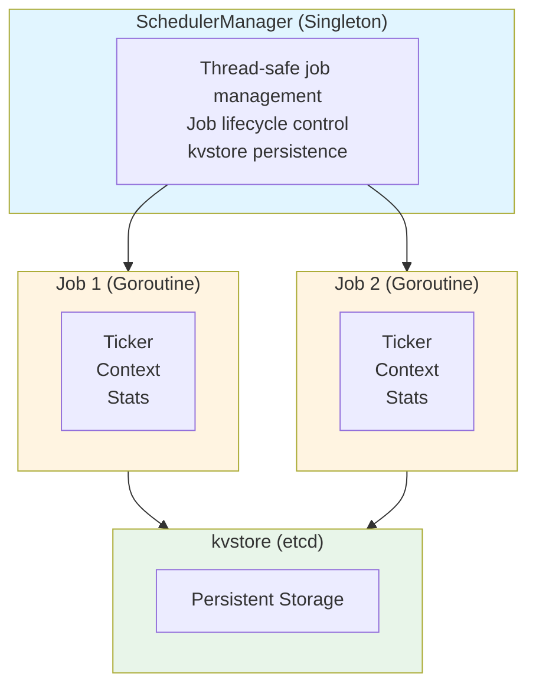
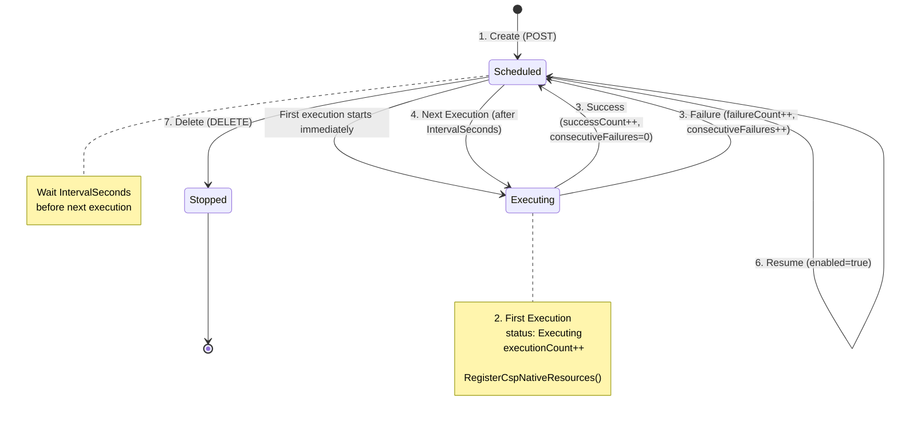
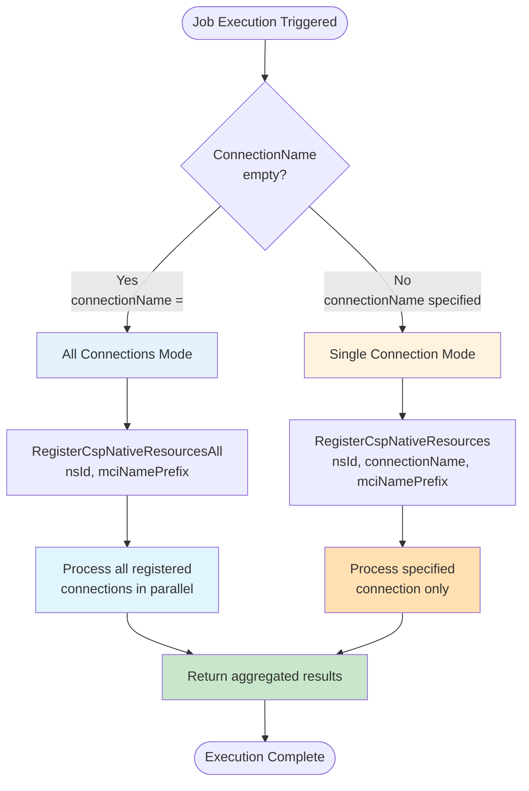
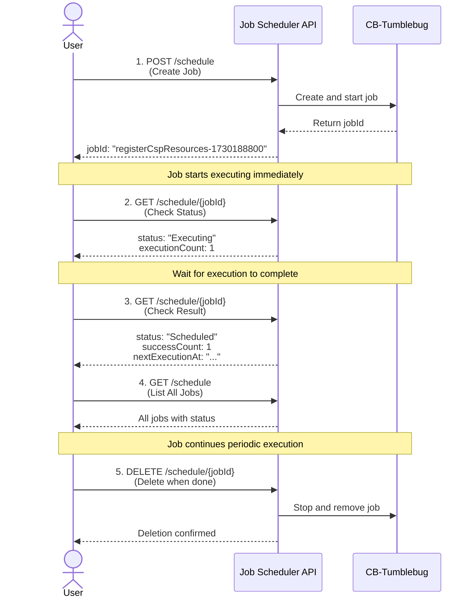
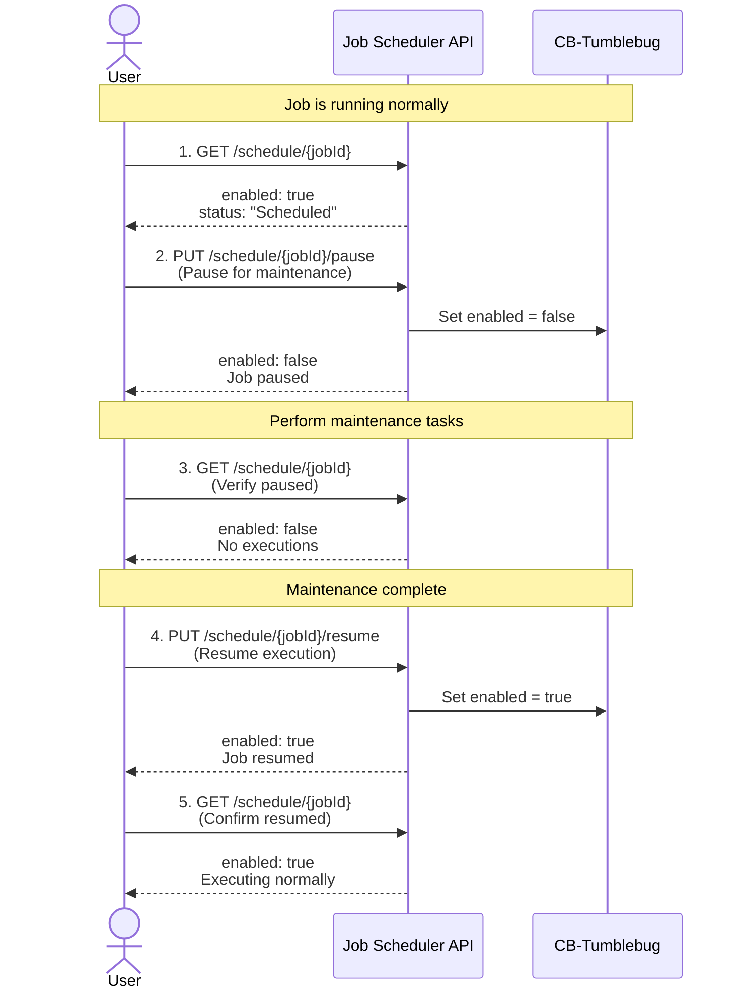
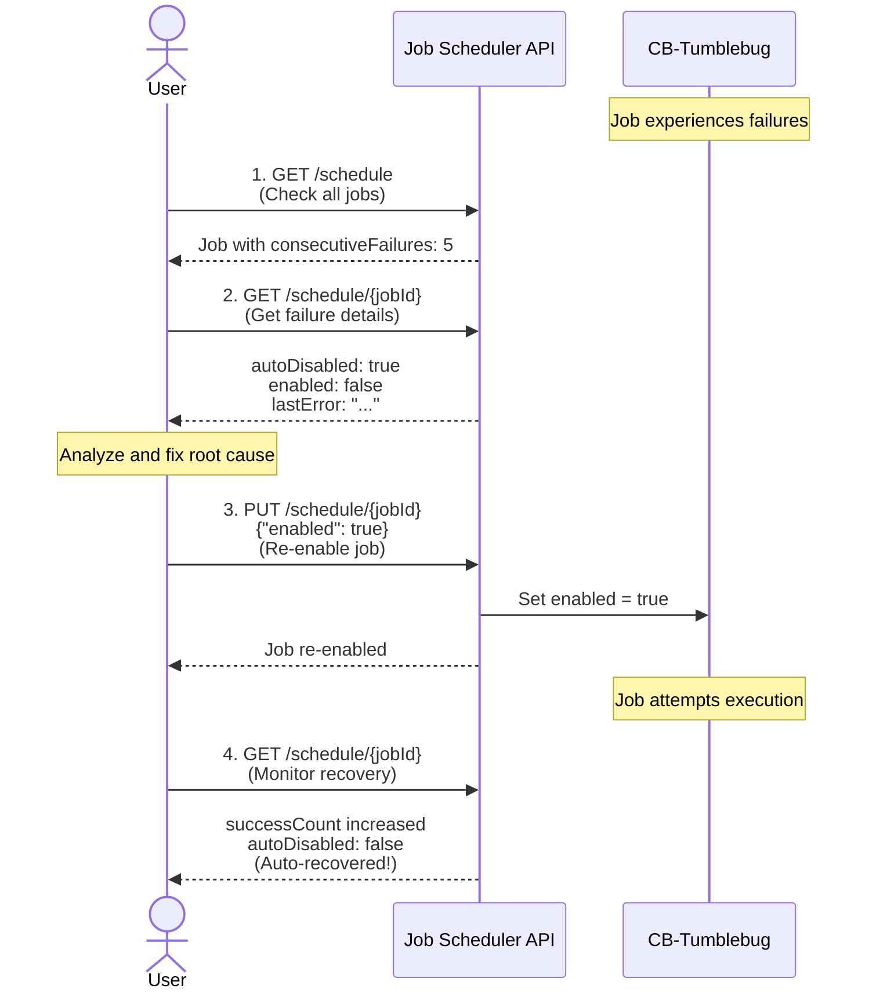
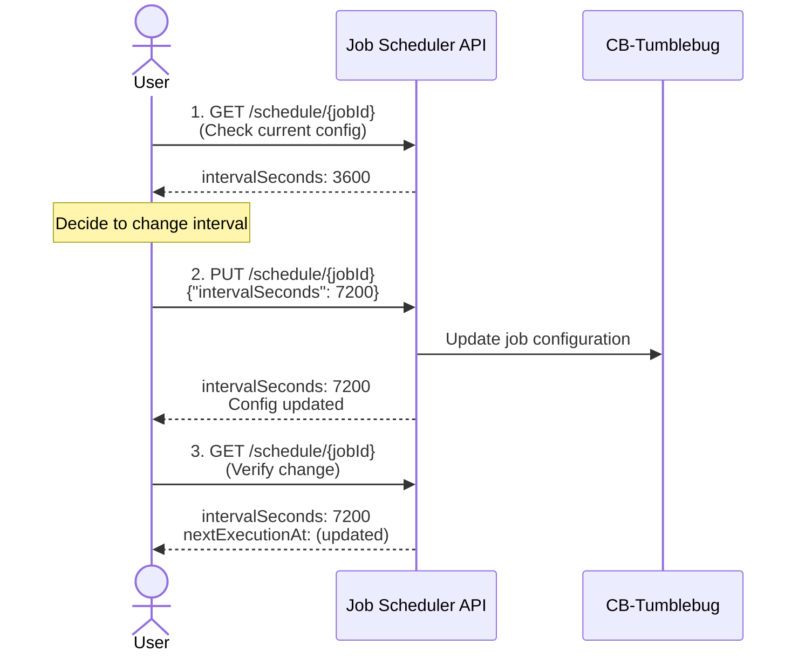
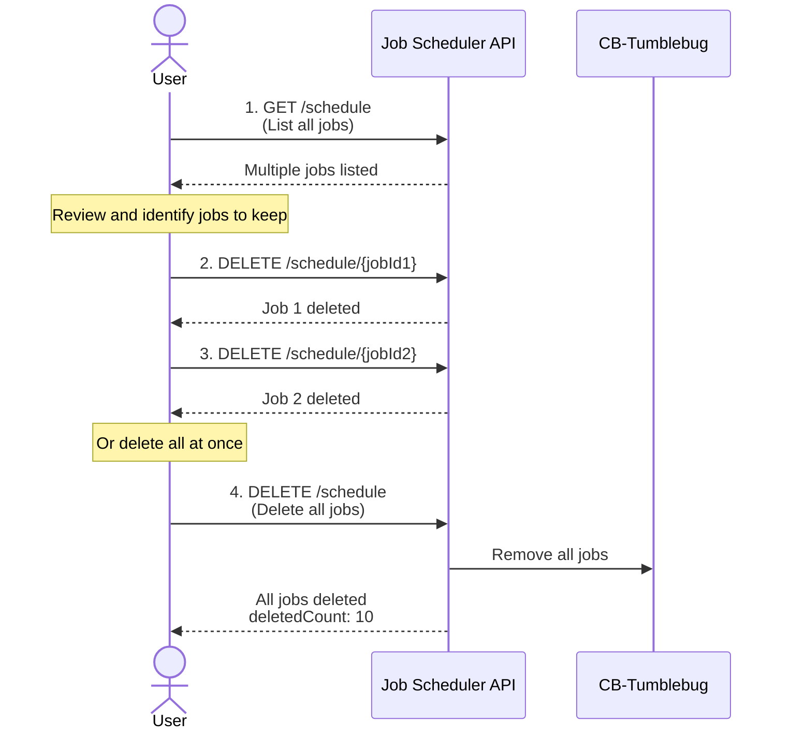

# Job Scheduler User Guide

Comprehensive guide for automated CSP resource registration using CB-Tumblebug's Job Scheduler

## 📑 Table of Contents

1. [Overview](#overview)
2. [Key Features](#key-features)
3. [Architecture](#architecture)
4. [Getting Started](#getting-started)
5. [API Reference](#api-reference)
6. [Usage Scenarios](#usage-scenarios)
7. [Advanced Configuration](#advanced-configuration)
8. [Monitoring and Management](#monitoring-and-management)
9. [Troubleshooting](#troubleshooting)
10. [Best Practices](#best-practices)

---

## Overview

### What is Job Scheduler?

Job Scheduler is a system in CB-Tumblebug that automatically executes recurring tasks. It currently supports automation of **CSP resource registration tasks**, automatically collecting and registering CSP native resources (VNet, SecurityGroup, SSHKey, VM) at configured intervals.

### Why Use Job Scheduler?

**Problem:**
- Manual registration of resources created in CSP to CB-Tumblebug is repetitive
- Regular synchronization is needed but manual execution is cumbersome and error-prone
- Periodic checking of resources across multiple CSPs and regions is required

**Solution:**
- Automated periodic execution through Job Scheduler
- Set once and run continuously
- Execution history, success/failure tracking, auto-recovery features

### Key Highlights

✅ **Immediate Execution**: First execution starts immediately upon job creation  
✅ **Periodic Repetition**: Automatic execution at configured intervals (minimum 10 seconds)  
✅ **Flexible Targeting**: Select specific connection or all connections  
✅ **Smart Routing**: Empty connectionName → automatically processes all connections  
✅ **Auto Recovery**: Auto-disable after 5 consecutive failures, re-enable on success  
✅ **Namespace Independent**: Jobs are managed globally, nsId is for target specification  
✅ **Persistence**: Jobs automatically recovered after server restart  
✅ **Duplicate Prevention**: Blocks creation of jobs with identical configuration


---

## Testing based on GUI

### Sync scheduling request


### Sync scheduling result


---

## Key Features

### 1. Periodic Automatic Execution

```
Task Complete → [Interval Wait] → Task Execute → [Interval Wait] → ...
```

- **Interval-based**: Next execution starts at exact interval after task completion
- **Difference from Cron**: Maintains consistent interval regardless of task duration
- **Minimum Interval**: 10 seconds (for testing/development)
- **Recommended Interval**: 30 minutes or more for production environments

### 2. Smart Target Selection

**Single Connection Mode:**
```json
{
  "connectionName": "aws-ap-northeast-2",
  "mciNamePrefix": "aws-kr"
}
```
→ Registers resources from specified connection only

**All Connections Mode:**
```json
{
  "connectionName": "",
  "mciNamePrefix": "all-csps"
}
```
→ Automatically registers resources from all registered connections

### 3. Execution Status Tracking

| Status | Meaning | Transition Condition |
|--------|---------|---------------------|
| `Scheduled` | Waiting for next execution | After job creation or execution completion |
| `Executing` | Currently executing task | When execution time is reached |
| `Stopped` | Job has been stopped | When DELETE is called |

### 4. Failure Handling and Auto Recovery



**Statistics Tracking:**
- `executionCount`: Total number of executions
- `successCount`: Number of successes
- `failureCount`: Number of failures
- `consecutiveFailures`: Consecutive failure count

### 5. Timeout Protection

- **Default Timeout**: 30 minutes
- **On Exceed**: Automatically marked as failed and waits for next execution
- **During Server Restart**: Automatically recovers from `Executing` to `Scheduled`

---

## Architecture

### System Components



### Job Lifecycle



### Smart Routing Logic



### Namespace Independence

**Important:** Jobs are NOT bound to namespaces!

```
kvstore structure:
/scheduledJob/{jobId}  ← No nsId!

Job's nsId field:
→ Specifies "target namespace" where resources will be registered
→ Not the job's ownership
```

**Example:**
```json
{
  "jobId": "job-123",
  "nsId": "production",     ← Namespace where resources will be registered
  "connectionName": "aws-us-east-1"
}
```
→ This job registers AWS resources to the `production` namespace

---

## Getting Started

### Prerequisites

- CB-Tumblebug running
- At least one CSP connection registered
- Proper permissions configured (API authentication)

### API Usage Flow

Understanding the typical workflow will help you use the Job Scheduler effectively. Here are common usage patterns:

#### Basic Workflow: Create, Monitor, and Manage



#### Pause and Resume Workflow



#### Failure Recovery Workflow



#### Update Configuration Workflow



#### Bulk Management Workflow



### Quick Start

#### 1. Create Basic Job

```bash
curl -X POST http://localhost:1323/tumblebug/registerCspResources/schedule \
  -H "Content-Type: application/json" \
  -d '{
    "jobType": "registerCspResources",
    "nsId": "default",
    "intervalSeconds": 3600,
    "connectionName": "aws-ap-northeast-2",
    "mciNamePrefix": "aws-kr-resources"
  }'
```

**Response Example:**
```json
{
  "jobId": "registerCspResources-1730188800",
  "jobType": "registerCspResources",
  "nsId": "default",
  "status": "Executing",
  "intervalSeconds": 3600,
  "enabled": true,
  "createdAt": "2025-10-29T10:00:00Z",
  "nextExecutionAt": "2025-10-29T11:00:00Z",
  "executionCount": 1,
  "successCount": 0,
  "failureCount": 0,
  "consecutiveFailures": 0,
  "connectionName": "aws-ap-northeast-2",
  "mciNamePrefix": "aws-kr-resources"
}
```

#### 2. Check Job Status

```bash
curl http://localhost:1323/tumblebug/registerCspResources/schedule/{jobId}
```

#### 3. List Jobs

```bash
curl http://localhost:1323/tumblebug/registerCspResources/schedule
```

#### 4. Pause Job

```bash
curl -X PUT http://localhost:1323/tumblebug/registerCspResources/schedule/{jobId}/pause
```

#### 5. Resume Job

```bash
curl -X PUT http://localhost:1323/tumblebug/registerCspResources/schedule/{jobId}/resume
```

#### 6. Delete Job

```bash
curl -X DELETE http://localhost:1323/tumblebug/registerCspResources/schedule/{jobId}
```

---

## API Reference

### 1. Create Scheduled Job

**Endpoint:** `POST /registerCspResources/schedule`

**Request Body:**
```json
{
  "jobType": "registerCspResources",        // Required: Job type
  "nsId": "default",                        // Required: Target namespace
  "intervalSeconds": 3600,                  // Required: Execution interval (seconds, minimum 10)
  "connectionName": "aws-ap-northeast-2",   // Optional: Specific connection (empty = all)
  "mciNamePrefix": "mci-prefix",            // Optional: MCI name prefix
  "option": "vNet,securityGroup",           // Optional: Resource types (empty = all)
  "mciFlag": "y"                            // Optional: "y" (single MCI), "n" (per-VM MCI)
}
```

**Parameters:**

| Parameter | Type | Required | Default | Description |
|-----------|------|----------|---------|-------------|
| `jobType` | string | Yes | - | Fixed value: "registerCspResources" |
| `nsId` | string | Yes | - | Target namespace to register resources |
| `intervalSeconds` | int | Yes | - | Execution interval (seconds), minimum 10 |
| `connectionName` | string | No | "" | Specific connection (empty = all connections) |
| `mciNamePrefix` | string | No | "mci" | MCI name prefix |
| `option` | string | No | "" | Resource types to register. (empty = all resources) |
| `mciFlag` | string | No | "y" | "y": single MCI, "n": individual MCI per VM |

**Option Values:**
Specify the resource types to register, separated by commas (e.g., `"vNet, customImage"`).

* **Supported Types:** `vNet`, `securityGroup`, `sshKey`, `vm`, `dataDisk`, `customImage`
* **Default Behavior (`""`):** If empty, **all** supported resource types are registered.
* **Dependency Note:** Logical dependencies must be met (e.g., selecting `securityGroup` requires `vNet` to be selected).

**Response:** `200 OK`
```json
{
  "jobId": "registerCspResources-1730188800",
  "jobType": "registerCspResources",
  "nsId": "default",
  "status": "Executing",
  "intervalSeconds": 3600,
  "executionTimeout": 1800,
  "enabled": true,
  "connectionName": "aws-ap-northeast-2",
  "mciNamePrefix": "mci-prefix",
  "createdAt": "2025-10-29T10:00:00Z",
  "lastExecutedAt": "2025-10-29T10:00:00Z",
  "nextExecutionAt": "2025-10-29T11:00:00Z",
  "executionCount": 1,
  "successCount": 0,
  "failureCount": 0,
  "consecutiveFailures": 0,
  "autoDisabled": false
}
```

**Error Responses:**
- `400 Bad Request`: Invalid request format or missing required fields
- `409 Conflict`: Job with identical configuration already exists
- `500 Internal Server Error`: Server internal error

### 2. List Scheduled Jobs

**Endpoint:** `GET /registerCspResources/schedule`

**Response:** `200 OK`
```json
{
  "jobs": [
    {
      "jobId": "registerCspResources-1730188800",
      "jobType": "registerCspResources",
      "nsId": "default",
      "status": "Scheduled",
      "intervalSeconds": 3600,
      "enabled": true,
      "connectionName": "aws-ap-northeast-2",
      "mciNamePrefix": "aws-kr",
      "executionCount": 5,
      "successCount": 5,
      "failureCount": 0,
      "lastExecutedAt": "2025-10-29T14:00:00Z",
      "nextExecutionAt": "2025-10-29T15:00:00Z"
    }
  ]
}
```

### 3. Get Job Status

**Endpoint:** `GET /registerCspResources/schedule/{jobId}`

**Path Parameters:**
- `jobId`: Job ID (e.g., "registerCspResources-1730188800")

**Response:** `200 OK`
```json
{
  "jobId": "registerCspResources-1730188800",
  "jobType": "registerCspResources",
  "nsId": "default",
  "status": "Scheduled",
  "intervalSeconds": 3600,
  "executionTimeout": 1800,
  "enabled": true,
  "connectionName": "aws-ap-northeast-2",
  "mciNamePrefix": "aws-kr",
  "option": "",
  "mciFlag": "y",
  "createdAt": "2025-10-29T10:00:00Z",
  "lastExecutedAt": "2025-10-29T14:00:00Z",
  "nextExecutionAt": "2025-10-29T15:00:00Z",
  "executionCount": 5,
  "successCount": 5,
  "failureCount": 0,
  "consecutiveFailures": 0,
  "lastError": "",
  "lastResult": "Successfully registered 15 resources",
  "autoDisabled": false
}
```

### 4. Update Job Configuration

**Endpoint:** `PUT /registerCspResources/schedule/{jobId}`

**Request Body:**
```json
{
  "intervalSeconds": 7200,     // Optional: Change execution interval
  "enabled": true               // Optional: Enable/disable
}
```

**Response:** `200 OK` (Updated job status)

### 5. Pause Job

**Endpoint:** `PUT /registerCspResources/schedule/{jobId}/pause`

**Request Body:** None

**Response:** `200 OK`
```json
{
  "jobId": "registerCspResources-1730188800",
  "status": "Scheduled",
  "enabled": false,
  "message": "Job paused successfully"
}
```

### 6. Resume Job

**Endpoint:** `PUT /registerCspResources/schedule/{jobId}/resume`

**Request Body:** None

**Response:** `200 OK`
```json
{
  "jobId": "registerCspResources-1730188800",
  "status": "Scheduled",
  "enabled": true,
  "message": "Job resumed successfully"
}
```

### 7. Delete Job

**Endpoint:** `DELETE /registerCspResources/schedule/{jobId}`

**Response:** `200 OK`
```json
{
  "message": "Scheduled job stopped and deleted successfully: registerCspResources-1730188800"
}
```

### 8. Delete All Jobs

**Endpoint:** `DELETE /registerCspResources/schedule`

**Response:** `200 OK`
```json
{
  "message": "All scheduled jobs deleted successfully",
  "deletedCount": 3
}
```

---

## Usage Scenarios

### Scenario 1: Single CSP Regular Synchronization

**Requirements:**
- Synchronize AWS ap-northeast-2 region resources every hour
- Include all resource types

**Configuration:**
```bash
curl -X POST http://localhost:1323/tumblebug/registerCspResources/schedule \
  -H "Content-Type: application/json" \
  -d '{
    "jobType": "registerCspResources",
    "nsId": "production",
    "intervalSeconds": 3600,
    "connectionName": "aws-ap-northeast-2",
    "mciNamePrefix": "aws-kr-prod",
    "option": "",
    "mciFlag": "y"
  }'
```

### Scenario 2: Multi-CSP Integrated Management

**Requirements:**
- Collect resources from all registered CSPs every 6 hours
- Register to separate namespaces per CSP

**Configuration (per namespace):**

```bash
# AWS resources to 'aws-ns'
curl -X POST http://localhost:1323/tumblebug/registerCspResources/schedule \
  -d '{
    "jobType": "registerCspResources",
    "nsId": "aws-ns",
    "intervalSeconds": 21600,
    "connectionName": "aws-ap-northeast-2",
    "mciNamePrefix": "aws-resources"
  }'

# Azure resources to 'azure-ns'
curl -X POST http://localhost:1323/tumblebug/registerCspResources/schedule \
  -d '{
    "jobType": "registerCspResources",
    "nsId": "azure-ns",
    "intervalSeconds": 21600,
    "connectionName": "azure-koreacentral",
    "mciNamePrefix": "azure-resources"
  }'

# GCP resources to 'gcp-ns'
curl -X POST http://localhost:1323/tumblebug/registerCspResources/schedule \
  -d '{
    "jobType": "registerCspResources",
    "nsId": "gcp-ns",
    "intervalSeconds": 21600,
    "connectionName": "gcp-asia-northeast3",
    "mciNamePrefix": "gcp-resources"
  }'
```

### Scenario 3: Network Resources Only Periodic Collection

**Requirements:**
- Collect only network-related resources excluding VMs every 30 minutes
- Fast infrastructure change detection

**Configuration:**
```bash
curl -X POST http://localhost:1323/tumblebug/registerCspResources/schedule \
  -d '{
    "jobType": "registerCspResources",
    "nsId": "network-monitoring",
    "intervalSeconds": 1800,
    "connectionName": "aws-us-east-1",
    "mciNamePrefix": "network-scan",
    "option": "vNet,securityGroup",
    "mciFlag": "n"
  }'
```

### Scenario 4: Development Environment Quick Testing

**Requirements:**
- Short interval execution for quick feedback during development
- Target specific connection only

**Configuration:**
```bash
curl -X POST http://localhost:1323/tumblebug/registerCspResources/schedule \
  -d '{
    "jobType": "registerCspResources",
    "nsId": "dev",
    "intervalSeconds": 60,
    "connectionName": "aws-dev-region",
    "mciNamePrefix": "dev-test"
  }'
```

**Delete after testing:**
```bash
curl -X DELETE http://localhost:1323/tumblebug/registerCspResources/schedule/{jobId}
```

### Scenario 5: Daily Full CSP Resource Scan

**Requirements:**
- Scan resources from all connections once daily
- Execute during off-peak hours (minimize server load)

**Configuration:**
```bash
curl -X POST http://localhost:1323/tumblebug/registerCspResources/schedule \
  -d '{
    "jobType": "registerCspResources",
    "nsId": "inventory",
    "intervalSeconds": 86400,
    "connectionName": "",
    "mciNamePrefix": "daily-scan"
  }'
```

### Scenario 6: Temporary Pause and Resume

**Requirements:**
- Temporarily pause job during maintenance
- Resume after maintenance completion

**Pause:**
```bash
curl -X PUT http://localhost:1323/tumblebug/registerCspResources/schedule/{jobId}/pause
```

**Resume:**
```bash
curl -X PUT http://localhost:1323/tumblebug/registerCspResources/schedule/{jobId}/resume
```

---

## Advanced Configuration

### Execution Interval Optimization

| Use Case | Interval | Reason |
|----------|----------|--------|
| Development/Testing | 10-60 seconds | Quick feedback, immediate validation |
| Frequent Change Monitoring | 5-30 minutes | Quick detection of resource changes |
| General Production | 1-6 hours | Balance of stability and efficiency |
| Daily Synchronization | 12-24 hours | Save server resources, large-scale environments |

### CSP API Rate Limit Considerations

**AWS Example:**
- EC2 DescribeInstances: ~100 requests per minute
- VPC Describe APIs: ~100 requests per minute

**Recommendations:**
- Multiple connections: Minimum 30 minutes interval
- Single connection: Minimum 10 minutes interval
- On rate limit errors: Increase interval

### Connection Name Strategy

**1. Specific Connection (connectionName specified):**
```json
{
  "connectionName": "aws-ap-northeast-2",
  "mciNamePrefix": "aws-kr"
}
```
- **Pros**: Precise targeting, fast execution
- **Cons**: Need to create job per connection

**2. All Connections (connectionName empty):**
```json
{
  "connectionName": "",
  "mciNamePrefix": "all-resources"
}
```
- **Pros**: Process all CSPs at once, simple management
- **Cons**: Longer execution time, larger impact on failure

### Namespace Strategy

**1. Separate by CSP:**
```
nsId: "aws-production"   → AWS resources
nsId: "azure-production" → Azure resources
nsId: "gcp-production"   → GCP resources
```

**2. Separate by Purpose:**
```
nsId: "production"  → Production resources
nsId: "development" → Development resources
nsId: "staging"     → Staging resources
```

**3. Separate by Region:**
```
nsId: "asia-pacific"  → APAC regions
nsId: "north-america" → NA regions
nsId: "europe"        → EU regions
```

### MCI Flag Strategy

**mciFlag: "y" (recommended)**
```json
{
  "mciFlag": "y",
  "mciNamePrefix": "aws-kr"
}
```
- Group all VMs into one MCI
- Improved management convenience
- Simplified resource structure

**mciFlag: "n"**
```json
{
  "mciFlag": "n",
  "mciNamePrefix": "vm"
}
```
- Create individual MCI per VM
- When detailed per-VM management needed
- Not recommended for large-scale environments

### Execution Timeout Configuration

**Default:** 30 minutes (1800 seconds)

**Customization (future support):**
```json
{
  "intervalSeconds": 3600,
  "executionTimeout": 1200
}
```
- Fast execution environment: 10-15 minutes
- Large-scale environment: 30-60 minutes

---

## Monitoring and Management

### Execution Status Monitoring

#### 1. Check Individual Job Status
```bash
curl http://localhost:1323/tumblebug/registerCspResources/schedule/{jobId}
```

**Key Metrics to Check:**
- `status`: Current status (Scheduled/Executing)
- `executionCount`: Total execution count
- `successCount`: Number of successes
- `failureCount`: Number of failures
- `consecutiveFailures`: Consecutive failures (alert if >= 5)
- `lastExecutedAt`: Last execution time
- `nextExecutionAt`: Next scheduled execution time
- `autoDisabled`: Whether auto-disabled
- `lastError`: Last error message
- `lastResult`: Last execution result

#### 2. Check All Jobs
```bash
curl http://localhost:1323/tumblebug/registerCspResources/schedule
```

### Success Rate Calculation

```python
success_rate = (successCount / executionCount) * 100
```

**Example:**
```json
{
  "executionCount": 100,
  "successCount": 95,
  "failureCount": 5
}
```
→ Success rate: 95%

### Alert Conditions

**Critical (Immediate Action Required):**
- `consecutiveFailures >= 5`: 5 consecutive failures
- `autoDisabled = true`: Auto-disabled
- `status = "Executing"` for over 30 minutes

**Warning (Monitoring Needed):**
- `consecutiveFailures >= 3`: 3 consecutive failures
- `failureCount / executionCount > 0.1`: Failure rate over 10%
- `nextExecutionAt < now`: Execution scheduled time exceeded

### Log Checking

**CB-Tumblebug Logs:**
```bash
# Docker environment
docker logs -f cb-tumblebug

# Direct execution environment
tail -f /var/log/cb-tumblebug/tumblebug.log
```

**Key Log Patterns:**
```
# Job creation
INFO Scheduler: Created scheduled job: registerCspResources-1730188800

# Execution start
INFO Scheduler: Starting job execution: registerCspResources-1730188800

# Execution complete
INFO Scheduler: Job completed successfully: registerCspResources-1730188800

# Execution failed
ERROR Scheduler: Job execution failed: registerCspResources-1730188800, error: ...

# Auto-disabled
WARN Scheduler: Job auto-disabled after 5 consecutive failures: registerCspResources-1730188800
```

### Job Configuration Changes

#### Change Interval (Adjust Execution Frequency)
```bash
curl -X PUT http://localhost:1323/tumblebug/registerCspResources/schedule/{jobId} \
  -H "Content-Type: application/json" \
  -d '{
    "intervalSeconds": 7200
  }'
```

#### Enable/Disable
```bash
# Disable
curl -X PUT http://localhost:1323/tumblebug/registerCspResources/schedule/{jobId} \
  -d '{"enabled": false}'

# Enable
curl -X PUT http://localhost:1323/tumblebug/registerCspResources/schedule/{jobId} \
  -d '{"enabled": true}'
```

### Bulk Management

#### List All Jobs and Filter
```bash
# List all jobs
curl http://localhost:1323/tumblebug/registerCspResources/schedule | jq '.jobs'

# Filter jobs by namespace
curl http://localhost:1323/tumblebug/registerCspResources/schedule | \
  jq '.jobs[] | select(.nsId == "production")'

# Filter failing jobs
curl http://localhost:1323/tumblebug/registerCspResources/schedule | \
  jq '.jobs[] | select(.consecutiveFailures > 0)'
```

#### Delete All Jobs
```bash
curl -X DELETE http://localhost:1323/tumblebug/registerCspResources/schedule
```

---

## Troubleshooting

### Issue 1: Job Not Executing

**Symptoms:**
- `nextExecutionAt` keeps showing future time
- `executionCount` not increasing

**Causes and Solutions:**

1. **enabled = false status**
   ```bash
   # Check
   curl .../schedule/{jobId} | jq '.enabled'
   
   # Solution: Enable
   curl -X PUT .../schedule/{jobId}/resume
   ```

2. **autoDisabled = true (auto-disabled)**
   ```bash
   # Check
   curl .../schedule/{jobId} | jq '.autoDisabled, .consecutiveFailures'
   
   # Solution: Identify issue then manually enable
   curl -X PUT .../schedule/{jobId} -d '{"enabled": true}'
   ```

3. **Server time issue**
   ```bash
   # Check server time
   date
   
   # Check job's nextExecutionAt
   curl .../schedule/{jobId} | jq '.nextExecutionAt'
   ```

### Issue 2: Job Stuck in "Executing" Status

**Symptoms:**
- `status = "Executing"` persists
- Executing for over 30 minutes

**Causes:**
- Execution timeout (default 30 minutes) exceeded
- Task interrupted by network issues
- No response from CSP API

**Solution:**
```bash
# 1. Restart job (delete and recreate)
curl -X DELETE .../schedule/{jobId}

curl -X POST .../schedule -d '{
  "jobType": "registerCspResources",
  "nsId": "...",
  "intervalSeconds": 3600,
  "connectionName": "...",
  ...
}'

# 2. Automatically recovers on server restart
# Job automatically recovers to "Scheduled" status
```

### Issue 3: Executes But Keeps Failing

**Symptoms:**
- `consecutiveFailures` increasing
- Error message in `lastError`

**Common Errors and Solutions:**

#### 1. Connection Error
```json
{
  "lastError": "failed to connect to CSP: connection 'aws-invalid' not found"
}
```
**Solution:** Verify and correct connection name
```bash
# Check connection list
curl http://localhost:1323/tumblebug/config

# Delete job and recreate with correct connection
```

#### 2. Permission Error
```json
{
  "lastError": "CSP API error: UnauthorizedOperation"
}
```
**Solution:** Verify and reconfigure CSP credentials

#### 3. Rate Limit Error
```json
{
  "lastError": "CSP API error: RequestLimitExceeded"
}
```
**Solution:** Increase execution interval
```bash
curl -X PUT .../schedule/{jobId} -d '{"intervalSeconds": 3600}'
```

#### 4. Timeout Error
```json
{
  "lastError": "execution timeout exceeded (30 minutes)"
}
```
**Solution:** 
- Reduce number of connections (target specific connection)
- Increase interval to reduce server load

### Issue 4: Cannot Create Duplicate Job

**Symptoms:**
```json
{
  "message": "A job with the same configuration already exists",
  "existingJobId": "registerCspResources-1730188800"
}
```

**Cause:**
Job with identical configuration (jobType + nsId + connectionName + mciNamePrefix + option + mciFlag) already exists

**Solution:**
```bash
# 1. Check existing job
curl .../schedule/{existingJobId}

# 2. Delete existing job then recreate
curl -X DELETE .../schedule/{existingJobId}
curl -X POST .../schedule -d '{ ... }'

# Or 3. Modify existing job configuration
curl -X PUT .../schedule/{existingJobId} -d '{"intervalSeconds": 7200}'
```

### Issue 5: Job Cannot Be Deleted

**Symptoms:**
- Job remains after DELETE request
- Job continues to execute

**Solution:**
```bash
# 1. Check job status
curl .../schedule/{jobId}

# 2. Force delete (stops even if currently executing)
curl -X DELETE .../schedule/{jobId}

# 3. If still problematic: Restart server
docker-compose restart cb-tumblebug
```

### Issue 6: Jobs Disappear After Server Restart

**Symptoms:**
- Jobs existed before server restart, disappeared after

**Causes:**
- kvstore connection issue
- Job save failure

**Check and Solution:**
```bash
# Check kvstore (etcd) status
docker-compose ps etcd

# Check kvstore data
curl http://localhost:2379/v2/keys/scheduledJob

# Check CB-Tumblebug logs
docker logs cb-tumblebug | grep "Failed to persist"
```

### Issue 7: Memory Usage Increases

**Symptoms:**
- Memory usage continues to increase as job count increases

**Causes:**
- Each job uses Goroutine + Ticker
- Excessive job creation

**Recommendations:**
- Limit job count: Under 100 per namespace
- Clean up unnecessary jobs
- Consolidate similar jobs (empty connectionName)

**Monitoring:**
```bash
# Check job count
curl .../schedule | jq '.jobs | length'

# Check memory usage
docker stats cb-tumblebug
```

---

## Best Practices

### 1. Appropriate Interval Configuration

**Bad Example:**
```json
{
  "intervalSeconds": 10,
  "connectionName": ""
}
```
→ Too short interval scanning all connections → Server overload

**Good Example:**
```json
{
  "intervalSeconds": 3600,
  "connectionName": "aws-ap-northeast-2"
}
```
→ Appropriate interval, specific connection scan only

### 2. Namespace Design

**Bad Example:**
```
Register all resources to "default" namespace
```

**Good Example:**
```
aws-production    → AWS production
azure-production  → Azure production
aws-development   → AWS development
monitoring        → Monitoring resources
```

### 3. Job Naming Strategy

**MCI Name Prefix Convention:**
```
{csp}-{region}-{purpose}

Examples:
- aws-kr-prod
- azure-us-dev
- gcp-asia-test
```

### 4. Error Handling

**Monitoring Script Example:**
```bash
#!/bin/bash
# check-jobs.sh

JOBS=$(curl -s http://localhost:1323/tumblebug/registerCspResources/schedule)

# Check failing jobs
FAILED=$(echo $JOBS | jq '[.jobs[] | select(.consecutiveFailures >= 3)] | length')

if [ $FAILED -gt 0 ]; then
  echo "WARNING: $FAILED jobs with failures detected"
  echo $JOBS | jq '.jobs[] | select(.consecutiveFailures >= 3) | {jobId, consecutiveFailures, lastError}'
  
  # Send alert (Slack, Email, etc.)
  # send-alert.sh "Job failures detected"
fi
```

### 5. Centralized Management

**Dashboard Composition:**
```
┌─────────────────────────────────────┐
│     Job Scheduler Dashboard          │
├─────────────────────────────────────┤
│ Total Jobs: 12                       │
│ Running: 10                          │
│ Paused: 1                            │
│ Failed: 1                            │
├─────────────────────────────────────┤
│ Job Details:                         │
│  - aws-kr-prod: ✓ (Success: 99%)   │
│  - azure-us-dev: ✓ (Success: 100%) │
│  - gcp-asia-test: ✗ (Failed: 3)    │
└─────────────────────────────────────┘
```

### 6. Regular Job Cleanup

```bash
#!/bin/bash
# cleanup-old-jobs.sh

# Find jobs not executed for over 30 days
OLD_JOBS=$(curl -s .../schedule | \
  jq -r '.jobs[] | select(.lastExecutedAt < (now - 2592000) | todate) | .jobId')

for jobId in $OLD_JOBS; do
  echo "Deleting old job: $jobId"
  curl -X DELETE .../schedule/$jobId
done
```

### 7. Documentation

**Documentation for Each Job:**
```
Job ID: registerCspResources-1730188800
Purpose: AWS Korea region production resource synchronization
Owner: DevOps Team
Created: 2025-10-29
Interval: 1 hour (3600 seconds)
Target: aws-ap-northeast-2 → production namespace
Alert: Slack #infra-alerts
```

---

### Swagger UI
Access interactive API documentation at:
```
http://localhost:1323/tumblebug/api
```

### Sample Code

**Python Example:**
```python
import requests
import json

BASE_URL = "http://localhost:1323/tumblebug"

# Create job
def create_job(ns_id, connection, interval):
    response = requests.post(
        f"{BASE_URL}/registerCspResources/schedule",
        json={
            "jobType": "registerCspResources",
            "nsId": ns_id,
            "intervalSeconds": interval,
            "connectionName": connection,
            "mciNamePrefix": f"{connection}-resources"
        }
    )
    return response.json()

# Check job status
def check_job(job_id):
    response = requests.get(
        f"{BASE_URL}/registerCspResources/schedule/{job_id}"
    )
    return response.json()

# Usage example
job = create_job("production", "aws-ap-northeast-2", 3600)
print(f"Created job: {job['jobId']}")

status = check_job(job['jobId'])
print(f"Job status: {status['status']}")
print(f"Executions: {status['executionCount']}")
```

---

## FAQ

### Q1: When does the first execution start after creating a job?
**A:** The first execution starts immediately after job creation. `intervalSeconds` applies after the first execution completes.

### Q2: What happens if I delete a job while it's executing?
**A:** The currently executing task is safely stopped and the job is deleted. The in-progress task will not complete.

### Q3: Are jobs maintained after server restart?
**A:** Yes, jobs are stored in kvstore and automatically recovered after server restart. However, tasks that were executing are stopped and recovered to `Scheduled` status.

### Q4: Can I create multiple jobs for the same connection?
**A:** No, you cannot create duplicate jobs with identical configuration (jobType + nsId + connectionName + mciNamePrefix + option + mciFlag). A 409 Conflict error will be returned.

### Q5: What happens if connectionName is empty?
**A:** Resources from all registered connections are automatically collected. The `RegisterCspNativeResourcesAll()` function is called.

### Q6: What happens after 5 consecutive failures?
**A:** The job is automatically set to `autoDisabled = true`, `enabled = false`. You can manually reactivate it by setting `enabled = true`.

### Q7: What if execution time is longer than intervalSeconds?
**A:** Next execution waits until previous execution completes. After completion, it waits for `intervalSeconds` before starting the next execution.

### Q8: Is there a maximum job count limit?
**A:** No technical limit, but under 100 per namespace is recommended. Excessive job creation can increase server resource usage.

### Q9: Can I check job execution history?
**A:** Currently only recent execution results (`lastResult`, `lastError`) are stored. Full history management feature is planned for the future.

### Q10: Can I use Cron expressions?
**A:** Currently only interval-based scheduling is supported. Cron expression support is planned for the future.
