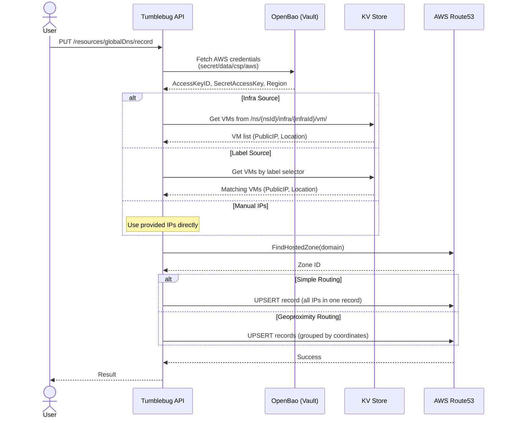
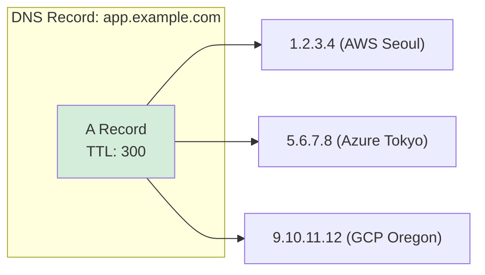
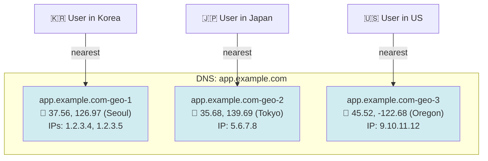

# Global DNS Management

Guide for managing DNS records across multi-cloud infrastructures using AWS Route53. Supports automatic IP resolution from Infra VMs, label-based VM selection, and geoproximity routing for location-aware traffic distribution.

## 📑 Table of Contents

1. [Overview](#overview)
2. [Key Concepts](#key-concepts)
3. [Architecture](#architecture)
4. [Routing Policies](#routing-policies)
5. [Prerequisites](#prerequisites)
6. [API Reference](#api-reference)
7. [Usage Examples](#usage-examples)

---

## Overview

### What is Global DNS Management?

**Global DNS Management** enables users to create, update, query, and delete DNS records in AWS Route53 through a unified CB-Tumblebug API. Instead of manually managing DNS entries, users can point a DNS record at an Infra — Tumblebug automatically resolves VM public IPs and creates the appropriate Route53 records.

### Why Use This Feature?

**Problem:**
- Multi-cloud VMs have dynamic public IPs that change on reprovisioning
- Manually updating DNS records for dozens of VMs across multiple clouds is tedious
- Standard DNS (simple routing) sends all traffic to one region, ignoring user proximity

**Solution:**
- **Infra-Aware DNS**: Automatically resolve public IPs from Infra VMs and create DNS records
- **Label-Based Selection**: Target specific VMs using label selectors (e.g., `role=web`)
- **Geoproximity Routing**: Route users to the nearest VM based on geographic coordinates
- **Bulk Operations**: Delete multiple records in a single API call

---

## Key Concepts

### IP Source Selection

When creating or updating a DNS record, users must choose **exactly one** method to specify the IP addresses:

| Method | Field | Description | Geoproximity Support |
|--------|-------|-------------|---------------------|
| **Infra** | `setBy.infra` | All public IPs from VMs in the specified Infra | ✅ (uses VM location) |
| **Label** | `setBy.label` | Public IPs from VMs matching a label selector | ✅ (uses VM location) |
| **Manual IPs** | `setBy.ips` | User-provided IP addresses | ❌ (no location data) |

### Record Name Resolution

Record names are automatically resolved to FQDNs:

| Input | Domain | Resolved FQDN |
|-------|--------|----------------|
| `app` | `example.com` | `app.example.com` |
| `app.example.com` | `example.com` | `app.example.com` (unchanged) |
| *(empty)* | `example.com` | `example.com` (apex) |

### Namespace Scoping with Labels

When using the Label source with a `nsId`, the system automatically scopes the label query by prepending `sys.namespace=<nsId>` to the label selector. This ensures only VMs in the target namespace are selected.

When using the MapUI with the Infra + Label filter mode, `sys.infraId=<infraId>` is also prepended to scope VMs within the selected Infra.

---

## Architecture

### Overall Flow



### Credential Flow

AWS credentials for Route53 are stored in **OpenBao** (HashiCorp Vault compatible) and fetched at runtime:

```
OpenBao (secret/data/csp/aws)
├── AWS_ACCESS_KEY_ID
├── AWS_SECRET_ACCESS_KEY
└── AWS_DEFAULT_REGION (default: us-east-1)
```

The `VAULT_TOKEN` environment variable must be set for Tumblebug to authenticate with OpenBao.

---

## Routing Policies

### Simple Routing

All resolved IPs are placed into a **single DNS record**. DNS resolvers return all IPs, and clients typically connect to the first one (round-robin at the resolver level).



### Geoproximity Routing

VMs are **grouped by geographic coordinates** (latitude/longitude from `VmInfo.Location`). Each coordinate group becomes a separate Route53 record with a `GeoProximityLocation`, causing Route53 to route users to the nearest endpoint.



**Key Behaviors:**
- VMs at the **same coordinates** (same CSP region) are grouped into one record with multiple IPs
- Coordinates are rounded to **2 decimal places** (Route53 precision limit)
- Each group gets a `SetIdentifier` like `app.example.com-geo-1`, `app.example.com-geo-2`, etc.
- Geoproximity routing requires **Infra or Label** source (manual IPs have no location data)

---

## Prerequisites

1. **AWS Route53 Hosted Zone**: A domain must be registered and a hosted zone created in Route53
2. **OpenBao (Vault)**: AWS credentials stored at `secret/data/csp/aws`
3. **VAULT_TOKEN**: Environment variable set with a valid OpenBao token
4. **VAULT_ADDR**: OpenBao server address (configured in Tumblebug)

### OpenBao Secret Setup

```bash
# Store AWS credentials in OpenBao
export VAULT_ADDR="http://localhost:8200"
export VAULT_TOKEN="your-token"

bao kv put secret/csp/aws \
  AWS_ACCESS_KEY_ID="AKIA..." \
  AWS_SECRET_ACCESS_KEY="wJalr..." \
  AWS_DEFAULT_REGION="us-east-1"
```

---

## API Reference

### List Hosted Zones

List all hosted zones available in Route53.

```
GET /tumblebug/resources/globalDns/hostedZone
```

**Response:**
```json
{
  "hostedZones": [
    {
      "zoneId": "/hostedzone/Z1234567890",
      "name": "example.com.",
      "recordCount": 5
    }
  ]
}
```

### Update (Upsert) DNS Record

Create or update a DNS record.

```
PUT /tumblebug/resources/globalDns/record
```

**Request Body:**
```json
{
  "domainName": "example.com",
  "recordName": "app",
  "recordType": "A",
  "ttl": 300,
  "routingPolicy": "simple",
  "setBy": {
    "infra": {
      "nsId": "default",
      "infraId": "infra-01"
    }
  }
}
```

| Field | Type | Required | Description |
|-------|------|----------|-------------|
| `domainName` | string | ✅ | Route53 hosted zone domain |
| `recordName` | string | | Record name (auto-appends domain if bare name) |
| `recordType` | string | | `A`, `AAAA`, `CNAME`, `TXT` (default: `A`) |
| `ttl` | int | | TTL in seconds (default: `300`) |
| `routingPolicy` | string | | `simple` or `geoproximity` (default: `simple`) |
| `setBy.infra` | object | ①  | `{ nsId, infraId }` |
| `setBy.label` | object | ①  | `{ nsId, labelSelector }` |
| `setBy.ips` | string[] | ①  | Manual IP list |

> ① Exactly one of `infra`, `label`, or `ips` must be provided.

**Response:**
```json
{
  "message": "Successfully updated record app.example.com"
}
```

### Query DNS Records

Retrieve DNS records for a domain.

```
GET /tumblebug/resources/globalDns/record?domainName={domain}&recordName={name}&recordType={type}
```

| Parameter | Type | Required | Description |
|-----------|------|----------|-------------|
| `domainName` | string | ✅ | Domain to query |
| `recordName` | string | | Filter by record name (prefix match) |
| `recordType` | string | | Filter by record type |

**Response:**
```json
{
  "record": [
    {
      "name": "app.example.com.",
      "type": "A",
      "ttl": 300,
      "values": ["1.2.3.4", "5.6.7.8"],
      "setIdentifier": "",
      "routingPolicy": "simple"
    },
    {
      "name": "geo.example.com.",
      "type": "A",
      "ttl": 300,
      "values": ["9.10.11.12"],
      "setIdentifier": "geo.example.com-geo-1",
      "routingPolicy": "geoproximity",
      "geoLatitude": "37.56",
      "geoLongitude": "126.97"
    }
  ]
}
```

### Delete DNS Record

Delete a single DNS record or all records matching a name and type.

```
DELETE /tumblebug/resources/globalDns/record
```

**Request Body:**
```json
{
  "domainName": "example.com",
  "recordName": "app.example.com",
  "recordType": "A",
  "setIdentifier": ""
}
```

| Field | Type | Required | Description |
|-------|------|----------|-------------|
| `domainName` | string | ✅ | Domain name |
| `recordName` | string | ✅ | Record FQDN to delete |
| `recordType` | string | | Record type (default: `A`) |
| `setIdentifier` | string | | Specific record ID (empty = delete all matching) |

### Bulk Delete DNS Records

Delete multiple records in a single request. Records are grouped by domain and submitted as one ChangeBatch per domain.

```
DELETE /tumblebug/resources/globalDns/records
```

**Request Body:**
```json
{
  "records": [
    { "domainName": "example.com", "recordName": "app.example.com", "recordType": "A" },
    { "domainName": "example.com", "recordName": "geo.example.com", "recordType": "A", "setIdentifier": "geo.example.com-geo-1" }
  ]
}
```

**Response:**
```json
{
  "totalRequested": 2,
  "succeeded": 2,
  "failed": 0,
  "results": [
    { "recordName": "app.example.com", "recordType": "A", "success": true, "message": "deleted successfully" },
    { "recordName": "geo.example.com", "recordType": "A", "setIdentifier": "geo.example.com-geo-1", "success": true, "message": "deleted successfully" }
  ]
}
```

---

## Usage Examples

### Example 1: Simple Record from Infra

Point `app.example.com` to all VMs in an Infra with simple round-robin routing:

```bash
curl -X PUT "http://localhost:1323/tumblebug/resources/globalDns/record" \
  -H "Content-Type: application/json" \
  -u default:default \
  -d '{
    "domainName": "example.com",
    "recordName": "app",
    "recordType": "A",
    "ttl": 300,
    "routingPolicy": "simple",
    "setBy": {
      "infra": { "nsId": "default", "infraId": "infra-01" }
    }
  }'
```

### Example 2: Geoproximity Record from Infra

Route users to the nearest VM based on geographic proximity:

```bash
curl -X PUT "http://localhost:1323/tumblebug/resources/globalDns/record" \
  -H "Content-Type: application/json" \
  -u default:default \
  -d '{
    "domainName": "example.com",
    "recordName": "geo",
    "recordType": "A",
    "ttl": 60,
    "routingPolicy": "geoproximity",
    "setBy": {
      "infra": { "nsId": "default", "infraId": "infra-01" }
    }
  }'
```

### Example 3: Record from Label Selector

Create a DNS record for VMs labeled as `role=web`:

```bash
curl -X PUT "http://localhost:1323/tumblebug/resources/globalDns/record" \
  -H "Content-Type: application/json" \
  -u default:default \
  -d '{
    "domainName": "example.com",
    "recordName": "web",
    "recordType": "A",
    "ttl": 300,
    "routingPolicy": "simple",
    "setBy": {
      "label": { "nsId": "default", "labelSelector": "role=web" }
    }
  }'
```

### Example 4: Manual IP Record

Create a DNS record with manually specified IPs:

```bash
curl -X PUT "http://localhost:1323/tumblebug/resources/globalDns/record" \
  -H "Content-Type: application/json" \
  -u default:default \
  -d '{
    "domainName": "example.com",
    "recordName": "static",
    "recordType": "A",
    "ttl": 3600,
    "setBy": {
      "ips": ["1.2.3.4", "5.6.7.8"]
    }
  }'
```

### Example 5: Query Records

```bash
# All records for a domain
curl "http://localhost:1323/tumblebug/resources/globalDns/record?domainName=example.com" \
  -u default:default

# Filter by record name
curl "http://localhost:1323/tumblebug/resources/globalDns/record?domainName=example.com&recordName=app" \
  -u default:default
```

### Example 6: Delete a Specific Geoproximity Record

```bash
curl -X DELETE "http://localhost:1323/tumblebug/resources/globalDns/record" \
  -H "Content-Type: application/json" \
  -u default:default \
  -d '{
    "domainName": "example.com",
    "recordName": "geo.example.com",
    "recordType": "A",
    "setIdentifier": "geo.example.com-geo-1"
  }'
```

### Example 7: Bulk Delete

```bash
curl -X DELETE "http://localhost:1323/tumblebug/resources/globalDns/records" \
  -H "Content-Type: application/json" \
  -u default:default \
  -d '{
    "records": [
      { "domainName": "example.com", "recordName": "app.example.com", "recordType": "A" },
      { "domainName": "example.com", "recordName": "geo.example.com", "recordType": "A", "setIdentifier": "geo.example.com-geo-1" },
      { "domainName": "example.com", "recordName": "geo.example.com", "recordType": "A", "setIdentifier": "geo.example.com-geo-2" }
    ]
  }'
```

---

## Error Handling

The API returns appropriate HTTP status codes based on the error type:

| Status | Condition |
|--------|-----------|
| `400 Bad Request` | Invalid input (missing required fields, multiple IP sources, geoproximity with manual IPs) |
| `404 Not Found` | Hosted zone not found, no matching records, no VMs with public IP |
| `503 Service Unavailable` | `VAULT_TOKEN` not set (OpenBao unavailable) |
| `500 Internal Server Error` | AWS API errors, unexpected failures |
