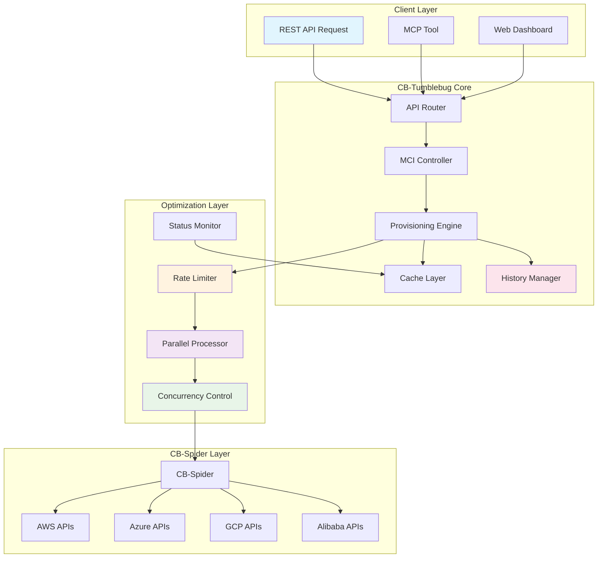
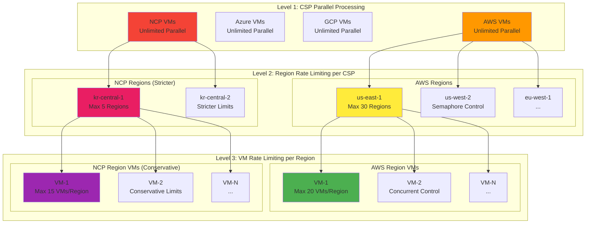
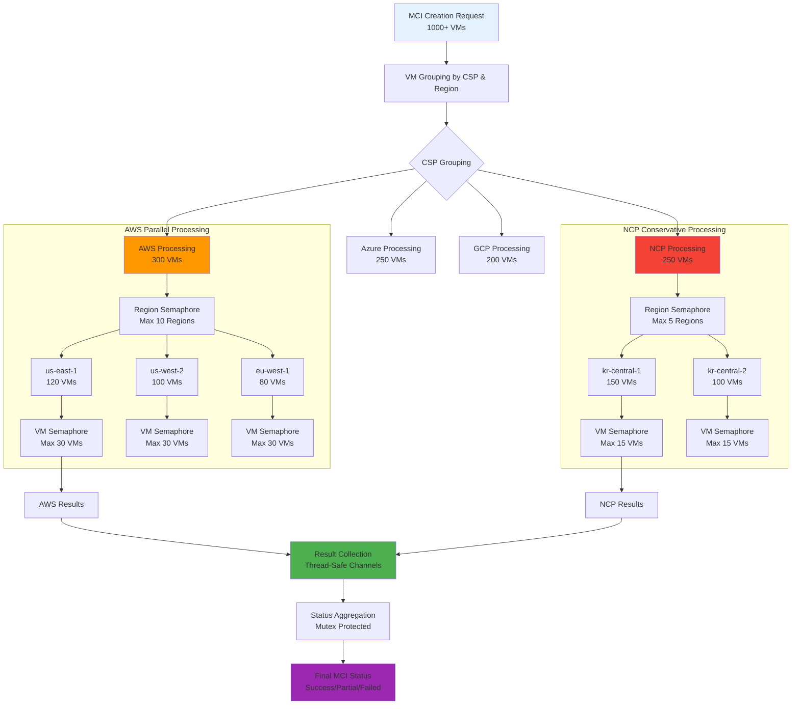
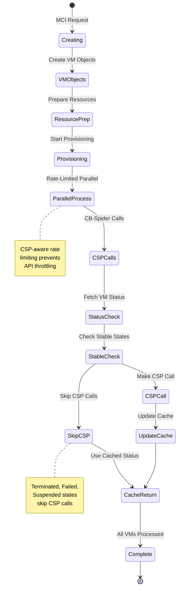
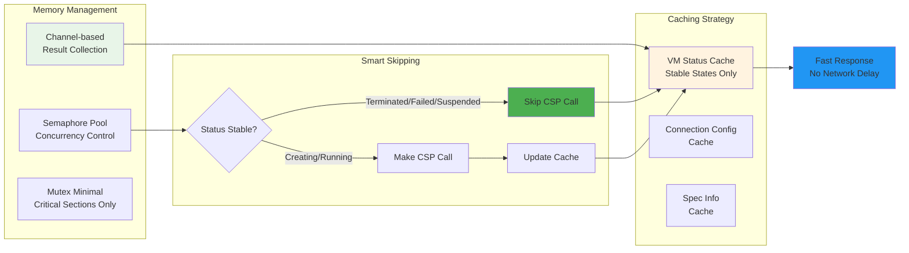
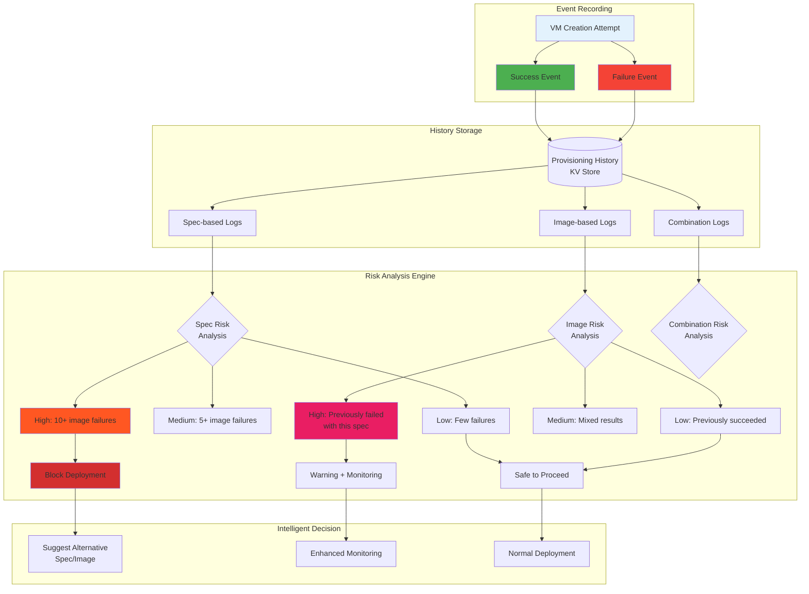
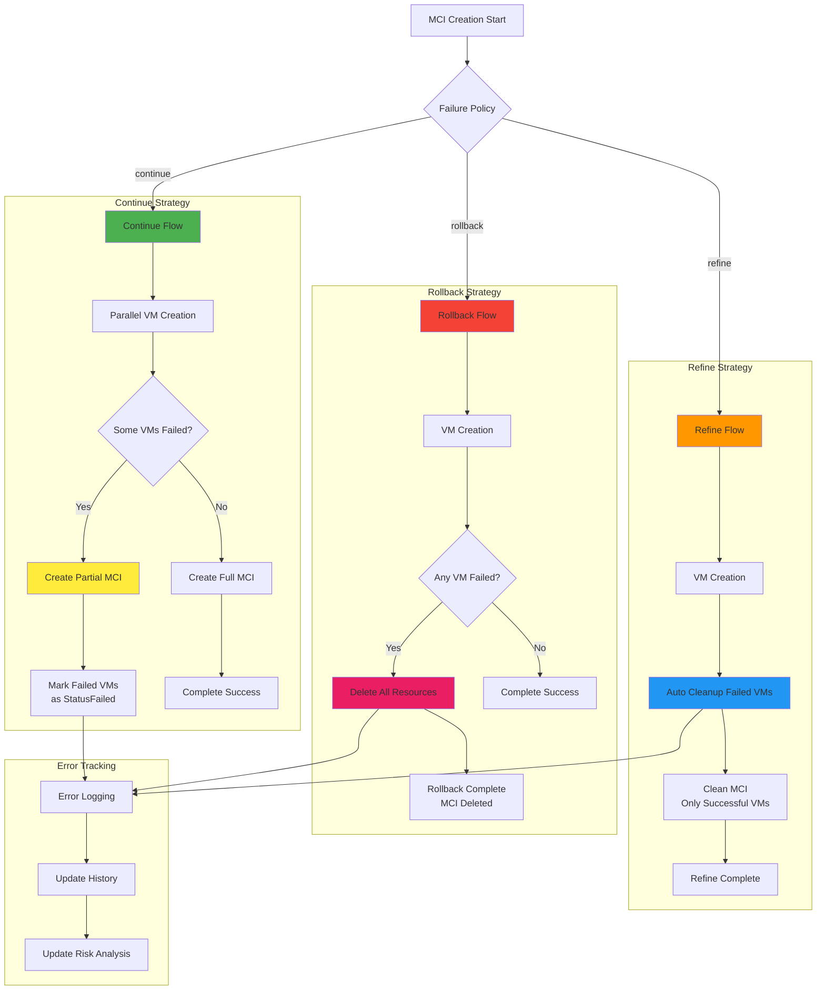
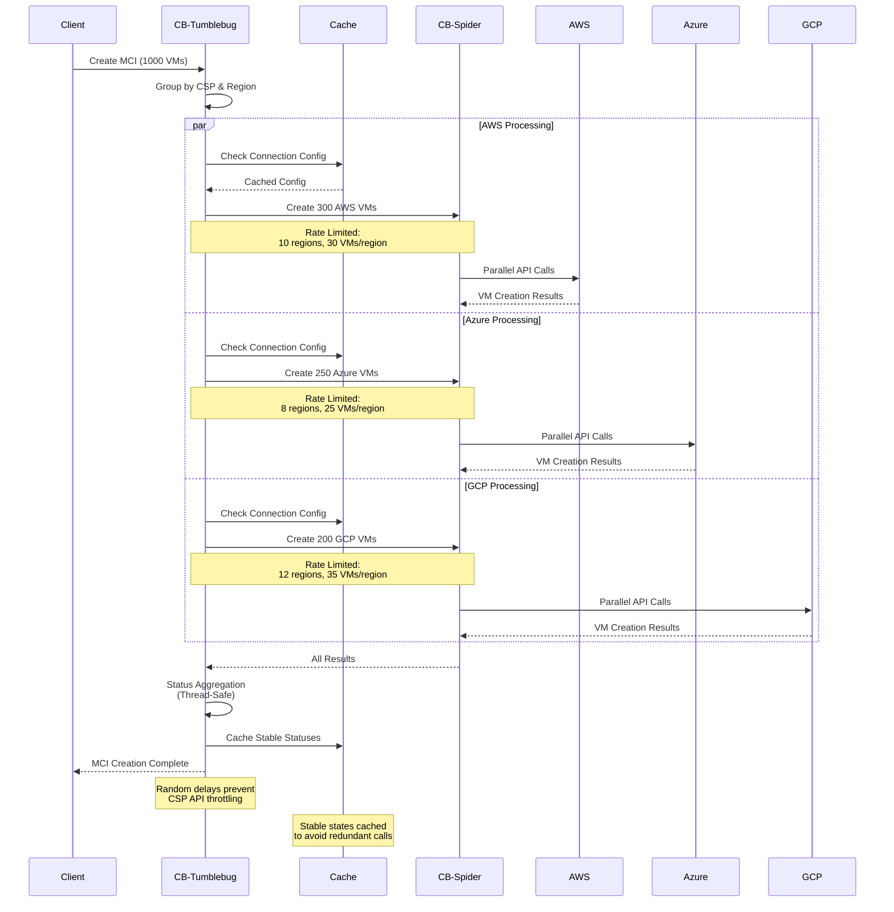
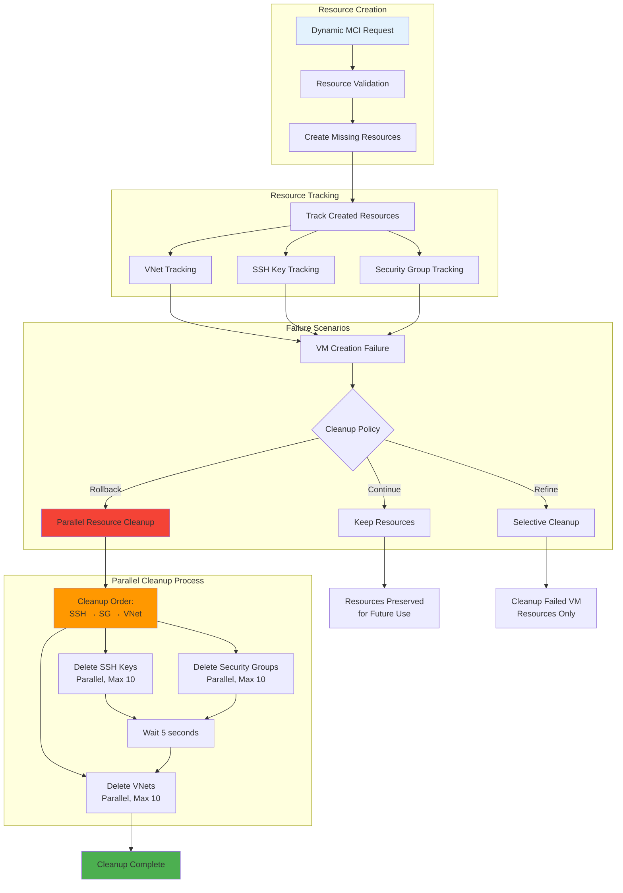

# CB-Tumblebug High-Scale VM Provisioning Architecture

Visually analyzing the advanced architecture and optimization techniques for high-scale VM provisioning in CB-Tumblebug.

## 🏗️ Overall Architecture

This diagram illustrates the high-level architecture of CB-Tumblebug's provisioning system. It separates the core logic from the optimization layer, ensuring that high-scale requests are handled efficiently before reaching the Cloud Service Providers (CSPs) via CB-Spider. Key components include the **MCI Controller**, **Provisioning Engine**, and a dedicated **Optimization Layer** for rate limiting and concurrency control.

## 🚀 Hierarchical Rate Limiting System

To prevent API throttling from CSPs, we implement a **3-level rate limiting system**. This ensures that while we maximize parallelism across different CSPs, we carefully control the request rate within specific regions and for individual VMs, adhering to provider-specific limits (e.g., stricter limits for NCP compared to AWS).

## ⚡ Advanced Parallel Processing Flow

This flow demonstrates how a massive MCI creation request (e.g., 1000+ VMs) is broken down. Requests are grouped by CSP and Region, allowing for **unlimited parallel processing** at the CSP level, while enforcing **semaphores** at the Region and VM levels to maintain stability and prevent resource exhaustion.

## 🎯 Intelligent Status Management

This state diagram shows the lifecycle of a VM status check. The system **intelligently skips CSP API calls** for VMs in stable states (Terminated, Failed, Suspended), significantly reducing unnecessary API traffic and improving overall system responsiveness by utilizing cached statuses.

## 🔄 Advanced Caching & Memory Optimization

We utilize a **multi-layered caching strategy** for connection configurations and VM statuses. Combined with Go's **channel-based concurrency** and minimal mutex usage, this approach minimizes memory footprint and eliminates redundant network operations, ensuring high performance.

## 📈 Provisioning History & Risk Analysis

The system learns from past deployments. By analyzing historical success and failure rates for specific Spec and Image combinations, the **Risk Analysis Engine** can predict potential failures and block or warn users about high-risk configurations before deployment begins, improving overall reliability.

## 🛡️ Failure Handling & Recovery Strategies

When failures occur, the system offers flexible recovery options. **'Continue'** ignores failures and proceeds, **'Rollback'** cleans up everything upon failure, and **'Refine'** allows users to keep successful VMs and only clean up the failed ones for a retry, minimizing downtime.

## 🌐 Network & Connection Optimization

Network overhead is minimized by **caching connection configurations**. Instead of validating credentials and endpoints for every single VM request, the system reuses validated connection info, speeding up the initialization phase of massive deployments.

## 🔧 Resource Management & Cleanup

This flow ensures no resources are orphaned. The system **tracks all dynamically created resources** (VNets, Security Groups, SSH Keys). In case of failure or termination, cleanup is performed in **parallel** to speed up the teardown process.

## 📊 Performance Test Results

We have validated the architecture with large-scale provisioning tests. The following metrics demonstrate the system's capability to handle massive multi-cloud deployments.

| Metric | Value | Note |
| :--- | :---: | :--- |
| **Total VMs** | **1,110** | 🚀 **Massive Scale** |
| **Regions Used** | **53** | 🌍 **Global Distribution** |
| CSPs Used | 8 | Multi-Cloud Coverage |
| MCIs Running | 4 | Concurrent Operations |

> The successful provisioning of **1,110 VMs** across **53 regions** validates the stability of the hierarchical rate limiting and parallel processing mechanisms.

 

## 🎯 Key Optimization Benefits

### Performance Improvements
- **3-Level Rate Limiting**: Prevent API throttling with hierarchical control (CSP → Region → VM).
- **Smart Status Caching**: Eliminate unnecessary CSP calls for stable VMs (30-50% call reduction).
- **Parallel Processing**: Optimal performance with unlimited parallelization per CSP and limited parallelization per Region/VM.

### Reliability Enhancements
- **Failure History Analysis**: Risk prediction and blocking based on historical failure data.
- **Intelligent Recovery**: Flexible failure handling with Continue/Rollback/Refine policies.
- **Resource Tracking**: Complete rollback support by tracking dynamically created resources.

### Scalability Features
- **CSP-Aware Rate Limits**: Differentiated limits (e.g., NCP: 5 regions, 15 VMs vs AWS: 30 regions, 20 VMs).
- **Memory Optimization**: Memory efficiency with Channel-based result collection and minimal mutex usage.
- **Connection Pooling**: Minimize network overhead with connection config caching.

Through these optimization techniques, we have implemented an enterprise-grade multi-cloud infrastructure provisioning system capable of **stably and efficiently managing MCIs with thousands of VMs**.