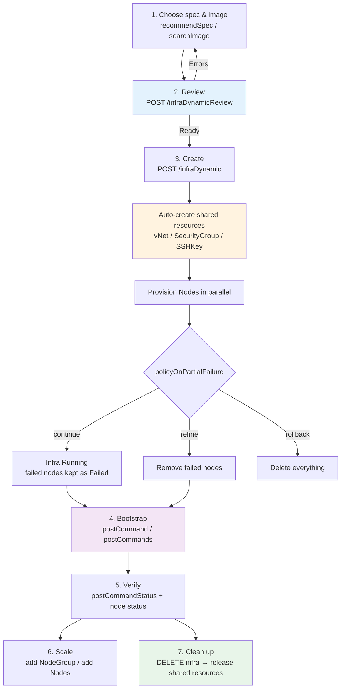

# Infra Provisioning

This document is the end-to-end guide for **creating infrastructure** with CB-Tumblebug:
what a provisioning request contains, what gets created automatically, how nodes are
bootstrapped with post-deployment commands, and how to verify, scale, and clean up.

It ties together the topics covered in depth elsewhere:
[Spec & Image Recommendation](spec-image-recommendation.md) (choosing what to run),
[Resource Templates](resource-template-management.md) (reusable network/SG intents),
[Shared Resources](shared-resource-management.md) (what is auto-created),
[Infra Resource Model & Lifecycle](infra-resource-model-and-lifecycle-management.md)
(status and control after creation), and
[Remote Command & File Transfer](remote-command-and-file-transfer.md)
(the execution engine reused by post-deployment commands).

## 🗺️ The Provisioning Flow



**Design principle:** the request is *declarative and CSP-agnostic*. You describe
node groups (spec + image + size); CB-Tumblebug resolves connections, creates the
network prerequisites, provisions in parallel, and reports a single aggregated status.

## 📦 The Request

`POST /tumblebug/ns/{nsId}/infraDynamic`

```jsonc
{
  "name": "web-cluster",
  "description": "Front tier",
  "policyOnPartialFailure": "continue",   // continue (default) | refine | rollback
  "nodeGroups": [
    {
      "name": "web",                       // NodeGroup id prefix → nodes become web-1, web-2, ...
      "specId": "aws+ap-northeast-2+t3a.medium",
      "imageId": "ami-0abc...",            // omit to let the server pick a matching basic image
      "nodeGroupSize": 3,
      "label": { "role": "web", "tier": "front" },
      "rootDiskType": "default",
      "rootDiskSize": 0                    // 0 = CSP default
    }
  ]
}
```

| Field | Meaning |
|---|---|
| `nodeGroups[]` | One entry per (spec, image) combination; `nodeGroupSize` nodes are created per entry |
| `specId` | From [`recommendSpec`](spec-image-recommendation.md) — never hand-crafted |
| `imageId` | From [`searchImage`](spec-image-recommendation.md); must match the spec's provider/region |
| `label` | Free-form key/value applied to every node of the group — the basis of `labelSelector` targeting later |
| `policyOnPartialFailure` | What to do when some nodes fail (see below) |
| `vNetTemplateId` / `sgTemplateId` | Apply a [resource template](resource-template-management.md) instead of the built-in defaults |

### Partial-failure policy

| Value | Behavior | When to use |
|---|---|---|
| `continue` (default) | Keep successful nodes; failed ones stay in `Failed` state | Best-effort capacity; fix later with `refine` |
| `refine` | Automatically remove failed nodes after creation | You want a clean Infra with whatever succeeded |
| `rollback` | Delete the whole Infra if any node fails | All-or-nothing deployments |

### Review before creating

`POST /tumblebug/ns/{nsId}/infraDynamicReview` accepts the **same body** and returns a
per-node-group verdict (`Ready` / `Error`), the resolved connections, and an estimated
hourly cost — without provisioning anything. Doing this first turns most provisioning
failures (unavailable spec, spec/image mismatch, quota-prone regions) into an
up-front error message.

### Hold option

`POST .../infraDynamic?option=hold` creates the Infra object and its shared resources
but stops before provisioning nodes, letting you inspect the plan. Continue with
`GET .../control/infra/{infraId}?action=continue` or abandon with `action=withdraw`.

## 🏗️ What Gets Created Automatically

You never have to pre-create networking. On first use of a connection in a namespace,
CB-Tumblebug creates:

| Resource | Default name | Notes |
|---|---|---|
| **vNet + Subnet** | `{nsId}-shared-{connectionName}` | CIDR auto-allocated; reused by later Infras |
| **SecurityGroup** | `{infraId}-{nodeGroupName}` | Per NodeGroup; **SSH (22) inbound only** by default |
| **SSHKey** | `{infraId}-{connectionName}` | Private key downloadable from the Infra |

Two consequences worth knowing:

1. **Service ports are closed by default.** After installing a web server you must open
   the port explicitly:
   ```
   POST /tumblebug/ns/{nsId}/resources/securityGroup/{sgId}/rules
   { "firewallRules": [ { "Ports": "80,443", "Protocol": "TCP", "Direction": "inbound", "CIDR": "0.0.0.0/0" } ] }
   ```
2. **Shared resources outlive the Infra.** Deleting an Infra does not release them —
   see [Shared Resource Management](shared-resource-management.md).

## 🏷️ Labels: Provisioning-time Investment for Later Targeting

Labels set in `nodeGroups[].label` are copied to every node and merged with system
labels (`sys.infraId`, `sys.nodeGroupId`, ...). They become the addressing mechanism for
everything that follows:

```bash
# Run a command only on workers
POST /ns/{nsId}/cmd/infra/{infraId}?labelSelector=role=worker

# Bootstrap only the control plane during creation (see postCommands below)
"postCommands": [ { "command": ["..."], "labelSelector": "role=control" } ]
```

Keep the label scheme consistent across NodeGroups (`role`, `tier`, `env`) — it pays off
when you later add NodeGroups or run targeted operations.

## 🚀 Post-deployment Commands (Bootstrap)

Post-deployment commands turn provisioned nodes into a working system. They run through
the same engine as [Remote Command](remote-command-and-file-transfer.md) — bastion
routing, TOFU host-key verification, per-node parallelism, `$$Func()` placeholders, and
command-status history all apply.

`postCommands[]` is the single entry point: it holds **phases** that run
**sequentially**, each with its own target. A simple "run these commands everywhere"
request is just one phase.

### Single phase (simple case)

```jsonc
"postCommands": [
  {
    "command": ["sudo apt-get update", "sudo apt-get install -y nginx"],
    "timeoutMinutes": 10,
    "labelSelector": "role=web"     // optional target; default = all nodes
  }
]
```

### Ordered phases (multi-step bootstrap)

Multiple phases give the control-plane-then-worker shape:

```jsonc
"postCommands": [
  { "command": ["k8s-control-plane-setup.sh"], "nodeGroupId": "control", "timeoutMinutes": 15 },
  { "command": ["k8s-worker-join.sh"],         "labelSelector": "role=worker",
    "continueOnError": false }                  // default: a failed phase skips the rest
]
```

| Field | Meaning |
|---|---|
| `command[]` | Commands executed in order on each target node |
| `nodeGroupId` / `nodeId` / `labelSelector` | Target scope — **at most one** per phase; omitted = all nodes |
| `timeoutMinutes` | Budget for that phase (default 30; the sum across phases must stay ≤ 120) |
| `continueOnError` | `true` keeps running later phases after this one fails |
| `userName` | Leave **empty** so each node uses its own verified SSH user (mixed images just work) |

The request is rejected with a 400 if a phase sets more than one target, if a phase has
no command, or if the cumulative timeout exceeds the budget.

### Synchronous vs Asynchronous

Nodes bill from the moment they are `Running`, and a long bootstrap can outlive client
or proxy timeouts. Therefore **asynchronous execution is recommended**:

```jsonc
"postCommandAsync": true
```

| | Synchronous (default) | Asynchronous |
|---|---|---|
| Response returns | after bootstrap finishes | as soon as nodes are provisioned |
| `postCommandStatus` in response | terminal (`Completed` / ...) | **`Running`** |
| `postCommandResults` | already filled | filled as phases complete |
| `postCommandRequestId` | present (for history/replay) | present (for live streaming) |

The response shape is identical in both modes — `postCommandStatus` is the only
discriminator, so clients need no mode-specific parsing.

The background run is detached from the request: a disconnecting client no longer
cancels the bootstrap.

### Watching progress

```bash
# Live stream (Server-Sent Events): CommandStatus → CommandLog → CommandDone
GET /tumblebug/ns/{nsId}/stream/cmd/infra/{infraId}?xRequestId={postCommandRequestId}

# Or poll the Infra object until the status becomes terminal
GET /tumblebug/ns/{nsId}/infra/{infraId}
```

### Interpreting the result

```jsonc
{
  "status": "Running:3 (R:3/3)",              // node status — independent of bootstrap
  "postCommandStatus": "CompletedWithErrors",
  "postCommandRequestId": "pc-web-cluster-tb1a2b3c",
  "postCommandResults": [
    { "phase": 1, "target": "nodeGroupId=control", "status": "Completed", "results": { "results": [ ... ] } },
    { "phase": 2, "target": "labelSelector=role=worker", "status": "Failed",
      "results": { "results": [ { "nodeId": "worker-1", "error": "Process exited with status 7" } ] } },
    { "phase": 3, "target": "all nodes", "status": "Skipped" }
  ]
}
```

| `postCommandStatus` | Meaning | Typical action |
|---|---|---|
| `None` | No post-deployment command was requested | — |
| `Running` | Still executing (async) | Stream or poll |
| `Completed` | All target nodes succeeded | Proceed |
| `CompletedWithErrors` | Some nodes failed | Inspect per-node `error`, re-run on those nodes |
| `Failed` | All targeted nodes failed, or execution could not start | Check SSH/user/image assumptions |
| `Skipped` (per phase) | An earlier phase failed with `continueOnError: false` | Fix the earlier phase first |

**Infra creation success and bootstrap success are separate signals.** Nodes can be
`Running` while the bootstrap failed; that is why the status field exists and why
per-node error strings are surfaced in the API response.

### Practical notes

- **SSH readiness gate.** Before the first phase, the server polls SSH reachability
  (bounded) instead of sleeping a fixed interval, which removes most cloud-init races
  on freshly created nodes. Genuine auth/config errors are still reported per node.
- **Timeouts are per phase.** For finer granularity, split work into more phases.
- **Failures are recorded.** Every run appears in the per-node command status history and
  can be re-inspected with the `postCommandRequestId`.
- **Re-running.** Bootstrap is not automatically retried; re-run the failed part with
  `POST /ns/{nsId}/cmd/infra/{infraId}` targeting the affected nodes.

## 📈 Scaling an Existing Infra

Two different operations, often confused:

| Goal | API | Notes |
|---|---|---|
| **Add a new NodeGroup** (different spec/image/labels) | `POST /ns/{nsId}/infra/{infraId}/nodeGroupDynamic` | Supports `label`, `postCommands` (scoped to the new group by default), and `postCommandAsync` |
| **Add nodes to an existing NodeGroup** | `POST /ns/{nsId}/infra/{infraId}/nodegroup/{nodegroupId}` with `{"numNodesToAdd": N}` | Same spec/image as the group; no bootstrap fields |

Adding a NodeGroup has its own review endpoint (`.../nodeGroupDynamicReview`) with the
same semantics as `infraDynamicReview`.

```jsonc
// Add GPU workers and bootstrap only them
{
  "name": "worker-gpu",
  "specId": "aws+us-east-1+g4dn.xlarge",
  "imageId": "ami-0abc...",
  "nodeGroupSize": 2,
  "label": { "role": "worker", "accelerator": "gpu" },
  "postCommands": [ { "command": ["curl -fsSL https://.../worker-setup.sh | bash"] } ],
  "postCommandAsync": true
}
```

## ✅ Verifying a Deployment

```bash
# Aggregated node status (Running:3 (R:3/3), Partial-Failed:1 (R:2/3), ...)
GET /tumblebug/ns/{nsId}/infra/{infraId}?option=status

# Access information (public/private IPs, SSH ports, per NodeGroup)
GET /tumblebug/ns/{nsId}/infra/{infraId}?option=accessinfo

# Bootstrap outcome
GET /tumblebug/ns/{nsId}/infra/{infraId}     # → postCommandStatus / postCommandResults
```

See [Infra Resource Model & Lifecycle](infra-resource-model-and-lifecycle-management.md)
for the full status vocabulary and control actions (`suspend`, `resume`, `reboot`,
`refine`, `terminate`).

## 🧹 Cleaning Up

```bash
# 1. Terminate nodes and delete the Infra (recommended)
DELETE /tumblebug/ns/{nsId}/infra/{infraId}?option=terminate

# 2. Optionally release the shared network resources of the namespace
DELETE /tumblebug/ns/{nsId}/sharedResources
```

> ⚠️ **Avoid `option=force`.** It deletes CB-Tumblebug records **without confirming CSP
> termination**, leaving orphaned instances that keep billing and block vNet/SecurityGroup
> deletion with `DependencyViolation`. It exists only for infra stuck in an
> undeletable state. When used, the response now includes a `[WARNING]` line listing the
> nodes that may remain; verify with `POST /tumblebug/inspectResources` and see
> [Shared Resource Management](shared-resource-management.md) for recovery.

If termination is still in progress, the delete call reports that and you should simply
retry a few minutes later rather than forcing.

## 🍳 Recipes

### 1. Web servers, ports opened, verified

```jsonc
// 1) create + bootstrap asynchronously
POST /ns/default/infraDynamic
{
  "name": "web-sv",
  "nodeGroups": [ { "name": "web", "specId": "aws+us-west-1+t3a.medium",
                    "imageId": "ami-0abc...", "nodeGroupSize": 3, "label": { "role": "web" } } ],
  "postCommandAsync": true,
  "postCommands": [ { "command": [
      "sudo apt-get update -qq && sudo DEBIAN_FRONTEND=noninteractive apt-get install -y -qq nginx",
      "echo \"<h1>$(hostname)</h1>\" | sudo tee /var/www/html/index.html >/dev/null && sudo systemctl enable --now nginx" ] } ]
}
// 2) watch: GET /ns/default/stream/cmd/infra/web-sv?xRequestId={postCommandRequestId}
// 3) open the port: POST /ns/default/resources/securityGroup/web-sv-web/rules  { Ports: "80", ... }
```

### 2. Kubernetes: control plane first, then workers

```jsonc
"postCommands": [
  { "command": ["curl -fsSL .../k8s-control-plane-setup.sh | bash"],
    "nodeGroupId": "control", "timeoutMinutes": 20 },
  { "command": ["curl -fsSL .../k8s-worker-setup.sh | bash -s -- --join '<JOIN_CMD>'"],
    "labelSelector": "role=worker", "timeoutMinutes": 20 }
]
```
Phase 2 runs only after phase 1 succeeds; if phase 1 fails, phase 2 is marked `Skipped`.

### 3. Bake a custom image

Provisioning + bootstrap + snapshot is automated by the
[Cloud-Agnostic Image](cloud-agnostic-image.md) workflow. There, post-deployment
commands run **synchronously** (the bootstrap result must be known before snapshotting),
and `policyOnPostCommandFailure` decides whether a failed bootstrap aborts the build.

## 📋 API Summary

| Purpose | Endpoint |
|---|---|
| Review a provisioning request | `POST /tumblebug/ns/{nsId}/infraDynamicReview` |
| Create an Infra | `POST /tumblebug/ns/{nsId}/infraDynamic[?option=hold]` |
| Add a NodeGroup | `POST /tumblebug/ns/{nsId}/infra/{infraId}/nodeGroupDynamic` |
| Review a NodeGroup addition | `POST /tumblebug/ns/{nsId}/infra/{infraId}/nodeGroupDynamicReview` |
| Add nodes to a NodeGroup | `POST /tumblebug/ns/{nsId}/infra/{infraId}/nodegroup/{nodegroupId}` |
| Stream bootstrap progress | `GET /tumblebug/ns/{nsId}/stream/cmd/infra/{infraId}?xRequestId={id}` |
| Open service ports | `POST /tumblebug/ns/{nsId}/resources/securityGroup/{sgId}/rules` |
| Delete an Infra | `DELETE /tumblebug/ns/{nsId}/infra/{infraId}?option=terminate` |
| Release shared resources | `DELETE /tumblebug/ns/{nsId}/sharedResources` |
