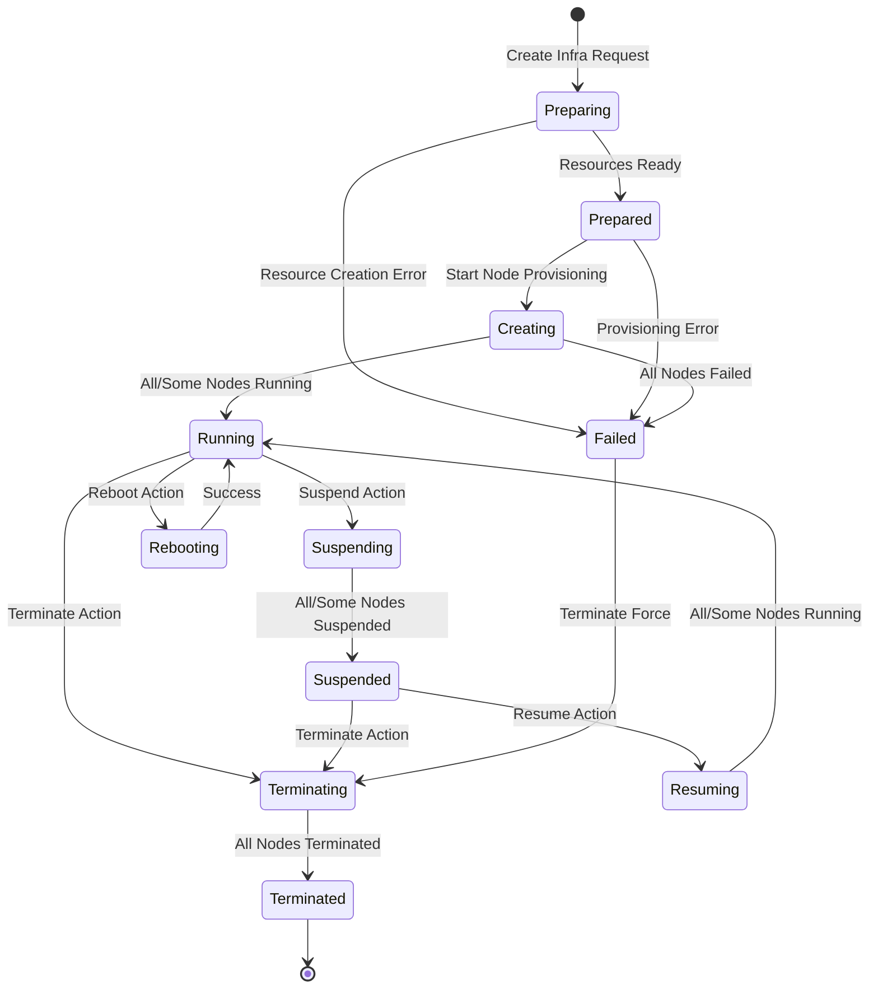
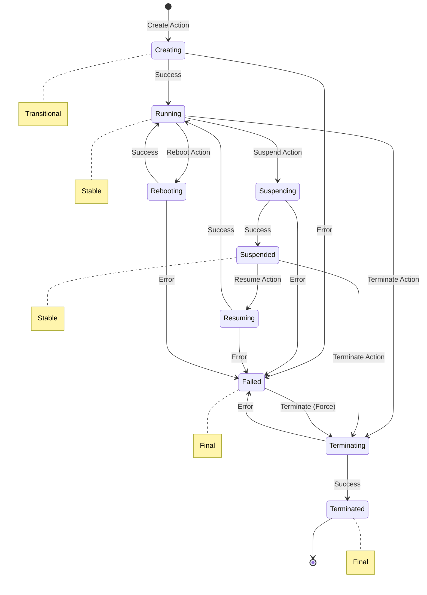
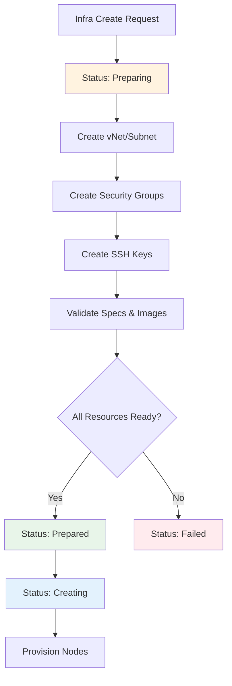
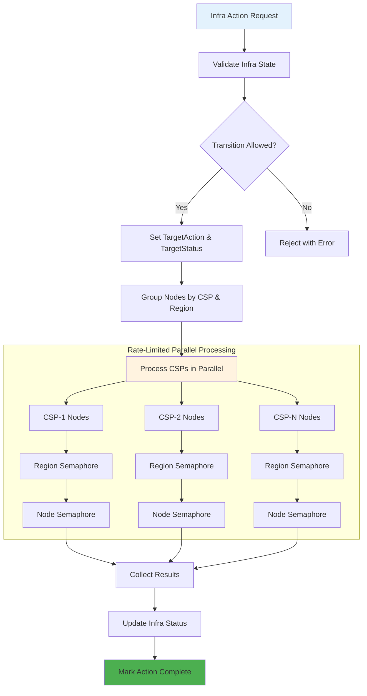
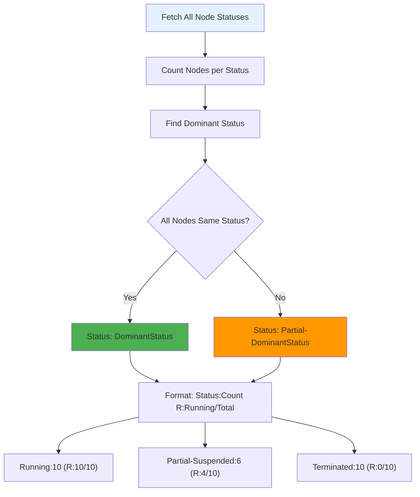
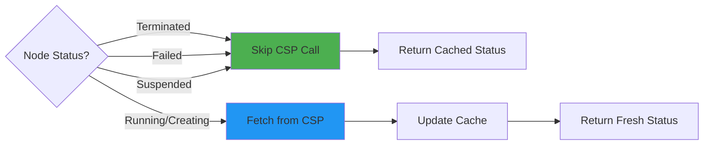
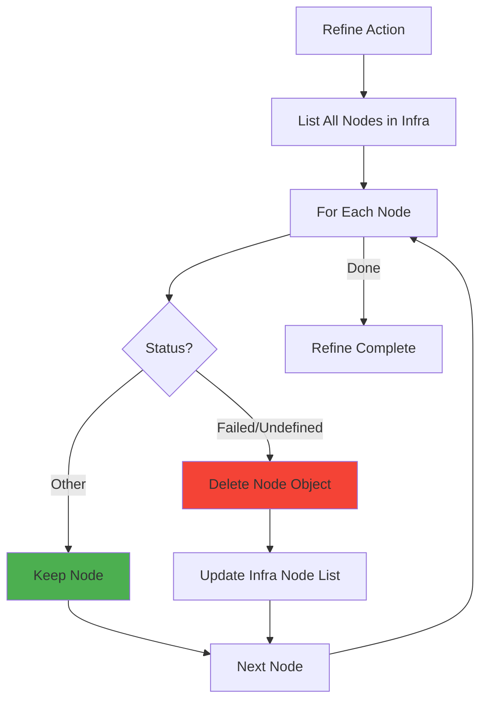
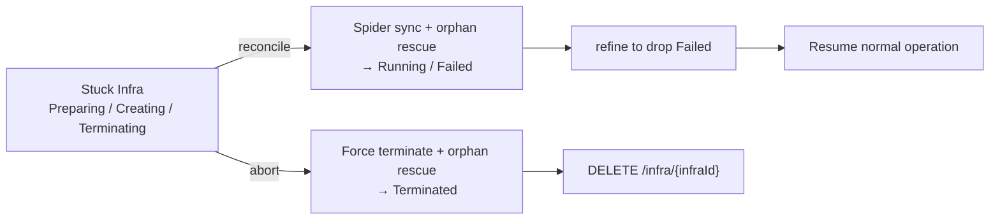

# Infra Resource Model and Lifecycle Management

This document provides a comprehensive guide to the **Infra** resource model in CB-Tumblebug, including the conceptual structure and terminology of **Infra**, **NodeGroup**, and **Node**, as well as their lifecycle management. It covers the resource hierarchy, naming rationale, state transitions, control actions, status management, and internal mechanisms.

## 🔑 Key Concepts and Terminology

### Why the Terminology Change

CB-Tumblebug originally used the terms **MCI** (Multi-Cloud Infrastructure), **SubGroup**, and **VM** for its core abstractions.
These were renamed to **Infra**, **NodeGroup**, and **Node** for the following reasons:

| Old Term | New Term | Reason for Change |
|----------|----------|-------------------|
| MCI | **Infra** | "MCI" was an acronym that required explanation every time. "Infra" is self-descriptive and universally understood. |
| SubGroup | **NodeGroup** | "SubGroup" was vague. "NodeGroup" clearly describes a group of homogeneous Nodes. It also aligns with Kubernetes `NodeGroup` semantics, preparing for future Kubernetes integration. |
| VM | **Node** | "VM" is implementation-specific (virtual machine). "Node" is a more general server instance abstraction that can represent a VM today and can be extended to bare-metal servers or other compute forms over time. The API uses "Node" for user-facing interactions, while the internal implementation still deals with VMs through CSP drivers. |

> **Note on internal implementation:** Within the codebase, `vm` is still used in some internal identifiers (e.g., KV store keys, CSP driver interfaces) to maintain backward compatibility with the storage layer and CB-Spider driver interfaces.

### Resource Hierarchy

CB-Tumblebug organizes multi-cloud compute resources in a clear hierarchy. For server workloads, an implicit Cluster view may also be derived inside an Infra when multiple NodeGroups share the same network boundary.

```
Namespace
└── Infra (server infra, multi-CSP)
    ├── Cluster-1 (implicit, vNet-1)
    │   ├── NodeGroup-A (AWS ap-northeast-2)
    │   │   ├── Node-A1 (VM instance)
    │   │   ├── Node-A2 (VM instance)
    │   │   └── Node-A3 (VM instance)
    │   └── NodeGroup-B (AWS ap-northeast-2)
    │       ├── Node-B1 (bare-metal instance)
    │       └── Node-B2 (bare-metal instance)
    └── Cluster-2 (implicit, vNet-2)
        └── NodeGroup-C (GCP asia-northeast3)
            └── Node-C1 (VM instance)
Namespace
└── Infra (server infra, single-CSP)
    └── Cluster-1 (implicit, vNet-1)
        └── NodeGroup-A (AWS, migrated-app)
            ├── Node-A1
            └── Node-A2            
```

### What is Infra?

**Infra** is a logical unit that groups multiple compute Nodes deployed across different Cloud Service Providers (CSPs) into a single manageable entity. An Infra can contain Nodes from AWS, Azure, GCP, Alibaba, and other clouds simultaneously.

- **API Path:** `/ns/{nsId}/infra/{infraId}`
- **Go Type:** `InfraInfo`

### What is a NodeGroup?

A **NodeGroup** is a logical grouping of homogeneous Nodes within an Infra. Nodes in the same NodeGroup share identical configurations (same spec, image, region, etc.) and are typically scaled together.

- **API Path:** `/ns/{nsId}/infra/{infraId}/nodegroup/{nodegroupId}`
- **Go Type:** `NodeGroupInfo`

The name "NodeGroup" is intentionally aligned with the Kubernetes NodeGroup concept, although CB-Tumblebug NodeGroups currently manage VMs rather than Kubernetes worker nodes.

### What is a Node?

A **Node** is an individual compute unit within an Infra. Conceptually, a Node means a **server instance** that a cloud or infrastructure provider can allocate and manage for you.

Examples of a Node include:

- a virtual machine instance
- a bare-metal server instance
- other server-style compute resources that may be supported in the future

In the current CB-Tumblebug implementation, most Nodes are provisioned as virtual machines through CSP drivers. However, the user-facing `Node` abstraction is intentionally broader than `VM` so the model can expand without renaming the core resource again.

- **API Path:** `/ns/{nsId}/infra/{infraId}/node/{nodeId}`
- **Go Type:** `NodeInfo`

### Cluster (Implicit Server Workload View)

For **server workloads** managed through `Infra` and `NodeGroup` resources, CB-Tumblebug now provides an implicit **Cluster** view inside an Infra. This is separate from the existing Kubernetes cluster resource (`/k8sCluster`) and is intended for VM-based or general server workloads rather than Kubernetes workloads.

**Cluster** is not explicitly created by the user. Instead, it is synthesized at query time from the Infra topology, primarily by grouping NodeGroups and Nodes that share the same network boundary (for example, the same `vNet`).

- A Cluster exists **within** an Infra, not above it
- Clusters are **not separately created or persisted**
- Clusters are synthesized dynamically when Infra or Cluster information is queried
- For the current implementation, the primary grouping key is shared `vNet`
- This complements the existing Kubernetes cluster model by providing a parallel abstraction for non-Kubernetes server workloads

```
Namespace
└── Infra (server infra)
    ├── Cluster-1 (implicit, vNet-1)
    │   ├── NodeGroup-A (AWS, app)
    │   │   ├── Node-A1
    │   │   └── Node-A2
    │   └── NodeGroup-B (AWS, batch)
    │       ├── Node-B1
    │       └── Node-B2
    └── Cluster-2 (implicit, vNet-2)
        └── NodeGroup-C (Azure, db)
            └── Node-C1
```

In this model, NodeGroups that share a vNet (or equivalent network boundary) implicitly form a Cluster. The cluster boundary is determined by the underlying network topology, not by explicit user declaration.

#### Unified Resource Hierarchy: Infra vs Multi-K8s Cluster

CB-Tumblebug provides two parallel top-level abstractions for different workload types, aligned for conceptual consistency:

```
Namespace
└── Infra (server infra, multi-CSP)
    ├── Cluster-1 (implicit, vNet-1)
    │   ├── NodeGroup-A (AWS, app)
    │   │   ├── Node-A1
    │   │   └── Node-A2
    │   └── NodeGroup-B (AWS, batch)
    │       ├── Node-B1
    │       └── Node-B2
    └── Cluster-2 (implicit, vNet-2)
        └── NodeGroup-C (Azure, db)
            └── Node-C1

Namespace
└── Multi-K8s Cluster (container infra)
    ├── K8s Cluster-1 (AWS EKS)
    │   ├── K8s NodeGroup-A
    │   │   ├── Worker Node A1
    │   │   └── Worker Node A2
    │   └── K8s NodeGroup-B
    │       └── Worker Node B1
    └── K8s Cluster-2 (Azure AKS)
        └── K8s NodeGroup-C
            └── Worker Node C1
```

**Key alignment points:**
- Both **Infra** and **Multi-K8s Cluster** are top-level resource groups within a Namespace
- Both contain **Cluster** as an organizing layer (implicit for Infra, explicit for Multi-K8s Cluster)
- Both use **NodeGroup** for homogeneous resource grouping
- **Node** represents a compute unit (VM for Infra, worker node for K8s clusters)

> **Note on terminology:** The term "Multi-K8s Cluster" may be renamed to **"Infra"** in future versions to provide a more consistent naming scheme. This change would clarify that both server workloads and container workloads are managed under the same unified "Infra" concept.

#### Cluster Query APIs

The implicit Cluster view in an Infra can be queried through the following APIs:

- `GET /ns/{nsId}/infra/{infraId}/cluster`
- `GET /ns/{nsId}/infra/{infraId}/cluster/{clusterId}`

In addition, Infra detail responses may include the synthesized cluster view as part of `InfraInfo`.

> The naming alignment (Node, NodeGroup, Cluster) between VM-based Infra and Kubernetes resources is intentional, providing a consistent mental model regardless of the underlying compute type.

> **Note on Infra flexibility:** Infra can represent infrastructure within a single CSP (e.g., cloud migration from on-premise to AWS) or span multiple CSPs simultaneously (e.g., geographic distribution across AWS, Azure, and GCP). In single-CSP scenarios, the unified "Infra" terminology eliminates the ambiguity of the legacy "MCI" term.

## 📊 Status Constants

### Infra Status

The following statuses represent the current state of an Infra:


| Status | Description | Stable? |
|--------|-------------|---------|
| `Preparing` | Infra resources are being prepared (vNet, SecurityGroup, SSH Key) | No (Transitional) |
| `Prepared` | Infra resources are prepared, ready for Node provisioning | No (Transitional) |
| `Creating` | Nodes are being provisioned | No (Transitional) |
| `Running` | All Nodes are running | Yes |
| `Suspending` | Nodes are being suspended | No (Transitional) |
| `Suspended` | All Nodes are suspended | Yes |
| `Resuming` | Nodes are being resumed | No (Transitional) |
| `Rebooting` | Nodes are being rebooted | No (Transitional) |
| `Terminating` | Nodes are being terminated | No (Transitional) |
| `Terminated` | All Nodes are terminated | Yes (Final) |
| `Failed` | Infra creation failed | Yes (Final) |
| `Undefined` | Infra status cannot be determined | Yes |
| `Partial-*` | Mixed Node states (e.g., `Partial-Running`, `Partial-Suspended`) | Yes |

### Node Status

The following statuses represent the current state of a Node:

| Status | Description | Stable? |
|--------|-------------|---------|
| `Creating` | Node is being provisioned | No (Transitional) |
| `Running` | Node is running and accessible | Yes |
| `Suspending` | Node is being suspended | No (Transitional) |
| `Suspended` | Node is suspended (stopped) | Yes |
| `Resuming` | Node is being resumed from suspended state | No (Transitional) |
| `Rebooting` | Node is being rebooted | No (Transitional) |
| `Terminating` | Node is being terminated | No (Transitional) |
| `Terminated` | Node has been terminated | Yes (Final) |
| `Failed` | Node creation or operation failed | Yes (Final) |
| `Undefined` | Node status cannot be determined | Yes |

### Action Constants

Actions that can be performed on Infra/Node. They fall into three groups by purpose.

**Lifecycle (normal operation):**

| Action | Description | Target Status |
|--------|-------------|---------------|
| `Create` | Create new Node(s) | Running |
| `Suspend` | Stop Node(s) without termination | Suspended |
| `Resume` | Start suspended Node(s) | Running |
| `Reboot` | Restart Node(s) | Running |
| `Terminate` | Permanently delete Node(s) | Terminated |
| `Refine` | Remove Nodes whose status is `Failed` or `Undefined` from Infra metadata. **No CSP-side termination** is issued for those Nodes. | - |

**Hold gate (only valid right after `POST /infra` with `option=hold`):**

| Action | Description |
|--------|-------------|
| `Continue` | Signal the in-memory holding goroutine to **proceed** with provisioning. |
| `Withdraw` | Signal the in-memory holding goroutine to **cancel** provisioning. |

> Hold-gate actions only work while the holding goroutine is alive in memory. After a server restart they will fail — use the crash-recovery actions below instead.

**Crash recovery (Infra stuck after server restart or partial failure):**

| Action | Description |
|--------|-------------|
| `Reconcile` | **Forward** recovery. For each transient Node, query Spider for the real CSP status and absorb CSP-side orphan VMs (created before the crash but not recorded in TB). Nodes that cannot be matched on the CSP are marked `Failed` so a subsequent `refine` can remove them. **No new Spider create calls are issued.** |
| `Abort` | **Backward** recovery. Force-terminate every non-final Node in parallel (with orphan rescue), then sweep any `Failed` remnants via `refine`. The final `DELETE` call is left to the operator. |

## 🔄 State Transition Diagram

### Infra State Transitions

Infra follows a multi-phase lifecycle: **Preparation → Provisioning → Operation → Termination**

> **Note:** Most statuses can have a `Partial-` prefix (e.g., `Partial-Running`) indicating mixed Node states within the Infra.



**Status Format:** `(Partial-){Status}:{Count} (R:{RunningCount}/{TotalCount})`

| Example Status | Meaning |
|----------------|---------|
| `Running:5 (R:5/5)` | All 5 Nodes are running |
| `Partial-Running:3 (R:3/5)` | 3 of 5 Nodes running, others in different states |
| `Partial-Suspended:4 (R:1/5)` | 4 Nodes suspended, 1 still running |
| `Terminated:5 (R:0/5)` | All 5 Nodes terminated |

### Node State Transitions

Individual Nodes follow a simpler lifecycle:



### Preparation Phase Details

The `Preparing` → `Prepared` phase involves creating shared resources before Node provisioning:



## 🎮 Control Actions

### Allowed Transitions

The system validates state transitions before executing actions. Below is the transition matrix:

| Current Status | Suspend | Resume | Reboot | Terminate | Reconcile | Abort |
|----------------|---------|--------|--------|-----------|-----------|-------|
| Preparing      | ❌     | ❌    | ❌    | ❌        | ✅        | ✅    |
| Prepared       | ❌     | ❌    | ❌    | ❌        | ✅        | ✅    |
| Creating       | ❌     | ❌    | ❌    | ❌        | ✅        | ✅    |
| Running        | ✅     | ❌    | ✅    | ✅        | ✅ (no-op) | ✅    |
| Suspended      | ❌     | ✅    | ❌    | ✅        | ✅ (no-op) | ✅    |
| Terminating    | ❌     | ❌    | ❌    | ❌        | ✅        | ✅    |
| Terminated     | ❌     | ❌    | ❌    | ❌        | ❌        | ❌ (no-op) |
| Failed         | ❌     | ❌    | ❌    | ✅ (Force) | ✅        | ✅    |
| `Partial-*`    | ❌     | ❌    | ❌    | ✅ (Force) | ✅        | ✅    |

> `Reconcile` and `Abort` are crash-recovery actions and are intentionally permitted from non-final states (including transitional states like `Preparing` / `Creating` / `Terminating`) so an operator can always recover a stuck Infra without resorting to `force` flags.

### Infra-Level Actions

When an action is applied to an Infra, it propagates to all Nodes within:



### Node-Level Actions

Individual Node actions follow a similar pattern but only affect the specified Node:

```go
// Example: Suspend a specific Node
HandleInfraNodeAction(nsId, infraId, nodeId, "suspend", force)
```

## 📈 Status Management

### Status Aggregation for Infra

Infra status is aggregated from all Node statuses. The aggregation logic determines the overall Infra status based on the dominant Node status:



### Status Count Structure

```go
type StatusCountInfo struct {
    CountTotal       int  // Total Nodes in Infra
    CountCreating    int  // Nodes being created
    CountRunning     int  // Running Nodes
    CountFailed      int  // Failed Nodes
    CountSuspended   int  // Suspended Nodes
    CountRebooting   int  // Rebooting Nodes
    CountTerminated  int  // Terminated Nodes
    CountSuspending  int  // Nodes being suspended
    CountResuming    int  // Nodes being resumed
    CountTerminating int  // Nodes being terminated
    CountUndefined   int  // Nodes with undefined status
}
```

## 🔧 Internal Mechanisms

### TargetAction and TargetStatus

Each Infra and Node maintains two tracking fields:

- **TargetAction**: The action currently being performed (e.g., `Create`, `Terminate`)
- **TargetStatus**: The expected final status after the action completes (e.g., `Running`, `Terminated`)

When `TargetStatus == CurrentStatus`, the action is considered complete, and both fields are set to `None` (ActionComplete/StatusComplete).

### Smart Status Caching

To optimize performance, the system skips CSP API calls for Nodes in stable final states:



This optimization reduces API calls by 30-50% for large Infras with many terminated or suspended Nodes.

### Rate Limiting for Control Operations

Control operations (Suspend, Resume, Reboot, Terminate) use the same hierarchical rate limiting as provisioning:

| CSP | Max Concurrent Regions | Max Nodes per Region |
|-----|------------------------|-------------------|
| AWS | 10 | 30 |
| Azure | 8 | 25 |
| GCP | 12 | 35 |
| NCP | 3 | 15 |
| Alibaba | 6 | 20 |

## 🛡️ Failure Handling

### Refine Action

The `refine` action removes Nodes in `Failed` or `Undefined` status from an Infra's metadata. It does **not** issue any CSP-side termination call — it only cleans up TB metadata for Nodes that were never (or are no longer) backed by a usable CSP resource.



### Crash Recovery: `reconcile` and `abort`

When the cb-tumblebug server is restarted (or crashes) while an Infra is being provisioned, terminated, or otherwise transitioning, the in-memory orchestration state is lost. The Infra is then "stuck" in a transient status (`Preparing`, `Prepared`, `Creating`, `Terminating`, ...) with no goroutine making progress.

The `reconcile` and `abort` actions exist to recover from this situation **without** restarting the whole cluster or manually editing KV. They both use Spider as the source of truth:

- **`reconcile`** drives the Infra **forward** toward Running:
  - For each transient Node with a known `cspResourceName`, fetch the real status from Spider and persist it.
  - For Nodes missing `cspResourceName` (server died before Spider returned the VM IID), query Spider `/allvm` once per connection and try to match by `IID.NameId == Node.Uid`. Matched orphans are absorbed via Spider `/regvm` so the Node becomes manageable.
  - Nodes that still cannot be matched are marked `Failed` so a subsequent `refine` can clean them up.
  - For Infras stuck in `Preparing` / `Prepared` with **0 Nodes** (server died during shared-resource preparation), the Infra is marked `Failed` with a `systemMessage` explaining the situation — there is no safe way to auto-resume from that point because the original create request is not stored verbatim.

- **`abort`** drives the Infra **backward** toward Terminated:
  - All non-final Nodes are force-terminated in parallel using the same hierarchical CSP→region→Node rate-limited fan-out as the regular `terminate` action.
  - Nodes missing `cspResourceName` go through the same orphan-rescue path; if the VM exists on the CSP it is absorbed and then terminated, otherwise the Node is marked `Failed`.
  - Any `Failed` remnants are swept via an internal `refine` call.
  - The final `DELETE /infra/{infraId}` call is **not** issued automatically; the operator runs it explicitly when teardown completes.



**Choosing between `reconcile` and `abort`:**

| Situation | Recommended action |
|---|---|
| Most Nodes already Running, a few stuck `Creating` after a restart | `reconcile`, then `refine` if anything is left `Failed` |
| Provisioning crashed early, very few Nodes created, you don't want them | `abort`, then `DELETE` |
| Infra stuck `Terminating` after a restart | `abort` (idempotent; safe to re-run) |
| Infra stuck `Preparing` / `Prepared` with 0 Nodes | `abort` (cleans up shared resources via subsequent `DELETE`), then re-create |
| You want to inspect first | `reconcile` (read-only-ish: only force-terminates nothing, only marks Failed) |

**Hold gate vs crash recovery (do not confuse):**

| Goal | Use |
|---|---|
| Resume a provisioning that you held with `option=hold` | `continue` |
| Cancel a provisioning that you held with `option=hold` | `withdraw` |
| Recover an Infra that is stuck after a server restart | `reconcile` or `abort` |

If `continue` / `withdraw` is called when no holding goroutine exists (e.g. after a restart), the API returns an explanatory error pointing to `reconcile` / `abort`.

### Force Flag

Most actions support a `force` flag that bypasses state validation:

```go
// Normal action (validates state transitions)
HandleInfraAction(nsId, infraId, "terminate", false)

// Force action (skips validation)
HandleInfraAction(nsId, infraId, "terminate", true)
```

**Use `force` carefully** - it can lead to inconsistent states if misused.

## 📋 API Reference

### Infra Control Endpoint

```
GET /tumblebug/ns/{nsId}/control/infra/{infraId}?action={action}[&force={true|false}]
```

**Parameters:**
- `action` (required): one of
  - Lifecycle: `suspend`, `resume`, `reboot`, `terminate`, `refine`
  - Hold gate: `continue`, `withdraw`
  - Crash recovery: `reconcile`, `abort`
- `force` (optional, default `false`): bypass state-transition validation. Use with care.

### Node Control Endpoint

```
GET /tumblebug/ns/{nsId}/control/infra/{infraId}/node/{nodeId}?action={action}[&force={true|false}]
```

**Parameters:**
- `action` (required): one of `suspend`, `resume`, `reboot`, `terminate`
- `force` (optional, default `false`)

### Get Infra Status

```
GET /tumblebug/ns/{nsId}/infra/{infraId}?option=status
```

**Response:**
```json
{
  "id": "infra-01",
  "name": "infra-01",
  "status": "Running:5 (R:5/5)",
  "statusCount": {
    "countTotal": 5,
    "countRunning": 5,
    "countFailed": 0,
    ...
  },
  "targetStatus": "None",
  "targetAction": "None",
  "node": [...]
}
```

## 🔑 Best Practices

### 1. Check Status Before Actions

Always verify the current status before performing actions:

```go
infraStatus, err := GetInfraStatus(nsId, infraId)
if err != nil {
    return err
}
if infraStatus.TargetAction != model.ActionComplete {
    return fmt.Errorf("Infra is under %s, please try later", infraStatus.TargetAction)
}
```

### 2. Use Refine for Cleanup

After failed provisioning, use `refine` to remove Nodes left in `Failed` / `Undefined` from Infra metadata. `refine` does **not** terminate anything on the CSP — it is a metadata-only cleanup. If you suspect orphan VMs still exist on the CSP, run `reconcile` first (it absorbs orphans) and then `refine`.

```bash
curl "http://localhost:1323/tumblebug/ns/default/control/infra/my-infra?action=refine"
```

### 2-1. Recovering a Stuck Infra After a Server Restart

If cb-tumblebug was restarted while an Infra was being created or terminated, the Infra may be stuck in a transient status (`Creating`, `Terminating`, ...). Pick one of:

```bash
# Try to drive forward to Running (sync with Spider, absorb orphan VMs)
curl "http://localhost:1323/tumblebug/ns/default/control/infra/my-infra?action=reconcile"
# Then drop any Nodes that ended up Failed
curl "http://localhost:1323/tumblebug/ns/default/control/infra/my-infra?action=refine"
```

```bash
# Or give up and tear everything down
curl "http://localhost:1323/tumblebug/ns/default/control/infra/my-infra?action=abort"
# When all Nodes are Terminated, remove Infra metadata + shared resources
curl -X DELETE "http://localhost:1323/tumblebug/ns/default/infra/my-infra?option=terminate"
```

Do **not** call `continue` / `withdraw` for this purpose — those only signal an in-memory hold goroutine and will return an error after a restart.

### 3. Wait for Transitional States

Don't perform new actions while Infra is in a transitional state (Creating, Suspending, etc.):

```go
if strings.Contains(infraStatus.Status, model.StatusCreating) ||
   strings.Contains(infraStatus.Status, model.StatusTerminating) {
    return errors.New("Infra is in transitional state")
}
```

### 4. Handle Partial States

Be aware that Infra can be in "Partial-" states where Nodes have mixed statuses:

```go
if strings.HasPrefix(infraStatus.Status, "Partial-") {
    // Some Nodes may need individual attention
    for _, node := range infraStatus.Node {
        if node.Status == model.StatusFailed {
            // Handle failed Node
        }
    }
}
```
