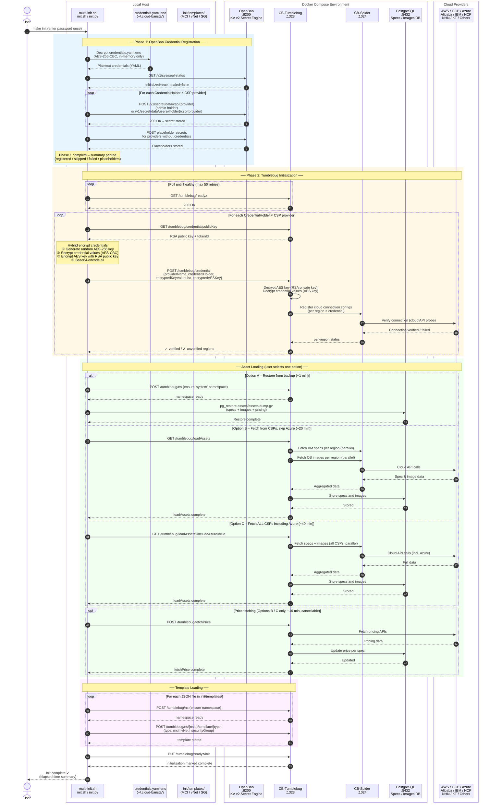
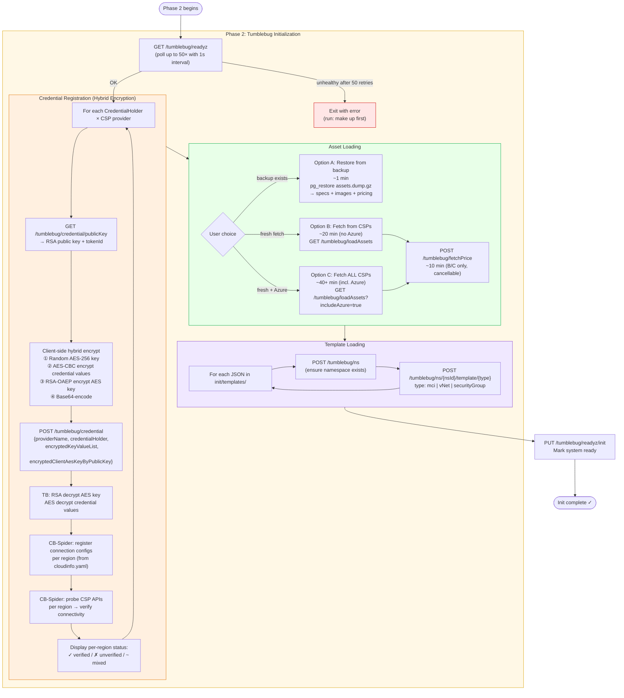
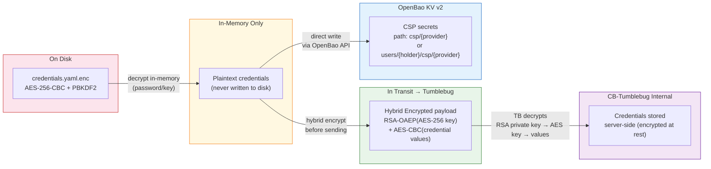

# CB-Tumblebug `make init` Initialization Workflow

## Overview

`make init` is the primary initialization command for CB-Tumblebug. It orchestrates a two-phase process that:

1. **Phase 1 — OpenBao Credential Registration**: Decrypts `credentials.yaml.enc` and stores CSP credentials into OpenBao (Vault-compatible secrets manager), making them available to MC-Terrarium's OpenTofu/Terraform templates.
2. **Phase 2 — Tumblebug Initialization**: Registers the same credentials into CB-Tumblebug (with end-to-end hybrid encryption), then loads cloud asset data (VM specs, OS images, pricing) and infrastructure templates into the system.

After `make init` completes, CB-Tumblebug is fully operational for multi-cloud infrastructure provisioning.

---

## Full Interaction Diagram

The diagram below shows how `make init` interacts with each component end-to-end.



---

## Component Roles During `make init`

| Component | Role During `make init` |
|-----------|------------------------|
| **multi-init.sh / init.py** | Orchestrator: decrypts credentials, calls all APIs, reports results |
| **credentials.yaml.enc** | Encrypted credential source — decrypted in-memory only, never written to disk as plaintext |
| **OpenBao** (`:8200`) | Stores CSP credentials in KV v2; later consumed by MC-Terrarium's OpenTofu templates |
| **CB-Tumblebug** (`:1323`) | Receives encrypted credentials, manages connections, triggers asset loading, stores templates |
| **CB-Spider** (`:1024`) | Registers connection configs per region, probes CSP APIs to verify connectivity |
| **PostgreSQL** (`:5432`) | Stores loaded VM specs, OS images, and pricing data |
| **CSPs** | Source of truth for connection verification, VM specs, OS images, and pricing |

---

## Phase Details

### Phase 1 — OpenBao Credential Registration


### Phase 2 — Tumblebug Initialization



---

## Security Design

`make init` applies a **two-layer encryption strategy** to protect CSP credentials at every stage:



| Stage | Mechanism |
|-------|-----------|
| Storage on disk | `credentials.yaml.enc` — AES-256-CBC with PBKDF2 key derivation |
| In-memory decryption | Plaintext exists only in RAM; never written to disk |
| Transit to Tumblebug | Hybrid RSA-OAEP + AES-256-CBC encryption; Tumblebug holds the RSA private key |
| OpenBao storage | Native KV v2 secret engine with access-control policies |

---

## Time Estimates

| Mode | Duration | Data Included |
|------|----------|---------------|
| Phase 1 (OpenBao) | ~1 min | CSP credentials in KV v2 |
| Phase 2 – Credential registration | ~1–2 min | All credential holders × CSPs × regions |
| Phase 2 – Asset restore (Option A) | ~1 min | Specs + images + pricing (from backup) |
| Phase 2 – Asset fetch, no Azure (Option B) | ~20 min | Specs + images (live from CSPs) |
| Phase 2 – Asset fetch, all CSPs (Option C) | ~40+ min | Specs + images incl. Azure (live) |
| Phase 2 – Price fetch (Options B/C only) | ~10 min | Pricing for all specs |

---

## Quick Reference

```bash
# Full initialization (recommended)
make init

# Skip the interactive prompt and auto-select asset backup restore
make init -y

# Initialize with specific options (see init/README.md)
./init/multi-init.sh --help
```

**Prerequisites:**
- All services running: `make up`
- Encrypted credentials file at `~/.cloud-barista/credentials.yaml.enc`
  - Generate from template: `./init/genCredential.sh`
  - Encrypt: `./init/encCredential.sh`

**Related documentation:**
- [Credential & Connection Guide](credential-and-connection.md)
- [Assets Backup & Restore Guide](assets-backup-restore.md)
- [Resource Template Management Guide](resource-template-management.md)
- [init/README.md](../../init/README.md)
