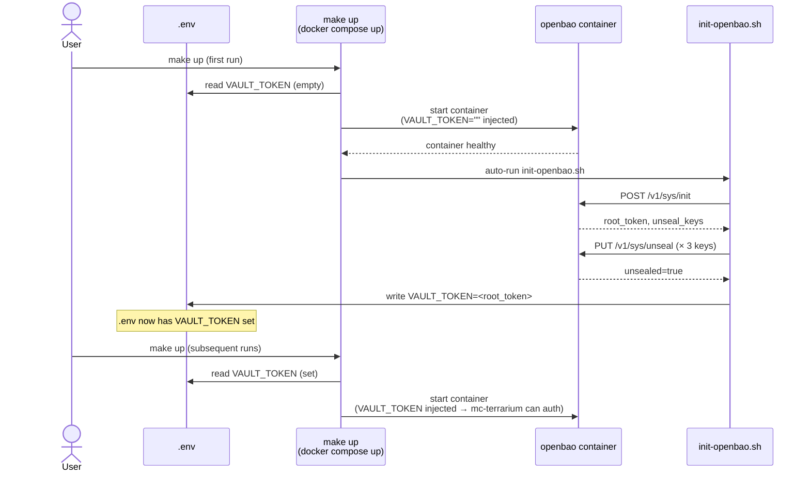
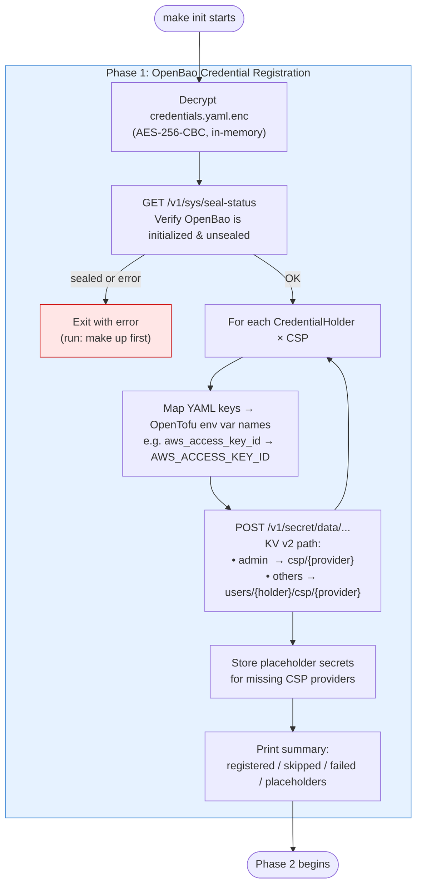
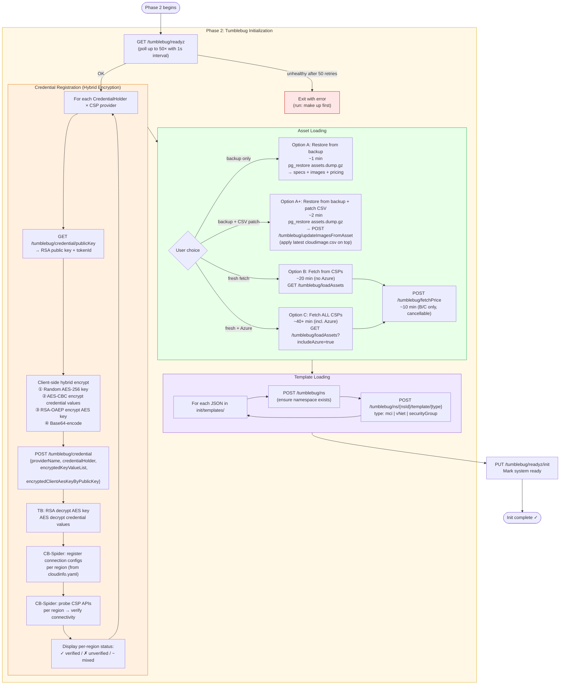
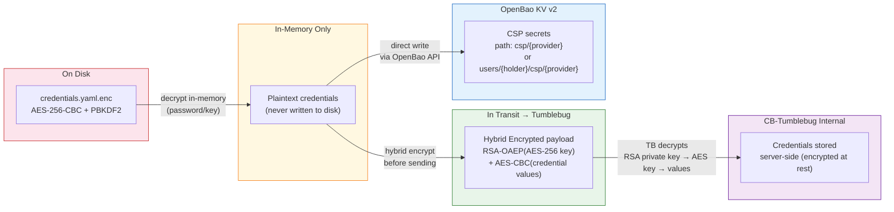

# CB-Tumblebug `make init` Initialization Workflow

## Overview

`make init` is the primary initialization command for CB-Tumblebug. It orchestrates a two-phase process that:

1. **Phase 1 — OpenBao Credential Registration**: Decrypts `credentials.yaml.enc` and stores CSP credentials into OpenBao (Vault-compatible secrets manager), making them available to MC-Terrarium's OpenTofu/Terraform templates.
2. **Phase 2 — Tumblebug Initialization**: Registers the same credentials into CB-Tumblebug (with end-to-end hybrid encryption), then loads cloud asset data (VM specs, OS images, pricing) and infrastructure templates into the system.

After `make init` completes, CB-Tumblebug is fully operational for multi-cloud infrastructure provisioning.

---

## Step 0 — Docker Compose and `.env`

`make init` requires all services to already be running (`make up`). Before services can start, Docker Compose reads the `.env` file in the project root to inject environment variables into each container.

### How `.env` is loaded

Docker Compose automatically reads `.env` from the project root directory (where `docker-compose.yaml` lives). You do **not** need to reference it explicitly — it is loaded by convention.

```bash
# Copy the example file and fill in your values
cp .env.example .env
# (edit .env)
make up
```

### `.env` variable map

The diagram below shows which `.env` variables flow into which containers, and with what behavior if a variable is missing.

```mermaid
graph TD
    EnvFile[".env<br/>(project root)"]

    subgraph DockerCompose["Docker Compose — variable injection"]
        direction TB

        subgraph TB_svc["cb-tumblebug container"]
            TB_U["TB_API_USERNAME :? required"]
            TB_P["TB_API_PASSWORD :? required"]
            TR_U2["TERRARIUM_API_USERNAME :? required"]
            TR_P2["TERRARIUM_API_PASSWORD :? required"]
            VT2["VAULT_TOKEN :- optional (empty default)"]
        end

        subgraph Spider_svc["cb-spider container"]
            SP_U["SPIDER_USERNAME :? required"]
            SP_P["SPIDER_PASSWORD :? required"]
        end

        subgraph Terrarium_svc["mc-terrarium container"]
            TR_U["TERRARIUM_API_USERNAME :? required"]
            TR_P["TERRARIUM_API_PASSWORD :? required"]
            VT3["VAULT_TOKEN :- optional (empty default)"]
        end

        subgraph OpenBao_svc["openbao container"]
            note_bao["No .env vars injected<br/>VAULT_TOKEN is written here<br/>by init-openbao.sh after first init"]
        end

        subgraph Compose_meta["Docker Compose itself"]
            CF["COMPOSE_FILE<br/>(selects which compose files to merge)"]
        end
    end

    EnvFile -->|interpolation| TB_U & TB_P & TR_U2 & TR_P2 & VT2
    EnvFile -->|interpolation| SP_U & SP_P
    EnvFile -->|interpolation| TR_U & TR_P & VT3
    EnvFile -->|compose config| CF

    style EnvFile fill:#fff8e1,stroke:#f57f17,stroke-width:2px
    style TB_svc fill:#fff0e0,stroke:#e07000
    style Spider_svc fill:#f3e5f5,stroke:#7b1fa2
    style Terrarium_svc fill:#f3e5f5,stroke:#7b1fa2
    style OpenBao_svc fill:#fce4ec,stroke:#c62828
    style Compose_meta fill:#eceff1,stroke:#607d8b
```



### Variable reference

| Variable | Used by container(s) | Behavior if missing | Set by |
|---|---|---|---|
| `COMPOSE_FILE` | Docker Compose (meta) | Defaults to `docker-compose.yaml` only | User (choose Traefik overlay) |
| `TB_API_USERNAME` | `cb-tumblebug` | **Error — startup fails** | User |
| `TB_API_PASSWORD` | `cb-tumblebug` | **Error — startup fails** | User |
| `SPIDER_USERNAME` | `cb-spider` | **Error — startup fails** | User |
| `SPIDER_PASSWORD` | `cb-spider` | **Error — startup fails** | User |
| `TERRARIUM_API_USERNAME` | `cb-tumblebug`, `mc-terrarium` | **Error — startup fails** | User |
| `TERRARIUM_API_PASSWORD` | `cb-tumblebug`, `mc-terrarium` | **Error — startup fails** | User |
| `VAULT_TOKEN` | `cb-tumblebug`, `mc-terrarium` | Empty string (silent default `:-`) | Auto-written by `init-openbao.sh` after first `make up` |
| `VAULT_ADDR` | (host-side reference) | `http://localhost:8200` | User (rarely changed) |

> **Note on `VAULT_TOKEN`**: The `:?` variables will abort `docker compose up` with a clear error message if undefined. `VAULT_TOKEN` uses `:-` (empty default) because it is written into `.env` automatically by `init-openbao.sh` during first startup — you do not set it manually.

### `COMPOSE_FILE` — enabling Traefik

`COMPOSE_FILE` is a special Docker Compose variable that controls which compose files are merged at startup:

```bash
# Default: only core services
COMPOSE_FILE=docker-compose.yaml

# With Traefik reverse proxy (HTTPS, routing):
COMPOSE_FILE=docker-compose.yaml:docker-compose.traefik.yaml
```

### OpenBao and `VAULT_TOKEN` lifecycle

`VAULT_TOKEN` starts empty in `.env.example`. On the first `make up`, `init-openbao.sh` initializes OpenBao, obtains a root token, and **automatically writes it back into `.env`**. Subsequent runs of `make up` and `make init` then pick it up without any manual action.



---

## Full Interaction Diagram

The diagram below shows how `make init` interacts with each component end-to-end.

```mermaid
sequenceDiagram
    autonumber
    actor User
    box Local Host
        participant Script as multi-init.sh<br/>init.sh / init.py
        participant EncFile as credentials.yaml.enc<br/>(~/.cloud-barista/)
        participant Templates as init/templates/<br/>(MCI / vNet / SG)
    end

    box Docker Compose Environment
        participant OpenBao as OpenBao<br/>:8200<br/>KV v2 Secret Engine
        participant TB as CB-Tumblebug<br/>:1323
        participant Spider as CB-Spider<br/>:1024
        participant PG as PostgreSQL<br/>:5432<br/>Specs / Images DB
    end

    box Cloud Providers
        participant CSPs as AWS / GCP / Azure<br/>Alibaba / IBM / NCP<br/>NHN / KT / Others
    end

    User->>Script: make init (enter password once)

    rect rgb(230, 245, 255)
        Note over Script,OpenBao: ── Phase 1: OpenBao Credential Registration ──

        Script->>EncFile: Decrypt credentials.yaml.enc<br/>(AES-256-CBC, in-memory only)
        EncFile-->>Script: Plaintext credentials (YAML)

        Script->>OpenBao: GET /v1/sys/seal-status
        OpenBao-->>Script: initialized=true, sealed=false

        loop For each CredentialHolder × CSP provider
            Script->>OpenBao: POST /v1/secret/data/csp/{provider}<br/>(admin holder)<br/>or /v1/secret/data/users/{holder}/csp/{provider}
            OpenBao-->>Script: 200 OK – secret stored
        end

        Script->>OpenBao: POST placeholder secrets<br/>for providers without credentials
        OpenBao-->>Script: Placeholders stored
        Note over Script: Phase 1 complete – summary printed<br/>(registered / skipped / failed / placeholders)
    end

    rect rgb(255, 248, 230)
        Note over Script,CSPs: ── Phase 2: Tumblebug Initialization ──

        loop Poll until healthy (max 50 retries)
            Script->>TB: GET /tumblebug/readyz
            TB-->>Script: 200 OK
        end

        loop For each CredentialHolder × CSP provider
            Script->>TB: GET /tumblebug/credential/publicKey
            TB-->>Script: RSA public key + tokenId

            Note over Script: Hybrid encrypt credentials<br/>① Generate random AES-256 key<br/>② Encrypt credential values (AES-CBC)<br/>③ Encrypt AES key with RSA public key<br/>④ Base64-encode all

            Script->>TB: POST /tumblebug/credential<br/>{providerName, credentialHolder,<br/>encryptedKeyValueList, encryptedAESKey}
            TB->>TB: Decrypt AES key (RSA private key)<br/>Decrypt credential values (AES key)
            TB->>Spider: Register cloud connection configs<br/>(per region × credential)
            Spider->>CSPs: Verify connection (cloud API probe)
            CSPs-->>Spider: Connection verified / failed
            Spider-->>TB: per-region status
            TB-->>Script: ✓ verified / ✗ unverified regions
        end
    end

    rect rgb(240, 255, 240)
        Note over Script,CSPs: ── Asset Loading (user selects one option) ──

        alt Option A – Restore from backup (~1 min)
            Script->>TB: POST /tumblebug/ns  (ensure 'system' namespace)
            TB-->>Script: namespace ready
            Script->>PG: pg_restore assets/assets.dump.gz<br/>(specs + images + pricing)
            PG-->>Script: Restore complete
        else Option A+ – Restore from backup + patch CSV (~2 min)
            Script->>TB: POST /tumblebug/ns  (ensure 'system' namespace)
            TB-->>Script: namespace ready
            Script->>PG: pg_restore assets/assets.dump.gz<br/>(specs + images + pricing)
            PG-->>Script: Restore complete
            Script->>TB: POST /tumblebug/updateImagesFromAsset<br/>(apply latest cloudimage.csv on top)
            TB->>PG: Upsert images from CSV
            PG-->>TB: Updated
            TB-->>Script: patch complete
        else Option B – Fetch from CSPs, skip Azure (~20 min)
            Script->>TB: GET /tumblebug/loadAssets
            TB->>Spider: Fetch VM specs per region (parallel)
            TB->>Spider: Fetch OS images per region (parallel)
            Spider->>CSPs: Cloud API calls
            CSPs-->>Spider: Spec & image data
            Spider-->>TB: Aggregated data
            TB->>PG: Store specs and images
            PG-->>TB: Stored
            TB-->>Script: loadAssets complete
        else Option C – Fetch ALL CSPs including Azure (~40 min)
            Script->>TB: GET /tumblebug/loadAssets?includeAzure=true
            TB->>Spider: Fetch specs + images (all CSPs, parallel)
            Spider->>CSPs: Cloud API calls (incl. Azure)
            CSPs-->>Spider: Full data
            Spider-->>TB: Aggregated data
            TB->>PG: Store specs and images
            PG-->>TB: Stored
            TB-->>Script: loadAssets complete
        end

        opt Price fetching (Options B / C only, ~10 min, cancellable)
            Script->>TB: POST /tumblebug/fetchPrice
            TB->>CSPs: Fetch pricing APIs
            CSPs-->>TB: Pricing data
            TB->>PG: Update price per spec
            PG-->>TB: Updated
            TB-->>Script: fetchPrice complete
        end
    end

    rect rgb(255, 240, 255)
        Note over Script,TB: ── Template Loading ──

        loop For each JSON file in init/templates/
            Script->>TB: POST /tumblebug/ns  (ensure namespace)
            TB-->>Script: namespace ready
            Script->>TB: POST /tumblebug/ns/{nsId}/template/{type}<br/>(type: mci | vNet | securityGroup)
            TB-->>Script: template stored
        end
    end

    Script->>TB: PUT /tumblebug/readyz/init
    TB-->>Script: initialization marked complete
    Script-->>User: Init complete ✓<br/>(elapsed time summary)
```



---

## Component Roles During `make init`

| Component | Role During `make init` |
|-----------|------------------------|
| **multi-init.sh / init.py** | Orchestrator: decrypts credentials, calls all APIs, reports results |
| **credentials.yaml.enc** | Encrypted credential source — decrypted in-memory only, never written to disk as plaintext |
| **OpenBao** (`:8200`) | Stores CSP credentials in KV v2; later consumed by MC-Terrarium's OpenTofu templates |
| **CB-Tumblebug** (`:1323`) | Receives encrypted credentials, manages connections, triggers asset loading, stores templates |
| **CB-Spider** (`:1024`) | Registers connection configs per region, probes CSP APIs to verify connectivity |
| **PostgreSQL** (`:5432`) | Stores loaded VM specs, OS images, and pricing data |
| **CSPs** | Source of truth for connection verification, VM specs, OS images, and pricing |

---

## Phase Details

### Phase 1 — OpenBao Credential Registration



### Phase 2 — Tumblebug Initialization



---

## Security Design

`make init` applies a **two-layer encryption strategy** to protect CSP credentials at every stage:



| Stage | Mechanism |
|-------|-----------|
| Storage on disk | `credentials.yaml.enc` — AES-256-CBC with PBKDF2 key derivation |
| In-memory decryption | Plaintext exists only in RAM; never written to disk |
| Transit to Tumblebug | Hybrid RSA-OAEP + AES-256-CBC encryption; Tumblebug holds the RSA private key |
| OpenBao storage | Native KV v2 secret engine with access-control policies |

---

## Time Estimates

| Mode | Duration | Data Included |
|------|----------|---------------|
| Phase 1 (OpenBao) | ~1 min | CSP credentials in KV v2 |
| Phase 2 – Credential registration | ~1–2 min | All credential holders × CSPs × regions |
| Phase 2 – Asset restore (Option A) | ~1 min | Specs + images + pricing (from backup) |
| Phase 2 – Asset restore + CSV patch (Option A+) | ~2 min | Specs + images + pricing (from backup) + latest cloudimage.csv applied on top |
| Phase 2 – Asset fetch, no Azure (Option B) | ~20 min | Specs + images (live from CSPs) |
| Phase 2 – Asset fetch, all CSPs (Option C) | ~40+ min | Specs + images incl. Azure (live) |
| Phase 2 – Price fetch (Options B/C only) | ~10 min | Pricing for all specs |

---

## Quick Reference

```bash
# Full initialization (recommended)
make init

# Skip the interactive prompt and auto-select asset backup restore
make init -y

# Initialize with specific options (see init/README.md)
./init/multi-init.sh --help
```

**Prerequisites:**
- All services running: `make up`
- Encrypted credentials file at `~/.cloud-barista/credentials.yaml.enc`
  - Generate from template: `./init/genCredential.sh`
  - Encrypt: `./init/encCredential.sh`

**Related documentation:**
- [Credential & Connection Guide](credential-and-connection.md)
- [Assets Backup & Restore Guide](assets-backup-restore.md)
- [Resource Template Management Guide](resource-template-management.md)
- [init/README.md](../../init/README.md)
