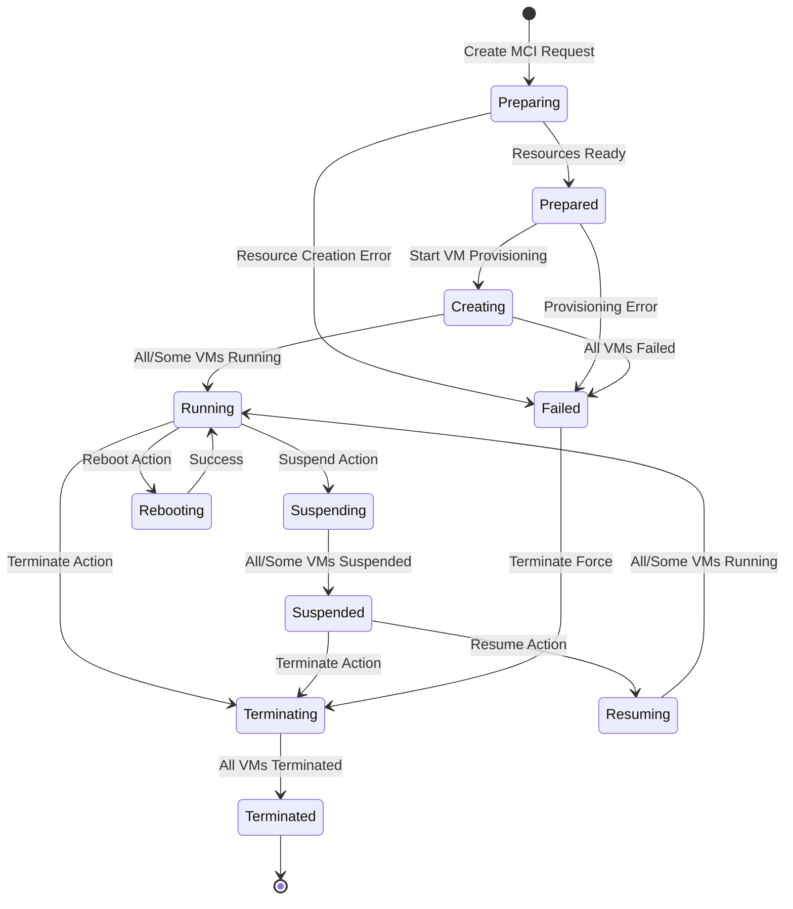
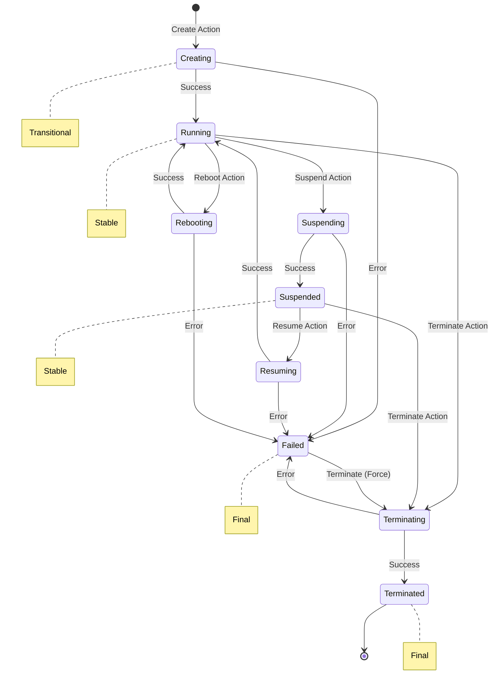
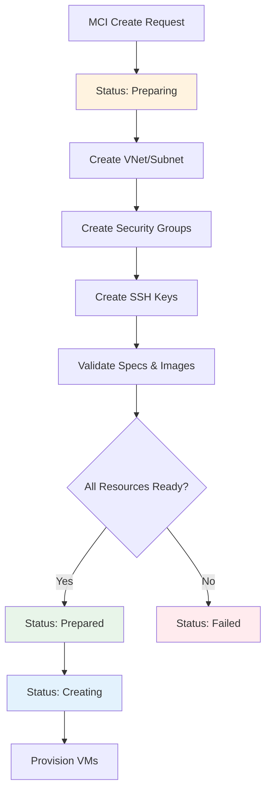
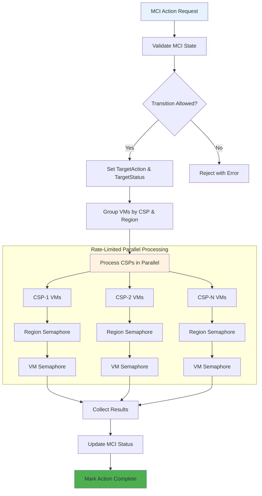
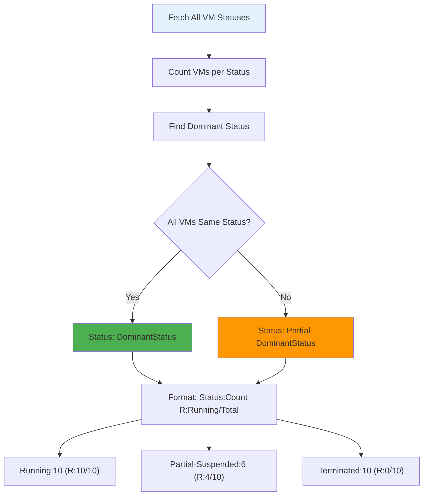
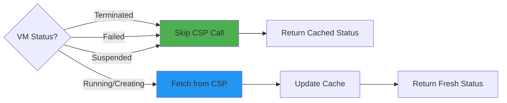
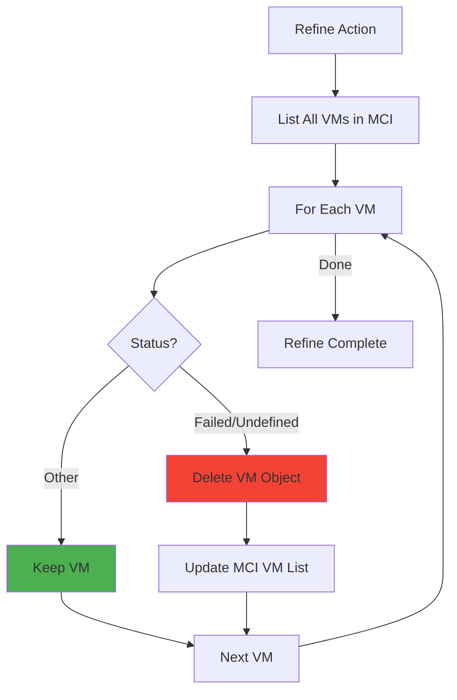

# MCI and VM Lifecycle Management

This document provides a comprehensive guide to the lifecycle management of MCI (Multi-Cloud Infrastructure) and VM (Virtual Machine) resources in CB-Tumblebug. It covers state transitions, control actions, status management, and internal mechanisms.

## 🔑 Key Concepts

### What is MCI?

**MCI (Multi-Cloud Infrastructure)** is a logical unit that groups multiple VMs deployed across different Cloud Service Providers (CSPs) into a single manageable entity. An MCI can contain VMs from AWS, Azure, GCP, Alibaba, and other clouds simultaneously.

### What is a SubGroup?

A **SubGroup** is a logical grouping of homogeneous VMs within an MCI. VMs in the same SubGroup share identical configurations (same spec, image, region, etc.) and are typically scaled together.

```
MCI
├── SubGroup-A (AWS ap-northeast-2)
│   ├── VM-A-1
│   ├── VM-A-2
│   └── VM-A-3
├── SubGroup-B (Azure koreacentral)
│   ├── VM-B-1
│   └── VM-B-2
└── SubGroup-C (GCP asia-northeast3)
    └── VM-C-1
```

## 📊 Status Constants

### MCI Status

The following statuses represent the current state of an MCI:

| Status | Description | Stable? |
|--------|-------------|---------|
| `Preparing` | MCI resources are being prepared (VNet, SecurityGroup, SSH Key) | No (Transitional) |
| `Prepared` | MCI resources are prepared, ready for VM provisioning | No (Transitional) |
| `Creating` | VMs are being provisioned | No (Transitional) |
| `Running` | All VMs are running | Yes |
| `Suspending` | VMs are being suspended | No (Transitional) |
| `Suspended` | All VMs are suspended | Yes |
| `Resuming` | VMs are being resumed | No (Transitional) |
| `Rebooting` | VMs are being rebooted | No (Transitional) |
| `Terminating` | VMs are being terminated | No (Transitional) |
| `Terminated` | All VMs are terminated | Yes (Final) |
| `Failed` | MCI creation failed | Yes (Final) |
| `Undefined` | MCI status cannot be determined | Yes |
| `Partial-*` | Mixed VM states (e.g., `Partial-Running`, `Partial-Suspended`) | Yes |

### VM Status

The following statuses represent the current state of a VM:

| Status | Description | Stable? |
|--------|-------------|---------|
| `Creating` | VM is being provisioned | No (Transitional) |
| `Running` | VM is running and accessible | Yes |
| `Suspending` | VM is being suspended | No (Transitional) |
| `Suspended` | VM is suspended (stopped) | Yes |
| `Resuming` | VM is being resumed from suspended state | No (Transitional) |
| `Rebooting` | VM is being rebooted | No (Transitional) |
| `Terminating` | VM is being terminated | No (Transitional) |
| `Terminated` | VM has been terminated | Yes (Final) |
| `Failed` | VM creation or operation failed | Yes (Final) |
| `Undefined` | VM status cannot be determined | Yes |

### Action Constants

Actions that can be performed on MCI/VM:

| Action | Description | Target Status |
|--------|-------------|---------------|
| `Create` | Create new VM(s) | Running |
| `Suspend` | Stop VM(s) without termination | Suspended |
| `Resume` | Start suspended VM(s) | Running |
| `Reboot` | Restart VM(s) | Running |
| `Terminate` | Permanently delete VM(s) | Terminated |
| `Refine` | Clean up failed/undefined VMs | - |

## 🔄 State Transition Diagram

### MCI State Transitions

MCI follows a multi-phase lifecycle: **Preparation → Provisioning → Operation → Termination**

> **Note:** Most statuses can have a `Partial-` prefix (e.g., `Partial-Running`) indicating mixed VM states within the MCI.



**Status Format:** `(Partial-){Status}:{Count} (R:{RunningCount}/{TotalCount})`

| Example Status | Meaning |
|----------------|---------|
| `Running:5 (R:5/5)` | All 5 VMs are running |
| `Partial-Running:3 (R:3/5)` | 3 of 5 VMs running, others in different states |
| `Partial-Suspended:4 (R:1/5)` | 4 VMs suspended, 1 still running |
| `Terminated:5 (R:0/5)` | All 5 VMs terminated |

### VM State Transitions

Individual VMs follow a simpler lifecycle:



### Preparation Phase Details

The `Preparing` → `Prepared` phase involves creating shared resources before VM provisioning:



## 🎮 Control Actions

### Allowed Transitions

The system validates state transitions before executing actions. Below is the transition matrix:

| Current Status | Suspend | Resume | Reboot | Terminate |
|----------------|---------|--------|--------|-----------|
| Running | ✅ | ❌ | ✅ | ✅ |
| Suspended | ❌ | ✅ | ❌ | ✅ |
| Creating | ❌ | ❌ | ❌ | ❌ |
| Terminating | ❌ | ❌ | ❌ | ❌ |
| Terminated | ❌ | ❌ | ❌ | ❌ |
| Failed | ❌ | ❌ | ❌ | ✅ (Force) |

### MCI-Level Actions

When an action is applied to an MCI, it propagates to all VMs within:



### VM-Level Actions

Individual VM actions follow a similar pattern but only affect the specified VM:

```go
// Example: Suspend a specific VM
HandleMciVmAction(nsId, mciId, vmId, "suspend", force)
```

## 📈 Status Management

### Status Aggregation for MCI

MCI status is aggregated from all VM statuses. The aggregation logic determines the overall MCI status based on the dominant VM status:



### Status Count Structure

```go
type StatusCountInfo struct {
    CountTotal       int  // Total VMs in MCI
    CountCreating    int  // VMs being created
    CountRunning     int  // Running VMs
    CountFailed      int  // Failed VMs
    CountSuspended   int  // Suspended VMs
    CountRebooting   int  // Rebooting VMs
    CountTerminated  int  // Terminated VMs
    CountSuspending  int  // VMs being suspended
    CountResuming    int  // VMs being resumed
    CountTerminating int  // VMs being terminated
    CountUndefined   int  // VMs with undefined status
}
```

## 🔧 Internal Mechanisms

### TargetAction and TargetStatus

Each MCI and VM maintains two tracking fields:

- **TargetAction**: The action currently being performed (e.g., `Create`, `Terminate`)
- **TargetStatus**: The expected final status after the action completes (e.g., `Running`, `Terminated`)

When `TargetStatus == CurrentStatus`, the action is considered complete, and both fields are set to `None` (ActionComplete/StatusComplete).

### Smart Status Caching

To optimize performance, the system skips CSP API calls for VMs in stable final states:



This optimization reduces API calls by 30-50% for large MCIs with many terminated or suspended VMs.

### Rate Limiting for Control Operations

Control operations (Suspend, Resume, Reboot, Terminate) use the same hierarchical rate limiting as provisioning:

| CSP | Max Concurrent Regions | Max VMs per Region |
|-----|------------------------|-------------------|
| AWS | 10 | 30 |
| Azure | 8 | 25 |
| GCP | 12 | 35 |
| NCP | 3 | 15 |
| Alibaba | 6 | 20 |

## 🛡️ Failure Handling

### Refine Action

The `refine` action removes VMs in `Failed` or `Undefined` status from an MCI:



### Force Flag

Most actions support a `force` flag that bypasses state validation:

```go
// Normal action (validates state transitions)
HandleMciAction(nsId, mciId, "terminate", false)

// Force action (skips validation)
HandleMciAction(nsId, mciId, "terminate", true)
```

**Use `force` carefully** - it can lead to inconsistent states if misused.

## 📋 API Reference

### MCI Control Endpoint

```
POST /tumblebug/ns/{nsId}/mci/{mciId}?action={action}
```

**Parameters:**
- `action`: One of `suspend`, `resume`, `reboot`, `terminate`, `refine`, `continue`, `withdraw`

### VM Control Endpoint

```
POST /tumblebug/ns/{nsId}/mci/{mciId}/vm/{vmId}?action={action}
```

**Parameters:**
- `action`: One of `suspend`, `resume`, `reboot`, `terminate`

### Get MCI Status

```
GET /tumblebug/ns/{nsId}/mci/{mciId}?option=status
```

**Response:**
```json
{
  "id": "mci-01",
  "name": "mci-01",
  "status": "Running:5 (R:5/5)",
  "statusCount": {
    "countTotal": 5,
    "countRunning": 5,
    "countFailed": 0,
    ...
  },
  "targetStatus": "None",
  "targetAction": "None",
  "vm": [...]
}
```

## 🔑 Best Practices

### 1. Check Status Before Actions

Always verify the current status before performing actions:

```go
mciStatus, err := GetMciStatus(nsId, mciId)
if err != nil {
    return err
}
if mciStatus.TargetAction != model.ActionComplete {
    return fmt.Errorf("MCI is under %s, please try later", mciStatus.TargetAction)
}
```

### 2. Use Refine for Cleanup

After failed provisioning, use `refine` to clean up failed VMs:

```bash
curl -X POST "http://localhost:1323/tumblebug/ns/default/mci/my-mci?action=refine"
```

### 3. Wait for Transitional States

Don't perform new actions while MCI is in a transitional state (Creating, Suspending, etc.):

```go
if strings.Contains(mciStatus.Status, model.StatusCreating) ||
   strings.Contains(mciStatus.Status, model.StatusTerminating) {
    return errors.New("MCI is in transitional state")
}
```

### 4. Handle Partial States

Be aware that MCI can be in "Partial-" states where VMs have mixed statuses:

```go
if strings.HasPrefix(mciStatus.Status, "Partial-") {
    // Some VMs may need individual attention
    for _, vm := range mciStatus.Vm {
        if vm.Status == model.StatusFailed {
            // Handle failed VM
        }
    }
}
```
