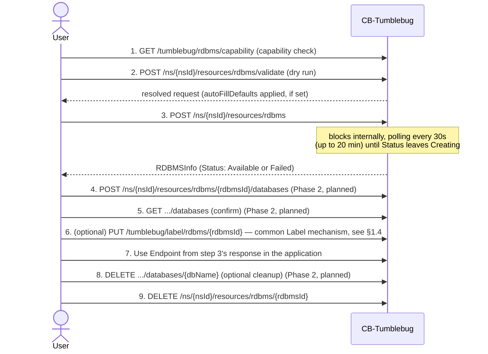

# RDBMS Management — Core Features and API Development Plan

- Scope: core feature set, CSP-specific default configuration, and the phased API development
  plan for CB-Tumblebug's RDBMS (managed relational database) feature.
- Backing integration: CB-Spider's RDBMS API, available since CB-Spider v0.12.44 — an
  implementation detail, not this document's focus (see References at the end for the Spider-side
  guide).

## Current Implementation Status

| Feature                                                      | Status                                                   | Location                                                                                                    |
| ------------------------------------------------------------ | -------------------------------------------------------- | ----------------------------------------------------------------------------------------------------------- |
| Static, CSP-wide support matrix (`GetRDBMSSupport`)          | ✅ Implemented                                           | [rdbms.go](../../src/core/resource/rdbms.go), [rdbms.go](../../src/interface/rest/server/resource/rdbms.go) |
| Live, per-connection capability query (`GetRDBMSCapability`) | ✅ Implemented                                           | [rdbms.go](../../src/core/resource/rdbms.go), [rdbms.go](../../src/interface/rest/server/resource/rdbms.go) |
| Instance lifecycle (Create/List/Get/Delete)                  | ✅ Implemented                                           | [rdbms.go](../../src/core/resource/rdbms.go), [rdbms.go](../../src/interface/rest/server/resource/rdbms.go) |
| Create-request validation (dry run, no side effects)         | ✅ Implemented                                           | `ValidateRDBMSCreateRequest` in [rdbms.go](../../src/core/resource/rdbms.go)                                |
| Internal Logical Database CRUD                               | 🚧 Planned (Phase 2)                                     | —                                                                                                           |
| Tag management                                               | ❌ Not planned — uses the common Label mechanism instead | [label.go](../../src/core/common/label/label.go)                                                            |
| Register/Unregister existing CSP RDBMS                       | 🚧 Planned (Phase 4)                                     | —                                                                                                           |
| Reconciliation                                               | ✅ Implemented                                           | [rdbmsReconcile.go](../../src/core/reconcile/rdbmsReconcile.go)                                             |

## 1. Core Features

### 1.1 Capability/Metadata Discovery (implemented)

- `GET /tumblebug/rdbms/support` (optional `?providerName=`): static, CSP-wide reference matrix
  from `assets/rdbmsinfo.yaml` (`common.RuntimeRDBMSInfo`); no live call. Returns
  `supportedDBEngines`, `supportedDBOperationMethod` (`cspApi`/`conventionalSqlExec`),
  `supportsTag`, `storageTypeSelectable`.
- `GET /tumblebug/rdbms/capability` (`providerName`+`regionName`+`dbEngine` all required): live,
  per-connection lookup. Returns `RDBMSMetaInfo` — versions, spec/storage options,
  `StorageSizeRange`, `Requires*`/`Supports*` flags, `notes.staticFields`. No "all connections"
  mode (would fan out into many slow round trips).
- Typical flow: `/support` to pick provider/dbEngine → `/capability` for the target connection —
  the same check `CreateRDBMS` runs internally before provisioning.

### 1.2 RDBMS Instance Lifecycle

Modeled after the existing VNet/SSHKey/SecurityGroup resource pattern.

- **Validate** (`POST .../rdbms/validate`): same checks as Create, as a pure dry run — no
  provisioning, no kvstore write. Returns the resolved request (`autoFillDefaults` applied, if
  set). Shares logic with Create via `resolveAndValidateRDBMSCreateRequest`, so the two can't
  silently disagree.
- **Create** (`POST .../rdbms`): resolves `vNetId`/`subnetIds`/`securityGroupIds` to CSP names;
  validates `dbEngine` support, `RequiresSubnet`/`RequiresSecurityGroup`, `StorageSizeRange`,
  `SupportsStorageTypeSelection`/`SupportsStorageSizeConfiguration` against live capability data
  (§2.3); auto-filled `storageSize` is raised to the storage type's own minimum if higher than the
  engine's overall minimum (e.g. AWS: gp3 needs 20GB vs. 5GB overall). Blocks server-side, polling
  every 30s up to a 20-minute timeout, until the instance leaves `Creating` — a temporary choice
  for Phase 1 that risks gateway timeouts in production and should move to async/background
  polling later.
- **Get/List**: `GetRDBMS` refreshes live on every call, updating kvstore only on change. No
  dedicated List function — served by the shared `ListResource`/`RestGetAllResources` path.
- **Delete**: deletes via the underlying integration, then clears the kvstore record.

### 1.3 Internal Logical Database Management (planned, Phase 2)

- Create/list/delete logical databases inside an `Available` instance.
- `MasterUserPassword` required on every call, not just create (CSP driver may need direct SQL
  execution when no native database API exists).
- Not tracked as separate Tumblebug resources — no kvstore entry; queried live per call.

### 1.4 Tag Management — Not Provided at the Tumblebug Level

- No dedicated RDBMS tag API planned — no `.../rdbms/{rdbmsId}/tags` endpoint (see §3, Phase 3).
- Uses the common [Label mechanism](../../src/core/common/label/label.go) instead
  (`label.CreateOrUpdateLabel`/`label.DeleteLabelObject`, already wired into `CreateRDBMS`/
  `DeleteRDBMS`), same as every other resource type — Tumblebug-side metadata, not a CSP-native tag.
- `SupportsTag`/`supportsTag` stay as CSP capability info only (AWS, Azure, GCP, Alibaba, Tencent,
  IBM support native tagging; OpenStack, NCP, NHN don't) — not a signal that a Tumblebug tag API
  exists.

### 1.5 Existing CSP RDBMS Registration (planned, Phase 4)

- Register an instance created outside Tumblebug by its CSP instance ID (`cspId`); unregister
  drops Tumblebug ownership without touching the CSP instance.
- Same pattern as VNet (`RegisterVNet`/`DeregisterVNet` in
  [vnet.go](../../src/core/resource/vnet.go)) and SecurityGroup
  (`CreateSecurityGroup(..., option="register")` in
  [securitygroup.go](../../src/core/resource/securitygroup.go)).

### 1.6 Master Password Handling

- Required at create time and for every database-management call; never returned by
  `GetRDBMS`/`ListRDBMS`.
- Not persisted in kvstore — forwarded per request; caller must resupply it for database
  operations and deletion.

### 1.7 Reconciliation (implemented)

- `RDBMSReconciler` ([rdbmsReconcile.go](../../src/core/reconcile/rdbmsReconcile.go)) detects drift
  via `PUT .../rdbms/{rdbmsId}/reconcile`, `PUT .../rdbms/reconcile`, and
  `POST .../rdbms/reconcile/prune` — see [resource-reconciliation.md](resource-reconciliation.md)
  for the shared contract.
- `reconcileCreating`/`reconcileDeleting` are logging-only skeletons (same as VNet/ObjectStorage);
  recovering a resource stuck mid-creation/deletion is a cross-resource open item, not
  RDBMS-specific.

## 2. CSP-Specific Capability Reference

- Tumblebug's live capability response (`RDBMSMetaInfo`, populated per CSP/connection) already
  exposes this data, but several fields carry CSP quirks that are easy to get wrong on first use
  (e.g., AWS requires a pre-existing Security Group; NCP rejects `StorageSize`/`StorageType`; IBM
  rejects passwords with special characters).
- The table below documents these quirks per CSP for MySQL, verified against CB-Spider v0.12.42's
  test results. Documentation only — no server code loads a static copy of it (see §2.3).

### 2.1 CSP Capability Summary (MySQL)

| CSP       | Engine Version | Instance Spec                                   | Storage            | Requires Subnet | Requires SG | Storage Type Selectable | Tag Support |
| --------- | -------------- | ----------------------------------------------- | ------------------ | :-------------: | :---------: | :---------------------: | :---------: |
| AWS       | 8.0            | db.t3.medium                                    | 100GB / gp3        |   🟢 (2 AZs)    |     🟢      |           🟢            |     🟢      |
| Azure     | 8.0.21         | Standard_B1ms                                   | 20GB / auto        |       🔴        |     🔴      |           🔴            |     🟢      |
| GCP       | 8.0            | db-custom-2-8192                                | 20GB / PD_SSD      |       🔴        |     🔴      | 🟢 (via machine series) |     🟢      |
| Alibaba   | 8.0            | mysql.n4.large.1                                | 20GB / cloud_essd  |       🟢        |     🔴      |           🟢            |     🟢      |
| Tencent   | 8.0            | 8000 (MB)                                       | 50GB / local_ssd   |       🟢        |     🔴      |           🟢            |     🟢      |
| IBM       | 8.4            | multitenant                                     | 30GB / auto        |       🔴        |     🔴      |           🔴            |     🟢      |
| OpenStack | 5.7.29         | m1.small                                        | 20GB / auto        |       🔴        |     🔴      |           🟢            |     🔴      |
| NCP       | 8.0.36         | SVR.VDBAS.AMD.STAND.C002.M008.NET.SSD.B050.G003 | CSP-managed        |       🟢        |     🔴      |           🔴            |     🔴      |
| NHN       | MYSQL_V8408    | m2.c2m4                                         | 20GB / General SSD |       🟢        |     🔴      |           🟢            |     🔴      |

See section 9 of the CB-Spider wiki's
[RDBMS Management Guide](<https://github.com/cloud-barista/cb-spider/wiki/RDBMS%E2%80%90Management%E2%80%90Guide(KR)>)
for the full per-CSP notes (password policy quirks, minimum storage sizes for premium storage
types, etc.).

### 2.2 CSP Capability Summary (MariaDB)

- MariaDB support is far more limited than MySQL — only 4 of the 9 documented CSPs list `mariadb`
  in `supportedDBEngines` (`assets/rdbmsinfo.yaml`).
- MariaDB test coverage is new as of CB-Spider v0.12.44 (no results existed at v0.12.42, the
  baseline for the MySQL table above); results below are from that v0.12.44 test run.

| CSP       | Engine Version  | Instance Spec        | Storage            | Result  | Duration |
| --------- | --------------- | -------------------- | ------------------ | :-----: | -------: |
| AWS       | 10.6.27         | db.t3.medium         | 100GB / gp2        | ✅ Pass |    4m44s |
| Alibaba   | 10.6            | mariadb.n2.medium.2c | 20GB / cloud_essd  | ✅ Pass |    3m20s |
| NHN       | MARIADB_V101118 | m2.c2m4              | 20GB / General SSD | ✅ Pass |    10m8s |
| OpenStack | 10.6            | m1.small             | 20GB / auto        | ❌ Fail |        — |

- OpenStack's failure is a test-environment gap, not a driver limitation: the referenced Trove
  instance had no MariaDB datastore registered (see the `note` field for `openstack` in
  `assets/rdbmsinfo.yaml`).
- Azure, GCP, Tencent, IBM, and NCP do not list `mariadb` at all — treat `mysql` as the only
  reliably-supported engine there until this coverage is extended.

### 2.3 Why Live Data, Not a Static Config File

`resource.CreateRDBMS` queries live capability data for every request instead of a static copy:

- Creating the instance itself requires a reachable CSP connection anyway — a static fallback
  would only let an invalid/stale request slip past validation and fail later, after minutes of
  CSP provisioning.
- The one-time cost of a live lookup is negligible next to the multi-minute provisioning time it
  protects.
- A static copy drifts out of sync whenever a CSP changes supported versions/specs/storage
  constraints; the live call always reflects current state.
- (An earlier draft shipped `conf/rdbms_conf.yaml` as a static file; removed since nothing read it.)

## 3. API Development Plan

- The endpoints below are Tumblebug's own REST API surface.
- Where Tumblebug already has a generic mechanism for a capability — `inspectResources` for
  CSP/Tumblebug-mapped listing, counting, and orphan detection (see
  [shared-resource-management.md](shared-resource-management.md)) — the plan reuses it instead of
  adding a parallel RDBMS-only API, keeping the audit workflow consistent with
  VNet/SecurityGroup/SSHKey/Node.
- This only requires adding `model.StrRDBMS` as a supported `resourceType` value and an RDBMS
  branch in `infra.InspectResources` (Phase 4).

### Phase 0 — Capability Discovery (done)

| Method | Path                          | Handler                  |
| ------ | ----------------------------- | ------------------------ |
| GET    | `/tumblebug/rdbms/support`    | `RestGetRDBMSSupport`    |
| GET    | `/tumblebug/rdbms/capability` | `RestGetRDBMSCapability` |

### Phase 1 — Instance Lifecycle (done)

| Method | Path                                   | Handler                         |
| ------ | -------------------------------------- | ------------------------------- |
| POST   | `/ns/{nsId}/resources/rdbms/validate`  | `RestValidateRDBMS`             |
| POST   | `/ns/{nsId}/resources/rdbms`           | `RestPostRDBMS`                 |
| GET    | `/ns/{nsId}/resources/rdbms`           | `RestGetAllResources` (generic) |
| GET    | `/ns/{nsId}/resources/rdbms/{rdbmsId}` | `RestGetRDBMS`                  |
| DELETE | `/ns/{nsId}/resources/rdbms/{rdbmsId}` | `RestDeleteRDBMS`               |

- Model additions (`model/rdbms.go`): `RDBMSCreateRequest`, `RDBMSInfo` (persisted + response,
  Condition-based `Status` like `ObjectStorageInfo`), `RDBMSListResponse`.
- Core logic (`resource/rdbms.go`): `CreateRDBMS`, `GetRDBMS`, `DeleteRDBMS`; no separate
  `ListRDBMS` — listing is served entirely by the shared `ListResource`/`RestGetAllResources` path.
  `ValidateRDBMSCreateRequest` shares logic with `CreateRDBMS` via
  `resolveAndValidateRDBMSCreateRequest` (see §1.2).
- kvstore key: `/ns/{nsId}/resources/rdbms/{rdbmsId}`.

### Phase 2 — Internal Logical Database CRUD

| Method | Path                                                      | Handler (proposed)        |
| ------ | --------------------------------------------------------- | ------------------------- |
| POST   | `/ns/{nsId}/resources/rdbms/{rdbmsId}/databases`          | `RestPostRDBMSDatabase`   |
| GET    | `/ns/{nsId}/resources/rdbms/{rdbmsId}/databases`          | `RestGetRDBMSDatabases`   |
| DELETE | `/ns/{nsId}/resources/rdbms/{rdbmsId}/databases/{dbName}` | `RestDeleteRDBMSDatabase` |

Model additions: `RDBMSDatabaseReq` (`databaseName`, `masterUserPassword`), `RDBMSDatabaseInfo`.

### Phase 3 — Tag Management: Descoped

- Earlier draft proposed a dedicated tag API
  (`RestPostRDBMSTag`/`RestGetRDBMSTags`/`RestGetRDBMSTag`/`RestDeleteRDBMSTag`, rejecting the
  request when `RDBMSMetaInfo.SupportsTag=false`). **Not being built.**
- Uses the existing common Label mechanism instead, same as every other resource type — see §1.4.
- `SupportsTag`/`supportsTag` stay in the model purely as CSP capability information.

### Phase 4 — Registration, CSP-Direct Cleanup, and Sync

| Method | Path                                               | Handler (proposed)          |
| ------ | -------------------------------------------------- | --------------------------- |
| POST   | `/ns/{nsId}/resources/rdbms/register`              | `RestPostRegisterRDBMS`     |
| DELETE | `/ns/{nsId}/resources/rdbms/{rdbmsId}/unregister`  | `RestDeleteUnregisterRDBMS` |
| DELETE | `/tumblebug/rdbms/cspOnly/{cspId}?connectionName=` | `RestDeleteRDBMSCspOnly`    |

- Model additions: `RegisterRDBMSReq` (`name`, `connectionName`, `vNetId`, `cspId`), mirroring
  `RegisterVNetReq`. Omitted `vNetId` is resolved to the owning VPC automatically.
- `RestDeleteRDBMSCspOnly`: deletes an orphaned instance directly on the CSP (never registered in
  Tumblebug; found via `inspectResources`, `resources.onCspOnly`). Namespace-independent — no
  Tumblebug resource is involved. Destructive, admin-only (like `option=force` on infra deletion):
  requires explicit confirmation and logs the caller, connection, and CSP ID.
- List/count needs are covered by extending `infra.InspectResources`/`InspectResourcesOverview`
  with an `rdbms` resource type instead of adding dedicated endpoints.

### Phase 5 — Reconciliation (done)

- `RDBMSReconciler` is registered in `reconcile.Manager`, following
  [reconcile.instructions.md](../../.github/instructions/reconcile.instructions.md).
- Implemented ahead of Phase 2–4, since drift detection doesn't depend on database/tag/registration
  support.

## 4. Usage Sequence (Tumblebug User Perspective)

- Scenario A's steps 1–3, 7, and 9 are implemented today (Phase 0/1).
- Steps 4–6 and 8 (logical database CRUD, Phase 2) and all of Scenario B/C (registration and
  audit/cleanup, Phase 4) describe the target flow once those phases are built — see §3 for status.

### 4.1 Scenario A — Provision a New RDBMS Instance and a Logical Database

- Step 1: static, no-live-call reference lookup. Step 2: live dry run against the actual connection.
- Running both before step 3 (especially when the request omits optional fields or targets an
  unfamiliar CSP) surfaces which of `storageType`/`subnetIds`/`securityGroupIds` are required vs.
  rejected for that CSP (§2.1) — with no risk of a failed multi-minute create attempt.

### 4.2 Scenario B — Register an Existing CSP RDBMS Instance (Phase 4, planned)

1. `POST /tumblebug/inspectResources` (`resourceType: rdbms`) — find CSP-only instances not yet
   known to Tumblebug (`resources.onCspOnly`).
2. `POST /ns/{nsId}/resources/rdbms/register` with the CSP instance ID — `vNetId` is optional and
   auto-resolved if omitted.
3. `GET /ns/{nsId}/resources/rdbms/{rdbmsId}` — confirm the instance is now visible under Tumblebug.
4. Later: `DELETE .../unregister` to drop Tumblebug ownership without touching the CSP instance, or
   `DELETE /ns/{nsId}/resources/rdbms/{rdbmsId}` to actually delete it.

### 4.3 Scenario C — Audit and Clean Up Orphaned Instances (Phase 4, planned)

1. `POST /tumblebug/inspectResources` (`resourceType: rdbms`, optionally scoped to one
   `connectionName`) — returns `resourceOverview` (counts) and `resources` (`onTumblebug`/
   `onCspOnly` lists) in a single call.
2. For CSP-only orphans that should not be adopted into Tumblebug, `DELETE
/tumblebug/rdbms/cspOnly/{cspId}` removes them directly from the CSP (§Phase 4) — confirm the
   target before calling, since this bypasses Tumblebug entirely.

## 5. CSP-Specific Risks and Notes

- **AWS**: requires a pre-existing Security Group; `io1`/`io2` storage types require `Iops >= 1000`
  (per `assets/rdbmsinfo.yaml`'s `iopsRange.min`; the reference test verified `iops=3000`
  specifically, not a hard minimum) and `StorageSize >= 100GB`.
- **Azure / IBM / NCP**: `SupportsStorageTypeSelection=false` — omit `StorageType` in create
  requests; the CSP sets it automatically.
- **IBM**: rejects passwords containing special characters (e.g., `!`, `@`); provisions only the
  Gen1 platform.
- **NCP**: rejects requests that specify `StorageSize`/`StorageType`; requires a special character in
  `MasterUserPassword`; public domain access must be requested separately in the NCP console after
  creation.
- **NHN**: requires a dedicated RDS credential in addition to the base Connection credential.
- **OpenStack**: does not expose `StorageType` after creation; verify success via `Available` status
  only.
- **GCP**: `StorageType` is implied by machine series — mismatched combinations are rejected by the
  driver, not by Tumblebug's pre-flight validation.

Full detail and reproduction commands are in section 9 of the CB-Spider wiki's
[RDBMS Management Guide](<https://github.com/cloud-barista/cb-spider/wiki/RDBMS%E2%80%90Management%E2%80%90Guide(KR)>).

## References

Background references for CB-Spider's side of this integration (implementation detail, not part
of Tumblebug's own API contract):

- [RDBMS‐Management‐Guide (KR)](<https://github.com/cloud-barista/cb-spider/wiki/RDBMS%E2%80%90Management%E2%80%90Guide(KR)>)
- [CB-Spider RDBMS API Test README](https://github.com/cloud-barista/cb-spider/blob/master/test/rdbms-mysql-test/README.md)
- [CB-Spider RDBMS StorageType Test README](https://github.com/cloud-barista/cb-spider/blob/master/test/rdbms-mysql-test/storage-type-test/README.md)
- [CB-Spider RDBMS Database Management Test README](https://github.com/cloud-barista/cb-spider/blob/master/test/rdbms-mysql-test/database-test/README.md)
- [CB-Spider RDBMS Tag Management Test README](https://github.com/cloud-barista/cb-spider/blob/master/test/rdbms-mysql-test/tag-test/README.md)
