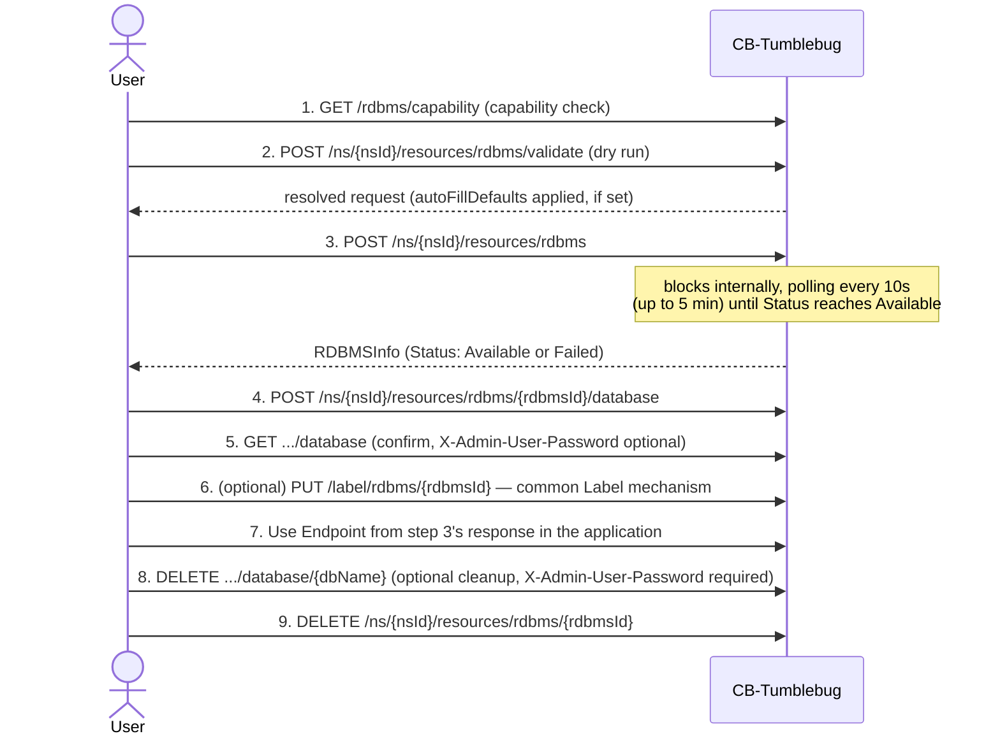

# RDBMS Management — Features and API Reference

CB-Tumblebug's RDBMS (managed relational database) feature: capability discovery, instance
lifecycle, logical database management, and CSP-specific defaults. Backed by CB-Spider's RDBMS
API (v0.13.0+) — an implementation detail, not this document's focus (see References).

## Feature Status

| Feature                                                      | Status      | Location                                                                                                    |
| ------------------------------------------------------------ | ----------- | ----------------------------------------------------------------------------------------------------------- |
| Static, CSP-wide support matrix (`GetRDBMSSupport`)          | ✅          | [rdbms.go](../../src/core/resource/rdbms.go), [rdbms.go](../../src/interface/rest/server/resource/rdbms.go) |
| Live, per-connection capability query (`GetRDBMSCapability`) | ✅          | [rdbms.go](../../src/core/resource/rdbms.go), [rdbms.go](../../src/interface/rest/server/resource/rdbms.go) |
| Instance lifecycle (Create/List/Get/Delete)                  | ✅          | [rdbms.go](../../src/core/resource/rdbms.go), [rdbms.go](../../src/interface/rest/server/resource/rdbms.go) |
| Create-request validation (dry run, no side effects)         | ✅          | `ValidateRDBMSCreateRequest` in [rdbms.go](../../src/core/resource/rdbms.go)                                |
| CSP admin username/password policy validation                | ✅          | `validateAdminCredentials` in [rdbms.go](../../src/core/resource/rdbms.go)                                  |
| Spec-aware autoFillDefaults picker (vCPU/memory-based)       | ✅          | `pickSmallestDBSpec` in [rdbms.go](../../src/core/resource/rdbms.go)                                        |
| Internal Logical Database CRUD                               | ✅          | [rdbms.go](../../src/core/resource/rdbms.go), [rdbms.go](../../src/interface/rest/server/resource/rdbms.go) |
| Tag management                                               | By Label    | [label.go](../../src/core/common/label/label.go)                                                            |
| Register/Unregister existing CSP RDBMS                       | Not Planned | —                                                                                                           |
| Reconciliation                                               | ✅          | [rdbmsReconcile.go](../../src/core/reconcile/rdbmsReconcile.go)                                             |

## Features

- **Capability discovery**: check which engines/features a CSP supports.
  - Static, CSP-wide reference, no live call (`GET /rdbms/support`).
  - Live, per-connection: versions, spec/storage options, `Requires*`/`Supports*` flags
    (`GET /rdbms/capability`).
  - Typical flow: `/support` to pick a CSP/engine, then `/capability` for the target connection.
- **Instance lifecycle**: create, inspect, and delete a managed instance.
  - Dry run, no provisioning (`POST .../rdbms/validate`).
  - Create: resolves network names, validates against live capability data (see CSP-Specific
    Capability Reference) and CSP admin-credential policy (see Admin Credential Constraints),
    auto-fills the smallest usable `dbSpec` and a compatible storage type if requested, and
    blocks server-side until the instance reaches `Available` (`POST .../rdbms`; see Creation and
    Deletion Reliability for why).
  - Delete: confirms via two independent checks before clearing the kvstore record
    (`DELETE .../rdbms/{rdbmsId}`; also in Creation and Deletion Reliability).
- **Internal logical databases**: create, list, and delete logical databases inside an
  `Available` instance.
  - Not a tracked Tumblebug resource — no kvstore entry, queried live
    (`POST`/`GET`/`DELETE .../rdbms/{rdbmsId}/database[/{dbName}]`).
  - Admin password required for create/delete, optional for list, and never persisted (masked
    before it ever reaches a log line — same rule for the instance's own create-time admin
    password).
- **Tag management**: uses the common
  [Label mechanism](../../src/core/common/label/label.go) instead of a dedicated tag API, like
  every other resource type.
- **Registration** of an existing CSP instance is planned but not built, mirroring the
  VNet/SecurityGroup register/deregister pattern.
- **Reconciliation**: detects drift via the shared
  [resource-reconciliation.md](resource-reconciliation.md) contract; the creating/deleting repair
  paths are logging-only skeletons today (same as VNet/ObjectStorage). A `DeletionFailed`
  instance only auto-restores to `Available` if it's auto-managed (`IsAutoManagedResource`) —
  a user-owned instance's tombstone is sticky, and its recovery path is **TBD**
  (`PUT .../restore` exists generically but isn't yet wired up for RDBMS; see Open Items
  in [resource-reconciliation.md](resource-reconciliation.md)).

## Creation and Deletion Reliability

Some CSPs run internal processing during create/delete that CB-Spider's own API can't observe or
report accurately — this section covers the resulting defensive logic and which CSPs each part
is for.

- **Create (`ConfirmRDBMSCreated`)**: polls every 10s for up to 5 minutes until `Available`.
  - AWS: returns `Creating` immediately, needing the poll.
  - IBM: returns `Creating` and variable creation time.
  - Alibaba: can return `Error` transiently before settling into `Available`.

- **Delete (`PollResourceFullyDeleted`)**: confirms deletion by checking both Spider and the CSP.
  - Alibaba: a real VPC/vSwitch attachment releases asynchronously (`DependencyViolation.Rds`).
  - Tencent: VPC/subnet IP release lags instance deletion (`ResourceInUse`).

- **Delete — CSP-specific stabilization buffer**: 10s normally
  - Alibaba: 180s
  - Tencent: 90s

## Usage Sequence (Tumblebug User Perspective)

Scenario A is fully implemented; B/C describe the target flow for planned registration/audit
features (see API Reference).

- **Scenario B — Register an existing CSP instance (planned)**: `POST /inspectResources` to find
  CSP-only instances, then `POST .../rdbms/register` (CSP instance ID; `vNetId` auto-resolved if
  omitted). `.../unregister` drops Tumblebug ownership without touching the CSP instance.
- **Scenario C — Audit and clean up orphans (planned)**: `POST /inspectResources` returns
  `onTumblebug`/`onCspOnly` lists; `DELETE /rdbms/cspOnly/{cspId}` removes a CSP-only orphan
  directly (bypasses Tumblebug entirely — confirm the target first).

## API Reference

Where a generic mechanism already covers a need — `inspectResources` for CSP/Tumblebug-mapped
listing, counting, and orphan detection (see
[shared-resource-management.md](shared-resource-management.md)) — planned features reuse it
instead of adding a parallel RDBMS-only API.

### Implemented Endpoints

| Method | Path                                                     | Handler                         |
| ------ | -------------------------------------------------------- | ------------------------------- |
| GET    | `/rdbms/support`                                         | `RestGetRDBMSSupport`           |
| GET    | `/rdbms/capability`                                      | `RestGetRDBMSCapability`        |
| POST   | `/ns/{nsId}/resources/rdbms/validate`                    | `RestValidateRDBMS`             |
| POST   | `/ns/{nsId}/resources/rdbms`                             | `RestPostRDBMS`                 |
| GET    | `/ns/{nsId}/resources/rdbms`                             | `RestGetAllResources` (generic) |
| GET    | `/ns/{nsId}/resources/rdbms/{rdbmsId}`                   | `RestGetRDBMS`                  |
| DELETE | `/ns/{nsId}/resources/rdbms/{rdbmsId}`                   | `RestDeleteRDBMS`               |
| POST   | `/ns/{nsId}/resources/rdbms/{rdbmsId}/database`          | `RestPostRDBMSDatabase`         |
| GET    | `/ns/{nsId}/resources/rdbms/{rdbmsId}/database`          | `RestGetRDBMSDatabases`         |
| DELETE | `/ns/{nsId}/resources/rdbms/{rdbmsId}/database/{dbName}` | `RestDeleteRDBMSDatabase`       |

### Planned Endpoints

| Method | Path                                              | Handler                     |
| ------ | ------------------------------------------------- | --------------------------- |
| POST   | `/ns/{nsId}/resources/rdbms/register`             | `RestPostRegisterRDBMS`     |
| DELETE | `/ns/{nsId}/resources/rdbms/{rdbmsId}/unregister` | `RestDeleteUnregisterRDBMS` |
| DELETE | `/rdbms/cspOnly/{cspId}?connectionName=`          | `RestDeleteRDBMSCspOnly`    |

`RestDeleteRDBMSCspOnly` is namespace-independent, destructive, admin-only (explicit confirmation
required, logs caller/connection/CSP ID). No dedicated tag API was built — RDBMS instances use the
common Label mechanism instead.

## CSP-Specific Capability Reference

Reference only — `CreateRDBMS` always re-checks live capability data at request time rather than
trusting a cached copy, since a stale reference could let an invalid request slip through and fail
only after minutes of CSP provisioning.

### CSP Capability Summary (MySQL)

`DB Op. Method` — `cspNativeApi` (CSP-native database API) or `sqlFallback` (direct SQL via the
admin login; see CSP-Specific Risks and Notes for the network-reachability caveat).

| CSP       | Engine Version | DB Spec                                         | Storage            | Requires Subnet | Requires SG | Storage Type Selectable | Tag Support | DB Op. Method |
| --------- | -------------- | ----------------------------------------------- | ------------------ | :-------------: | :---------: | :---------------------: | :---------: | ------------- |
| AWS       | 8.0            | db.t3.medium                                    | 100GB / gp3        |   🟢 (2 AZs)    |     🟢      |           🟢            |     🟢      | sqlFallback   |
| Azure     | 8.0.21         | Standard_B1ms                                   | 20GB / auto        |       🔴        |     🔴      |           🔴            |     🟢      | cspNativeApi  |
| GCP       | 8.0            | db-custom-2-8192                                | 20GB / PD_SSD      |       🔴        |     🔴      | 🟢 (via machine series) |     🟢      | cspNativeApi  |
| Alibaba   | 8.0            | mysql.n4.large.1                                | 20GB / cloud_essd  |       🟢        |     🔴      |           🟢            |     🟢      | cspNativeApi  |
| Tencent   | 8.0            | 8000 (MB)                                       | 50GB / local_ssd   |       🟢        |     🔴      |           🟢            |     🟢      | cspNativeApi  |
| IBM       | 8.4            | multitenant                                     | 30GB / auto        |       🔴        |     🔴      |           🔴            |     🟢      | sqlFallback   |
| OpenStack | 5.7.29         | m1.small                                        | 20GB / auto        |       🔴        |     🔴      |           🟢            |     🔴      | cspNativeApi  |
| NCP       | 8.0.36         | SVR.VDBAS.AMD.STAND.C002.M008.NET.SSD.B050.G003 | CSP-managed        |       🟢        |     🔴      |           🔴            |     🔴      | cspNativeApi  |
| NHN       | MYSQL_V8408    | m2.c2m4                                         | 20GB / General SSD |       🟢        |     🔴      |           🟢            |     🔴      | cspNativeApi  |

Full per-CSP notes (password quirks, premium storage minimums): section 9 of the CB-Spider wiki's
[RDBMS Management Guide](<https://github.com/cloud-barista/cb-spider/wiki/RDBMS%E2%80%90Management%E2%80%90Guide(KR)>).

### CSP Capability Summary (MariaDB)

Only 4 of 9 CSPs support MariaDB. Azure/GCP/Tencent/IBM/NCP don't list `mariadb` — use `mysql`
there.

| CSP       | Engine Version  | DB Spec              | Storage            | Result  | Duration |
| --------- | --------------- | -------------------- | ------------------ | :-----: | -------: |
| AWS       | 10.6.27         | db.t3.medium         | 100GB / gp2        | ✅ Pass |    4m44s |
| Alibaba   | 10.6            | mariadb.n2.medium.2c | 20GB / cloud_essd  | ✅ Pass |    3m20s |
| NHN       | MARIADB_V101118 | m2.c2m4              | 20GB / General SSD | ✅ Pass |    10m8s |
| OpenStack | 10.6            | m1.small             | 20GB / auto        | ❌ Fail |        — |

(OpenStack's failure is a test-environment gap — no MariaDB datastore registered — not a driver
limitation.)

### Admin Credential Constraints

Enforced client-side by `validateAdminCredentials` before Create reaches CB-Spider. `—` = no
constraint recorded.

| CSP       | Admin Username Constraint | Admin Password Constraint               |
| --------- | ------------------------- | --------------------------------------- |
| AWS       | —                         | —                                       |
| Azure     | Rejects: `admin`          | —                                       |
| GCP       | —                         | —                                       |
| Alibaba   | Rejects: `admin`          | —                                       |
| Tencent   | Fixed: `root`             | —                                       |
| IBM       | Fixed: `admin`            | 15-72 characters, no special characters |
| OpenStack | —                         | —                                       |
| NCP       | —                         | Requires ≥1 special character           |
| NHN       | —                         | —                                       |

### Direct SQL Connection (TLS) Requirements

About a caller's own application connecting straight to the instance endpoint — different from
the table above's `DB Op. Method`, which is CB-Spider's own database-management mechanism, not
row-level data access. `—` = not verified either way.

| CSP       | Requires TLS | Evidence                                                                                                           |
| --------- | :----------: | ------------------------------------------------------------------------------------------------------------------ |
| AWS       |      No      | Plain connection succeeded (test-cli dummy-data test)                                                              |
| Azure     |     Yes      | Plain connection rejected: `Error 3159 ... require_secure_transport=ON`                                            |
| GCP       |      No      | Plain connection succeeded (test-cli dummy-data test)                                                              |
| Alibaba   |      —       | Not verified                                                                                                       |
| Tencent   |      —       | Not verified                                                                                                       |
| IBM       |     Yes      | Inferred: CB-Spider's SQL-fallback code hardcodes `tls=skip-verify` for IBM's `*.databases.appdomain.cloud` domain |
| OpenStack |      —       | Not verified                                                                                                       |
| NCP       |      —       | Not verified                                                                                                       |
| NHN       |      —       | Not verified                                                                                                       |

A connection mode that adapts either way (e.g. `go-sql-driver/mysql`'s `tls=preferred`) avoids
needing this table at all.

## CSP-Specific Risks and Notes

Admin credential policy is in Admin Credential Constraints, not repeated here.

- **AWS**: requires a pre-existing Security Group; `io1`/`io2` need `Iops >= 1000` and
  `StorageSize >= 100GB`.
- **Azure / IBM / NCP**: `SupportsStorageTypeSelection=false` — omit `StorageType`; the CSP sets
  it automatically.
- **IBM**: provisions only the Gen1 platform.
- **NCP**: rejects requests specifying `StorageSize`/`StorageType`; public domain access needs a
  separate manual step in the console after creation.
- **NHN**: requires a dedicated RDS credential in addition to the base Connection credential.
- **OpenStack**: doesn't expose `StorageType` after creation — verify success via `Available`
  status only.
- **GCP**: `StorageType` is implied by machine series (`HYPERDISK_BALANCED` for C4A/N4,
  `PD_SSD`/`PD_HDD` for others) — Tumblebug's pre-flight validation catches a mismatch before it
  reaches the driver.
- **AWS / IBM**: internal database CRUD (`sqlFallback`) connects directly to the instance
  endpoint — a `publicAccess=false` instance may fail database create/list/delete if CB-Spider
  can't reach the private endpoint. (Azure's database CRUD is `cspNativeApi`, an ARM call not a
  SQL connection, so this doesn't apply to it.)
- **Alibaba / Tencent**: deleting an instance's VNet/Subnet immediately after deleting the
  instance can fail with a dependency error even after Tumblebug confirms the instance is fully
  gone — see Creation and Deletion Reliability.

## References

Background on CB-Spider's side of this integration (implementation detail, not part of
Tumblebug's own API contract):

- [RDBMS‐Management‐Guide (KR)](<https://github.com/cloud-barista/cb-spider/wiki/RDBMS%E2%80%90Management%E2%80%90Guide(KR)>)
- [CB-Spider RDBMS API Test README](https://github.com/cloud-barista/cb-spider/blob/master/test/rdbms-mysql-test/README.md)
- [CB-Spider RDBMS StorageType Test README](https://github.com/cloud-barista/cb-spider/blob/master/test/rdbms-mysql-test/storage-type-test/README.md)
- [CB-Spider RDBMS Database Management Test README](https://github.com/cloud-barista/cb-spider/blob/master/test/rdbms-mysql-test/database-test/README.md)
- [CB-Spider RDBMS Tag Management Test README](https://github.com/cloud-barista/cb-spider/blob/master/test/rdbms-mysql-test/tag-test/README.md)

## Appendix: Tumblebug API → CB-Spider API Mapping

Covers the 10 routes in Implemented Endpoints (planned endpoints excluded — their Spider-call
shape isn't finalized). `{Uid}` is CB-Spider's own instance ID (`RDBMSInfo.Uid`), not the
Tumblebug `rdbmsId`. 🔁 marks a field CB-Spider still calls `MasterUserName`/`MasterUserPassword`
on the wire, translated to/from Tumblebug's `adminUserName`/`adminUserPassword` at the call site
and never exposed as `Master*` to a Tumblebug API caller.

| Tumblebug API                                  | CB-Spider API(s) Called                                                                                          | Notes                                                             |
| ---------------------------------------------- | ---------------------------------------------------------------------------------------------------------------- | ----------------------------------------------------------------- |
| `GET /rdbms/support`                           | — (none)                                                                                                         | Static from `assets/rdbmsinfo.yaml`.                              |
| `GET /rdbms/capability`                        | `GET /rdbmsmetainfo` (required); `GET /dbspec`, `GET /rdbmsengine` (best-effort)                                 | Best-effort calls populate `dbSpecs`/`liveSupportedEngines` only. |
| `POST .../rdbms/validate`                      | Same as `/capability`'s required call, plus `GET /dbspec` if autofilling `dbSpec`                                | Dry run — never reaches create/delete.                            |
| `POST .../rdbms`                               | Same as Validate, plus `POST /rdbms`; `GET /rdbms/{Uid}` (poll every 10s up to 5 min, through Creating or Error) | 🔁 in the create request body.                                    |
| `GET .../rdbms` (list)                         | — (none)                                                                                                         | Served from kvstore.                                              |
| `GET .../rdbms/{rdbmsId}`                      | `GET /rdbms/{Uid}`                                                                                               | 🔁 in the response (password never returned).                     |
| `DELETE .../rdbms/{rdbmsId}`                   | `DELETE /rdbms/{Uid}`; `GET /rdbms/{Uid}` + `GET /allrdbms` (dual verify)                                        | See Creation and Deletion Reliability.                            |
| `POST .../rdbms/{rdbmsId}/database`            | `GET /rdbms/{Uid}` (Status check); `POST /rdbms/{Uid}/databases`                                                 | 🔁 in the request body.                                           |
| `GET .../rdbms/{rdbmsId}/database`             | `GET /rdbms/{Uid}`; `GET /rdbms/{Uid}/databases`                                                                 | 🔁 via `X-Admin-User-Password` header.                            |
| `DELETE .../rdbms/{rdbmsId}/database/{dbName}` | `GET /rdbms/{Uid}`; `DELETE /rdbms/{Uid}/databases/{dbName}`                                                     | 🔁 via `X-Admin-User-Password` header.                            |
