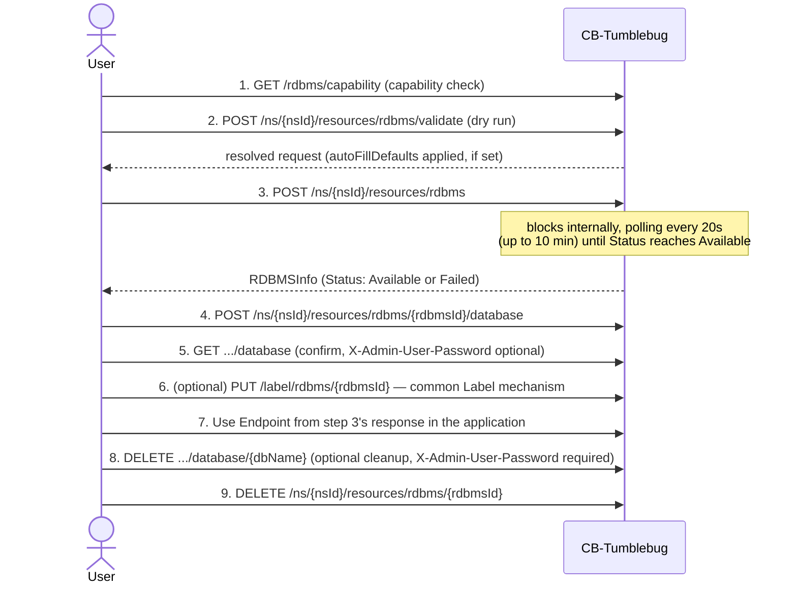
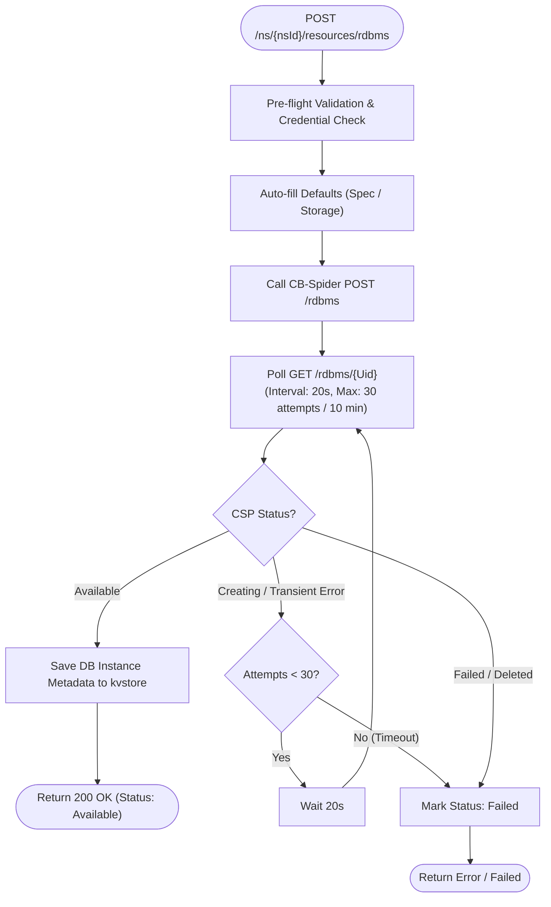
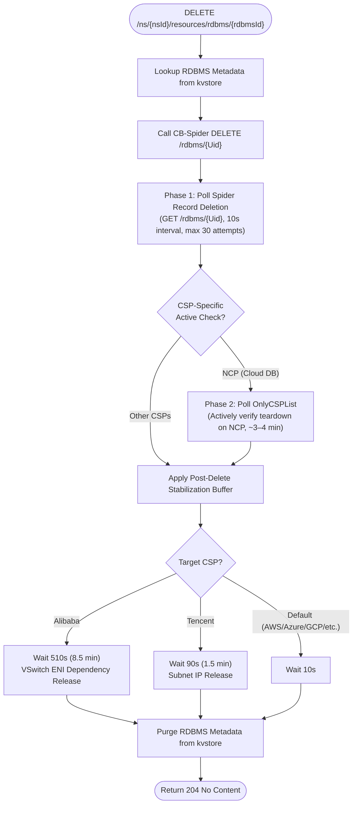

# RDBMS Management — Features and API Reference

CB-Tumblebug's RDBMS (managed relational database) feature: capability discovery, instance
lifecycle, logical database management, and CSP-specific defaults. Backed by CB-Spider's RDBMS
API (v0.13.1+) — an implementation detail, not this document's focus (see References).

## CSP-Wide Engine Support Matrix

| CSP           | Provider Name | MySQL | MariaDB | Tested Reference Version (MySQL / MariaDB) | Primary Platform / Service                 |
| :------------ | :------------ | :---: | :-----: | :----------------------------------------- | :----------------------------------------- |
| **AWS**       | `aws`         |  ✅   |   ✅    | `8.0` / `10.6`                             | Amazon RDS (Multi-AZ SubnetGroup)          |
| **Azure**     | `azure`       |  ✅   |   ❌    | `8.0.21` / —                               | Azure Database for MySQL Flexible Server   |
| **GCP**       | `gcp`         |  ✅   |   ❌    | `8.0` / —                                  | Google Cloud SQL for MySQL                 |
| **Alibaba**   | `alibaba`     |  ✅   |   ✅    | `8.0` / `10.6`                             | Alibaba Cloud ApsaraDB RDS                 |
| **Tencent**   | `tencent`     |  ✅   |   ❌    | `8.0` / —                                  | TencentDB for MySQL                        |
| **IBM**       | `ibm`         |  ✅   |   ❌    | `8.4` / —                                  | IBM Cloud Databases for MySQL              |
| **NCP**       | `ncp`         |  ✅   |   ❌    | `8.0.36` / —                               | NAVER Cloud Platform Cloud DB for MySQL    |
| **NHN**       | `nhn`         |  ✅   |   ✅    | `MYSQL_V8408` / `MARIADB_V101118`          | NHN Cloud RDS for MySQL / MariaDB          |
| **OpenStack** | `openstack`   |  ✅   |   ✅    | `5.7.29` / `10.4`                          | OpenStack Trove _(local testing deferred)_ |
| **KT Cloud**  | `kt`          |  ❌   |   ❌    | —                                          | _Unsupported (No managed DB service)_      |

## Features

| Feature                                                      | Status      | Location                                                                                                    |
| ------------------------------------------------------------ | ----------- | ----------------------------------------------------------------------------------------------------------- |
| Static, CSP-wide support matrix (`GetRDBMSSupport`)          | ✅          | [rdbms.go](../../src/core/resource/rdbms.go), [rdbms.go](../../src/interface/rest/server/resource/rdbms.go) |
| Live, per-connection capability query (`GetRDBMSCapability`) | ✅          | [rdbms.go](../../src/core/resource/rdbms.go), [rdbms.go](../../src/interface/rest/server/resource/rdbms.go) |
| DB instance lifecycle (Create/List/Get/Delete)               | ✅          | [rdbms.go](../../src/core/resource/rdbms.go), [rdbms.go](../../src/interface/rest/server/resource/rdbms.go) |
| Create-request validation (dry run, no side effects)         | ✅          | `ValidateRDBMSCreateRequest` in [rdbms.go](../../src/core/resource/rdbms.go)                                |
| CSP admin username/password policy validation                | ✅          | `validateAdminCredentials` in [rdbms.go](../../src/core/resource/rdbms.go)                                  |
| Spec-aware autoFillDefaults picker (vCPU/memory-based)       | ✅          | `pickSmallestDBSpec` in [rdbms.go](../../src/core/resource/rdbms.go)                                        |
| Internal Logical Database CRUD                               | ✅          | [rdbms.go](../../src/core/resource/rdbms.go), [rdbms.go](../../src/interface/rest/server/resource/rdbms.go) |
| Tag management                                               | By Label    | [label.go](../../src/core/common/label/label.go)                                                            |
| Register/Unregister existing CSP RDBMS                       | Not Planned | —                                                                                                           |
| Reconciliation                                               | ✅          | [rdbmsReconcile.go](../../src/core/reconcile/rdbmsReconcile.go)                                             |

- **Capability discovery**: check which engines/features a CSP supports.
  - Static, CSP-wide reference, no live call (`GET /rdbms/support`).
  - Live, per-connection: versions, spec/storage options, `Requires*`/`Supports*` flags
    (`GET /rdbms/capability`).
  - Typical flow: `/support` to pick a CSP/engine, then `/capability` for the target connection.
- **DB instance lifecycle**: create, inspect, and delete a managed DB instance.
  - Dry run, no provisioning (`POST .../rdbms/validate`).
  - Create: resolves network names, validates against live capability data (see [CSP Capability, Requirements & Constraints](#csp-capability-requirements--constraints)) and CSP admin-credential policy (see [Admin Credential Constraints](#admin-credential-constraints)),
    auto-fills the smallest usable `dbInstanceSpec` and a compatible storage type if requested, and
    blocks server-side until the DB instance reaches `Available` (`POST .../rdbms`; see
    [RDBMS Management Stability Enhancement](#rdbms-management-stability-enhancement) for details).
  - Delete: confirms via two independent checks before clearing the kvstore record
    (`DELETE .../rdbms/{rdbmsId}`; also in [RDBMS Management Stability Enhancement](#rdbms-management-stability-enhancement)).
- **Internal logical databases**: create, list, and delete logical databases inside an
  `Available` DB instance.
  - Not a tracked Tumblebug resource — no kvstore entry, queried live
    (`POST`/`GET`/`DELETE .../rdbms/{rdbmsId}/database[/{dbName}]`).
  - Admin password required for create/delete, optional for list, and never persisted (masked
    before it ever reaches a log line — same rule for the DB instance's own create-time admin
    password).
- **Tag management**: uses the common
  [Label mechanism](../../src/core/common/label/label.go) instead of a dedicated tag API, like
  every other resource type.
- **Registration** of an existing CSP DB instance is planned but not built, mirroring the
  VNet/SecurityGroup register/deregister pattern.
- **Reconciliation**: detects drift via the shared
  [resource-reconciliation.md](resource-reconciliation.md) contract; the creating/deleting repair
  paths are logging-only skeletons today (same as VNet/ObjectStorage). A `DeletionFailed`
  DB instance only auto-restores to `Available` if it's auto-managed (`IsAutoManagedResource`) —
  a user-owned DB instance's tombstone is sticky, and its recovery path is **TBD**
  (`PUT .../restore` exists generically but isn't yet wired up for RDBMS; see Open Items
  in [resource-reconciliation.md](resource-reconciliation.md)).

## Usage Sequence (Tumblebug User Perspective)

Scenario A is fully implemented; B/C describe the target flow for planned registration/audit features (see [API Reference](#api-reference)).

- **Scenario B — Register an existing CSP DB instance (planned)**: `POST /inspectResources` to find CSP-only DB instances, then `POST .../rdbms/register` (CSP instance ID; `vNetId` auto-resolved if omitted). `.../unregister` drops Tumblebug ownership without touching the CSP DB instance.
- **Scenario C — Audit and clean up orphans (planned)**: `POST /inspectResources` returns `onTumblebug`/`onCspOnly` lists; `DELETE /rdbms/cspOnly/{cspId}` removes a CSP-only orphan directly (bypasses Tumblebug entirely — confirm the target first).

## API Reference

Where a generic mechanism already covers a need — `inspectResources` for CSP/Tumblebug-mapped listing, counting, and orphan detection (see [shared-resource-management.md](shared-resource-management.md)) — planned features reuse it instead of adding a parallel RDBMS-only API.

### Implemented Endpoints

| Method | Path                                                     | Handler                         |
| ------ | -------------------------------------------------------- | ------------------------------- |
| GET    | `/rdbms/support`                                         | `RestGetRDBMSSupport`           |
| GET    | `/rdbms/capability`                                      | `RestGetRDBMSCapability`        |
| POST   | `/ns/{nsId}/resources/rdbms/validate`                    | `RestValidateRDBMS`             |
| POST   | `/ns/{nsId}/resources/rdbms`                             | `RestPostRDBMS`                 |
| GET    | `/ns/{nsId}/resources/rdbms`                             | `RestGetAllResources` (generic) |
| GET    | `/ns/{nsId}/resources/rdbms/{rdbmsId}`                   | `RestGetRDBMS`                  |
| DELETE | `/ns/{nsId}/resources/rdbms/{rdbmsId}`                   | `RestDeleteRDBMS`               |
| POST   | `/ns/{nsId}/resources/rdbms/{rdbmsId}/database`          | `RestPostRDBMSDatabase`         |
| GET    | `/ns/{nsId}/resources/rdbms/{rdbmsId}/database`          | `RestGetRDBMSDatabases`         |
| DELETE | `/ns/{nsId}/resources/rdbms/{rdbmsId}/database/{dbName}` | `RestDeleteRDBMSDatabase`       |

### Planned Endpoints

| Method | Path                                              | Handler                     |
| ------ | ------------------------------------------------- | --------------------------- |
| POST   | `/ns/{nsId}/resources/rdbms/register`             | `RestPostRegisterRDBMS`     |
| DELETE | `/ns/{nsId}/resources/rdbms/{rdbmsId}/unregister` | `RestDeleteUnregisterRDBMS` |
| DELETE | `/rdbms/cspOnly/{cspId}?connectionName=`          | `RestDeleteRDBMSCspOnly`    |

`RestDeleteRDBMSCspOnly` is namespace-independent, destructive, admin-only (explicit confirmation required, logs caller/connection/CSP ID). No dedicated tag API was built — RDBMS instances use the common Label mechanism instead.

## CSP Capability, Requirements & Constraints

Reference values and per-CSP rules — `CreateRDBMS` always re-checks live capability data at request time rather than trusting a cached copy, since a stale reference could let an invalid request slip through and fail only after minutes of CSP provisioning.

### CSP Capability Summary (MySQL)

`DB Op. Method` — `cspNativeApi` (CSP-native database API) or `sqlFallback` (direct SQL via the admin login; see [Direct SQL Connection & Reachability](#direct-sql-connection--reachability-external-vs-internal-vpc) for network-reachability details).

| CSP           | Engine Version | DB Spec                                           | Storage            | Storage Type Selection |        Subnet Requirement         | Security Group Requirement | Tag Support | DB Op. Method  |
| :------------ | :------------- | :------------------------------------------------ | :----------------- | :--------------------: | :-------------------------------: | :------------------------: | :---------: | :------------- |
| **AWS**       | `8.0`          | `db.t3.medium`                                    | 100GB / gp3        |       Selectable       |         Required (2 AZs)          |          Required          |  Supported  | `sqlFallback`  |
| **Azure**     | `8.0.21`       | `Standard_B1ms`                                   | 20GB / auto        |      Auto-managed      | Required (Private) / N/A (Public) |            N/A             |  Supported  | `cspNativeApi` |
| **GCP**       | `8.0`          | `db-custom-2-8192`                                | 20GB / PD_SSD      |      Series-bound      |                N/A                |            N/A             |  Supported  | `cspNativeApi` |
| **Alibaba**   | `8.0`          | `mysql.n4.large.1`                                | 20GB / cloud_essd  |       Selectable       |             Required              |            N/A             |  Supported  | `cspNativeApi` |
| **Tencent**   | `8.0`          | `8000` (MB)                                       | 50GB / local_ssd   |       Selectable       |             Required              |          Optional          |  Supported  | `cspNativeApi` |
| **IBM**       | `8.4`          | `multitenant`                                     | 30GB / auto        |      Auto-managed      |                N/A                |            N/A             |  Supported  | `sqlFallback`  |
| **OpenStack** | `5.7.29`       | `m1.small`                                        | 20GB / auto        |       Selectable       |                N/A                |            N/A             | Unsupported | `cspNativeApi` |
| **NCP**       | `8.0.36`       | `SVR.VDBAS.AMD.STAND.C002.M008.NET.SSD.B050.G003` | CSP-managed        |      Auto-managed      |             Required              |            N/A             | Unsupported | `cspNativeApi` |
| **NHN**       | `MYSQL_V8408`  | `m2.c2m4`                                         | 20GB / General SSD |       Selectable       |             Required              |   N/A (Dedicated DB-SG)    | Unsupported | `cspNativeApi` |

Full per-CSP notes (password quirks, premium storage minimums): section 9 of the CB-Spider wiki's [RDBMS Management Guide](<https://github.com/cloud-barista/cb-spider/wiki/RDBMS%E2%80%90Management%E2%80%90Guide(KR)>).

### CSP Capability Summary (MariaDB)

Only 4 of 9 CSPs support MariaDB. Azure, GCP, Tencent, IBM, and NCP do not list `mariadb` — use `mysql` for those providers.

| CSP           | Engine Version     | DB Spec                | Storage            | Storage Type Selection |        Subnet Requirement         | Security Group Requirement | Tag Support | DB Op. Method  |
| :------------ | :----------------- | :--------------------- | :----------------- | :--------------------: | :-------------------------------: | :------------------------: | :---------: | :------------- |
| **AWS**       | `10.6` (`10.6.27`) | `db.t3.medium`         | 100GB / gp2        |       Selectable       |         Required (2 AZs)          |          Required          |  Supported  | `sqlFallback`  |
| **Alibaba**   | `10.6`             | `mariadb.n2.medium.2c` | 20GB / cloud_essd  |       Selectable       |             Required              |            N/A             |  Supported  | `cspNativeApi` |
| **NHN**       | `MARIADB_V101118`  | `m2.c2m4`              | 20GB / General SSD |       Selectable       |             Required              |   N/A (Dedicated DB-SG)    | Unsupported | `cspNativeApi` |
| **OpenStack** | `10.4`             | `m1.small`             | 20GB / auto        |       Selectable       |                N/A                |            N/A             | Unsupported | `cspNativeApi` |

_(Note: OpenStack's local test environment currently does not have a MariaDB datastore registered, but the driver capability mapping is defined as above.)_

### CSP-Specific Requirements and Constraints

- **AWS**:
  - Requires 2 subnets in distinct AZs (SubnetGroup) and a pre-existing Security Group.
  - `io1`/`io2` storage types require `Iops >= 1000` and `StorageSize >= 100GB`.
  - Database CRUD uses `sqlFallback` (direct SQL connection via admin login) — private DB instances require network reachability to the private endpoint.
- **Azure**:
  - `RequiresSubnet`: Required when `PublicAccess: false` (VPC-private mode); not used when `PublicAccess: true` (default).
  - `SupportsStorageTypeSelection=false` — storage SKU is auto-managed by Azure based on the compute tier.
  - Enforces TLS encryption (`require_secure_transport=ON`); clients must connect with TLS enabled.
- **GCP**:
  - `StorageType` is bound to the machine series (`HYPERDISK_BALANCED` for C4A/N4 series, `PD_SSD`/`PD_HDD` for others) — pre-flight validation catches mismatches before provisioning.
- **Alibaba**:
  - Requires selecting a DB instance specification compatible with the target storage type (e.g. `mysql.n4.*` supports `cloud_essd`, while `local_ssd` requires `rds.mysql.*`).
  - Network interface release lags DB instance deletion; teardown incorporates stabilization retry buffers (510s / 8.5 min).
- **Tencent**:
  - DBSpec memory size is specified in MB (e.g. `8000` for 8GB).
  - Security Group is optional (shares the VM's security group).
  - Background ENI release lags DB instance deletion; teardown incorporates stabilization retry buffers (90s).
- **IBM**:
  - Provisions on the shared/multitenant platform with auto-managed storage (`SupportsStorageTypeSelection=false`).
  - Database CRUD uses `sqlFallback` and requires TLS connection.
  - Active supported MySQL version is `8.4`. End-of-Life (EOL) versions (`5.7`, `8.0`) are rejected by IBM Cloud for new deployments and are filtered out via `endOfLifeVersions` in `assets/rdbmsinfo.yaml`.
- **NCP**:
  - `StorageSize` is auto-managed (starts at 10GB and auto-scales up to 6000GB in 10GB increments); custom size inputs are ignored. Storage type defaults to `SSD`.
  - Assigns private VPC endpoints only (`*.vpc-cdb.ntruss.com`); direct external access requires manual public domain assignment via NCP console.
  - Full DB instance deletion is actively tracked via dynamic CSP-side polling (~3–4 min).
- **NHN**:
  - Requires dedicated RDS credentials (`User Access Key`, `Secret Access Key`, and engine AppKey).
  - Returns a single public FQDN endpoint when `PublicAccess: true`. Standard VPC Security Groups (`securityGroupIds`) are ignored.
  - Access control is governed by NHN Cloud's dedicated **DB Security Group** (DB 보안 그룹). Setting `nhnDBSGToAllowAllInbound: true` (or `NHNAutoOpenDBSecurityGroup: true` in Spider) with `PublicAccess: true` auto-creates and attaches a fully-open (`0.0.0.0/0`) DB Security Group for testing and deletes it automatically upon DB deletion.
- **OpenStack**:
  - Storage type is not reported after creation — verify provisioning success via `Available` status.

### Admin Credential Constraints

Enforced client-side by `validateAdminCredentials` before Create reaches CB-Spider. `—` = no constraint recorded.

| CSP       | Admin Username Constraint                                                                                                                                          | Admin Password Constraint               |
| --------- | ------------------------------------------------------------------------------------------------------------------------------------------------------------------ | --------------------------------------- |
| AWS       | —                                                                                                                                                                  | —                                       |
| Azure     | Rejects: `admin`                                                                                                                                                   | —                                       |
| GCP       | —                                                                                                                                                                  | —                                       |
| Alibaba   | Rejects: `admin`                                                                                                                                                   | —                                       |
| Tencent   | Fixed: `root`                                                                                                                                                      | —                                       |
| IBM       | Fixed: `admin`                                                                                                                                                     | 15-72 characters, no special characters |
| OpenStack | —                                                                                                                                                                  | —                                       |
| NCP       | Rejects: `admin`, `root`, etc. (system accounts)                                                                                                                   | Requires ≥1 special character           |
| NHN       | Rejects: `admin`, `root`, `rds_admin`, `rds_mha`, `rds_repl`, `sqlgw`, `etladm`, `alertman`, `prom`, `mysql.session`, `mysql.sys`, `mysql.infoschema` (1-32 chars) | —                                       |

### Direct SQL Connection & Reachability (External vs Internal VPC)

About a caller's own application or test client connecting straight to the database endpoint via MySQL wire protocol (port 3306) — distinct from Tumblebug/Spider's REST-based database management (`DB Op. Method`).

| CSP       |      External Public Access       |  Internal (VPC) Access   | Requires TLS | Reachability Constraints & Evidence                                                                                                                                                                                                                                                                                    |
| --------- | :-------------------------------: | :----------------------: | :----------: | ---------------------------------------------------------------------------------------------------------------------------------------------------------------------------------------------------------------------------------------------------------------------------------------------------------------------- |
| AWS       |                🟢                 |            🟢            |      No      | Plain connection succeeded externally with `publicAccess=true`.                                                                                                                                                                                                                                                        |
| Azure     |                🟢                 |            🟢            |     Yes      | Plain rejected (`Error 3159 ... require_secure_transport=ON`); requires TLS (`tls=preferred` or `true`).                                                                                                                                                                                                               |
| GCP       |                🟢                 |            🟢            |      No      | Plain connection succeeded externally with `publicAccess=true`.                                                                                                                                                                                                                                                        |
| Alibaba   |                🟢                 |            🟢            |      —       | When `publicAccess=true`, CB-Spider automatically allocates Public Connection and configures IP Whitelist.                                                                                                                                                                                                             |
| Tencent   |                🟢                 |            🟢            |      —       | When `publicAccess=true`, CB-Spider automatically opens Public WAN access.                                                                                                                                                                                                                                             |
| IBM       |                🟢                 |            🟢            |     Yes      | Public endpoint supported; TLS required (`*.databases.appdomain.cloud`).                                                                                                                                                                                                                                               |
| OpenStack |   🟢 (if FIP/router configured)   |            🟢            |      —       | Depends on tenant network external router and floating IP assignment.                                                                                                                                                                                                                                                  |
| NCP       |             🔴 (N/A)              |            🟢            |      —       | **No external public IP provided by default**; endpoint is private VPC-only (`*.vpc-cdb.ntruss.com`). External access requires manual public domain request via NCP console.                                                                                                                                           |
| NHN       | 🔴 (by default) / 🟢 (with DB SG) | 🟢 (requires DB SG rule) |      —       | **Public FQDN/IP is assigned, but port 3306 is blocked by default** by NHN Cloud's dedicated DB Security Group (positive security model). Access requires configuring an inbound permit rule in the NHN Console (`Database > RDS for MySQL > DB 보안 그룹`) or setting `nhnDBSGToAllowAllInbound: true` (for testing). |

> [!NOTE]
> **Dual Testing Strategy (External vs Internal VPC)**:
>
> - **External Remote Test**: Validates client-side connectivity over public internet (applicable to AWS, Azure, GCP, IBM).
> - **Internal VPC VM Test (via Remote Command API)**: Validates SQL CRUD from within the same VPC network, overcoming CSP-specific public IP/firewall constraints (essential for NCP, NHN, and private production database deployments).

A connection mode that adapts either way (e.g. `go-sql-driver/mysql`'s `tls=preferred`) avoids TLS negotiation errors.

## RDBMS Management Stability Enhancement

Managed relational databases exhibit significant heterogeneity across CSPs regarding asynchronous provisioning latency, transient state transitions, and background resource release lag. CB-Tumblebug implements specialized defensive mechanisms to ensure end-to-end reliability for DB instance creation and teardown.

### Creation Stability Enhancement

DB instance creation blocks server-side until the DB instance reaches `Available` status on the CSP.

- **Creation Polling (`ConfirmRDBMSCreated`)**: Polls every 20s for up to 10 minutes (30 attempts) until `Available`.
  - **AWS**: Returns `Creating` immediately; RDS MySQL/MariaDB creation typically requires 5–7 minutes.
  - **IBM**: Returns `Creating` immediately with variable cloud database provisioning times.
  - **Alibaba**: Can return `Error` transiently during initial cluster setup before settling into `Available`.

### Deletion Stability Enhancement

Deleting a DB instance confirms deletion via two-phase validation and applies CSP-specific post-delete stabilization buffers to prevent cascaded network teardown failures.

- **Deletion Confirmation (`PollResourceFullyDeleted`)**: Verifies deletion through two independent layers:
  - **NCP**: Cloud DB instance teardown takes ~3–4 minutes and is actively tracked via dynamic CSP-side polling (`PollResourceDeletedOnCSP`, polled every 10s for up to 10 min).
  - **Alibaba**: VPC/vSwitch attachments release asynchronously; deleting subnets immediately after instance deletion triggers `DependencyViolation.Rds`.
  - **Tencent**: VPC/subnet IP releases lag instance deletion (`ResourceInUse`).
- **Post-Delete Stabilization Buffers**:
  - **Alibaba**: 510s (8.5 minutes) to ensure complete background VSwitch ENI detachment before subsequent subnet/VPC deletion.
  - **Tencent**: 90s (1.5 minutes) for network interface release.
  - **NCP**: 10s default buffer (full teardown is already confirmed by dynamic `OnlyCSPList` polling).
  - **Default (AWS, Azure, GCP, IBM, OpenStack)**: 10s.

## References

Background on CB-Spider's side of this integration (implementation detail, not part of Tumblebug's own API contract):

- [RDBMS‐Management‐Guide (KR)](<https://github.com/cloud-barista/cb-spider/wiki/RDBMS%E2%80%90Management%E2%80%90Guide(KR)>)
- [CB-Spider RDBMS API Test README](https://github.com/cloud-barista/cb-spider/blob/master/test/rdbms-mysql-test/README.md)
- [CB-Spider RDBMS StorageType Test README](https://github.com/cloud-barista/cb-spider/blob/master/test/rdbms-mysql-test/storage-type-test/README.md)
- [CB-Spider RDBMS Database Management Test README](https://github.com/cloud-barista/cb-spider/blob/master/test/rdbms-mysql-test/database-test/README.md)
- [CB-Spider RDBMS Tag Management Test README](https://github.com/cloud-barista/cb-spider/blob/master/test/rdbms-mysql-test/tag-test/README.md)

## Appendix: Tumblebug API → CB-Spider API Mapping

Covers the 10 routes in Implemented Endpoints (planned endpoints excluded — their Spider-call shape isn't finalized). `{Uid}` is CB-Spider's own DB instance ID (`RDBMSInfo.Uid`), not the Tumblebug `rdbmsId`. 🔁 marks a field CB-Spider still calls `MasterUserName`/`MasterUserPassword` on the wire, translated to/from Tumblebug's `adminUserName`/`adminUserPassword` at the call site and never exposed as `Master*` to a Tumblebug API caller.

| Tumblebug API                                  | CB-Spider API(s) Called                                                                                           | Notes                                                                                  |
| ---------------------------------------------- | ----------------------------------------------------------------------------------------------------------------- | -------------------------------------------------------------------------------------- |
| `GET /rdbms/support`                           | — (none)                                                                                                          | Static from `assets/rdbmsinfo.yaml`.                                                   |
| `GET /rdbms/capability`                        | `GET /rdbmsmetainfo` (required); `GET /dbspec`, `GET /rdbmsengine` (best-effort)                                  | Best-effort calls populate `dbInstanceSpecs`/`liveSupportedEngines` only.              |
| `POST .../rdbms/validate`                      | Same as `/capability`'s required call, plus `GET /dbspec` if autofilling `dbInstanceSpec`                         | Dry run — never reaches create/delete.                                                 |
| `POST .../rdbms`                               | Same as Validate, plus `POST /rdbms`; `GET /rdbms/{Uid}` (poll every 20s up to 10 min, through Creating or Error) | 🔁 in the create request body.                                                         |
| `GET .../rdbms` (list)                         | — (none)                                                                                                          | Served from kvstore.                                                                   |
| `GET .../rdbms/{rdbmsId}`                      | `GET /rdbms/{Uid}`                                                                                                | 🔁 in the response (password never returned).                                          |
| `DELETE .../rdbms/{rdbmsId}`                   | `DELETE /rdbms/{Uid}`; `GET /rdbms/{Uid}` + `GET /allrdbms` (dual verify)                                         | See [RDBMS Management Stability Enhancement](#rdbms-management-stability-enhancement). |
| `POST .../rdbms/{rdbmsId}/database`            | `GET /rdbms/{Uid}` (Status check); `POST /rdbms/{Uid}/databases`                                                  | 🔁 in the request body.                                                                |
| `GET .../rdbms/{rdbmsId}/database`             | `GET /rdbms/{Uid}`; `GET /rdbms/{Uid}/databases`                                                                  | 🔁 via `X-Admin-User-Password` header.                                                 |
| `DELETE .../rdbms/{rdbmsId}/database/{dbName}` | `GET /rdbms/{Uid}`; `DELETE /rdbms/{Uid}/databases/{dbName}`                                                      | 🔁 via `X-Admin-User-Password` header.                                                 |
