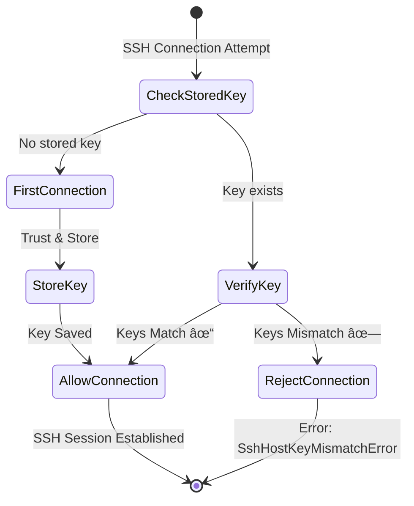

# Remote Command Execution and File Transfer

Comprehensive guide for executing remote commands and transferring files to MCI VMs via secure SSH with TOFU (Trust On First Use) verification.

## 📑 Table of Contents

1. [Overview](#overview)
2. [Key Concepts](#key-concepts)
3. [Architecture](#architecture)
4. [SSH Host Key Verification (TOFU)](#ssh-host-key-verification-tofu)
5. [API Reference](#api-reference)
6. [Usage Examples](#usage-examples)

---

## Overview

### What is Remote Command Execution?

**Remote Command Execution** is a core feature of CB-Tumblebug that allows users to execute shell commands on VMs within an MCI (Multi-Cloud Infrastructure). Commands are sent via SSH through a **Bastion Host** for security, supporting parallel execution across multiple VMs.

### What is File Transfer?

**File Transfer** enables uploading files from the Tumblebug server to target VMs via SCP (Secure Copy Protocol). Like remote commands, file transfers also use the Bastion Host architecture.

### Why Use These Features?

**Problem:**
- Manually SSH-ing into each VM across multiple clouds is tedious and error-prone.
- Direct SSH access to VMs in private subnets is not possible without a jump host.
- Trusting SSH host keys manually for dozens of VMs is impractical.

**Solution:**
- **Unified API**: Execute commands on multiple VMs with a single API call.
- **Bastion Architecture**: Secure access to private VMs via a designated jump host.
- **TOFU Security**: Automatic SSH host key verification to prevent MITM attacks.
- **Parallel Execution**: Commands run concurrently across all target VMs.

---

## Key Concepts

### Gradual Target Selection

Tumblebug supports **multi-level target selection** for precise command execution:


| Level | Parameter | Example | Target VMs |
|-------|-----------|---------|------------|
| **MCI** | (none) | `/cmd/mci/mci01` | All VMs in MCI |
| **SubGroup** | `subGroupId` | `?subGroupId=g1` | All VMs in SubGroup g1 |
| **VM** | `vmId` | `?vmId=g1-1` | Only VM g1-1 |
| **Label** | `labelSelector` | `?labelSelector=role=worker` | VMs with matching label |

**Label Selector Examples:**
- `role=worker` - VMs with role=worker label
- `env=prod,tier=backend` - VMs matching both labels
- `sys.id=g1-1` - System label matching (VM ID)

### Bastion Host (Jump Host)

A **Bastion Host** is a VM with a public IP that acts as a gateway for SSH connections to other VMs in the MCI. All remote commands and file transfers are routed through the Bastion.

```
┌─────────────────────────────────────────────────────────────────┐
│                           MCI                                   │
│  ┌─────────────────┐                                            │
│  │  Bastion Host   │◄─────── Public IP (SSH Entry Point)        │
│  │  (Jump Host)    │                                            │
│  └────────┬────────┘                                            │
│           │ SSH Tunnel (via Private Network)                    │
│           ▼                                                     │
│  ┌─────────────────┐  ┌─────────────────┐  ┌─────────────────┐  │
│  │   Target VM 1   │  │   Target VM 2   │  │   Target VM 3   │  │
│  │  (Private IP)   │  │  (Private IP)   │  │  (Private IP)   │  │
│  └─────────────────┘  └─────────────────┘  └─────────────────┘  │
└─────────────────────────────────────────────────────────────────┘
```

**Key Points:**
- Each VM in an MCI is assigned a Bastion Host automatically.
- The Bastion can be any VM in the MCI with a public IP.
- SSH connections: `User → Bastion (Public IP) → Target VM (Private IP)`

### Command Execution Flow

1. User sends command request to Tumblebug API
2. Tumblebug resolves Bastion Host for target VM
3. SSH connection established: Tumblebug → Bastion → Target VM
4. Command executed on Target VM
5. Output (stdout/stderr) returned to user

---

## Architecture

### Remote Command Execution Flow


### File Transfer Flow


### Parallel Execution Architecture

When targeting multiple VMs, commands execute in parallel:


---

## SSH Host Key Verification (TOFU)

### What is TOFU?

**TOFU (Trust On First Use)** is a security model where:
1. **First Connection**: The SSH host key is stored and trusted.
2. **Subsequent Connections**: The stored key is compared with the presented key.
3. **Mismatch Detection**: If keys don't match, the connection is rejected (possible MITM attack).

This is the same model used by the `ssh` command-line tool (`~/.ssh/known_hosts`).

### How TOFU Works in Tumblebug



### Host Key Storage

Host keys are stored in the `VmInfo` structure:

```go
type VmInfo struct {
    // ... other fields ...
    
    // SshHostKeyInfo contains SSH host key for TOFU verification
    SshHostKeyInfo *SshHostKeyInfo `json:"sshHostKeyInfo,omitempty"`
}

type SshHostKeyInfo struct {
    HostKey     string  // Base64-encoded public key
    KeyType     string  // ssh-rsa, ssh-ed25519, ecdsa-sha2-nistp256
    Fingerprint string  // SHA256 fingerprint
    FirstUsedAt string  // Timestamp of first trust (RFC3339)
}
```

### Handling Host Key Changes

When a VM is recreated (terminated and created again), its SSH host key changes. This is legitimate but will trigger a TOFU verification failure.

**Resolution Steps:**
1. Verify the key change is expected (VM was recreated, not compromised)
2. Reset the stored host key via API
3. Next connection will store the new key (TOFU)


### Independent Key Management: Bastion vs Target

Both Bastion and Target VMs have their own SSH host keys, managed independently:

| VM Role | Key Storage Location | Verification |
|---------|---------------------|--------------|
| Bastion | `bastion.SshHostKeyInfo` | TOFU on first jump |
| Target | `target.SshHostKeyInfo` | TOFU on final connection |

This ensures:
- Bastion compromise is detected if its key changes
- Target compromise is detected if its key changes
- Each VM's security is independently verified

---

## API Reference

### Execute Command on MCI

Execute commands on VMs within an MCI.

```
POST /tumblebug/ns/{nsId}/cmd/mci/{mciId}
```

**Query Parameters:**
| Parameter | Type | Description |
|-----------|------|-------------|
| `subGroupId` | string | Target specific subgroup only |
| `vmId` | string | Target specific VM only |
| `labelSelector` | string | Filter VMs by label (e.g., `role=worker`) |

**Request Body:**
```json
{
  "userName": "cb-user",
  "command": ["echo 'Hello World'", "hostname", "uname -a"]
}
```

**Response:**
```json
{
  "results": [
    {
      "mciId": "mci01",
      "vmId": "g1-1",
      "vmIp": "10.0.1.5",
      "command": {
        "0": "echo 'Hello World'",
        "1": "hostname",
        "2": "uname -a"
      },
      "stdout": {
        "0": "Hello World",
        "1": "g1-1",
        "2": "Linux g1-1 5.15.0-generic x86_64 GNU/Linux"
      },
      "stderr": {},
      "error": ""
    }
  ]
}
```

### Transfer File to MCI

Upload a file to VMs within an MCI.

```
POST /tumblebug/ns/{nsId}/file/mci/{mciId}
Content-Type: multipart/form-data
```

**Form Fields:**
| Field | Type | Description |
|-------|------|-------------|
| `file` | file | File to upload |
| `targetPath` | string | Destination directory on VM |
| `subGroupId` | string | Target specific subgroup (optional) |
| `vmId` | string | Target specific VM (optional) |

**Response:**
```json
{
  "results": [
    {
      "mciId": "mci01",
      "vmId": "g1-1",
      "vmIp": "10.0.1.5",
      "stdout": {
        "0": "File transfer successful: /home/cb-user/config.yaml"
      },
      "stderr": {},
      "error": ""
    }
  ]
}
```

### Get SSH Host Key Info

Retrieve stored SSH host key information for a VM.

```
GET /tumblebug/ns/{nsId}/mci/{mciId}/vm/{vmId}/sshHostKey
```

**Response (key exists):**
```json
{
  "hostKey": "AAAAC3NzaC1lZDI1NTE5AAAAI...",
  "keyType": "ssh-ed25519",
  "fingerprint": "SHA256:abcdef123456...",
  "firstUsedAt": "2024-01-15T10:30:00Z"
}
```

**Response (no key stored yet):**
```json
{}
```

### Reset SSH Host Key

Reset the stored SSH host key for a VM. Use when a VM has been legitimately recreated.

```
DELETE /tumblebug/ns/{nsId}/mci/{mciId}/vm/{vmId}/sshHostKey
```

**Response:**
```json
{
  "message": "SSH host key for VM 'g1-1' has been reset. The next SSH connection will store the new host key (TOFU)."
}
```

---

## Usage Examples

### Example 1: Execute Command on All VMs

```bash
curl -X POST "http://localhost:1323/tumblebug/ns/default/cmd/mci/mci01" \
  -H "Content-Type: application/json" \
  -d '{
    "userName": "cb-user",
    "command": ["df -h", "free -m"]
  }'
```

### Example 2: Execute Command on Specific VM

```bash
curl -X POST "http://localhost:1323/tumblebug/ns/default/cmd/mci/mci01?vmId=g1-1" \
  -H "Content-Type: application/json" \
  -d '{
    "userName": "cb-user",
    "command": ["systemctl status nginx"]
  }'
```

### Example 3: Execute Command on VMs with Label

```bash
curl -X POST "http://localhost:1323/tumblebug/ns/default/cmd/mci/mci01?labelSelector=role=worker" \
  -H "Content-Type: application/json" \
  -d '{
    "userName": "cb-user",
    "command": ["docker ps"]
  }'
```

### Example 4: Transfer File to All VMs

```bash
curl -X POST "http://localhost:1323/tumblebug/ns/default/file/mci/mci01" \
  -F "file=@./config.yaml" \
  -F "targetPath=/home/cb-user/"
```

### Example 5: Handle Host Key Mismatch

When you receive an error like:
```
SSH host key mismatch for VM 'g1-1'. Stored key (ssh-ed25519, SHA256:abc...) 
does not match received key (ssh-ed25519, SHA256:xyz...). 
This could indicate a MITM attack or the VM was recreated.
```

**Step 1:** Verify the change is legitimate (check if VM was recently recreated)

**Step 2:** Reset the host key
```bash
curl -X DELETE "http://localhost:1323/tumblebug/ns/default/mci/mci01/vm/g1-1/sshHostKey"
```

**Step 3:** Retry the command (new key will be stored via TOFU)
```bash
curl -X POST "http://localhost:1323/tumblebug/ns/default/cmd/mci/mci01?vmId=g1-1" \
  -H "Content-Type: application/json" \
  -d '{
    "userName": "cb-user",
    "command": ["hostname"]
  }'
```

### Example 6: Check Stored Host Key

```bash
curl -X GET "http://localhost:1323/tumblebug/ns/default/mci/mci01/vm/g1-1/sshHostKey"
```

---

## Security Considerations

### Why Not InsecureIgnoreHostKey?

Using `InsecureIgnoreHostKey` (accepting any host key) would make SSH vulnerable to **Man-in-the-Middle (MITM) attacks**:

```
[Attacker Scenario without TOFU]
User → Attacker's Fake VM → Real VM
      ↑                    
      Attacker intercepts all traffic
      and can modify commands/data
```

With TOFU:
- First connection establishes trust
- Subsequent connections verify the trusted key
- Any key change triggers an alert

### Best Practices

1. **Verify Key Changes**: Before resetting a host key, confirm the VM was legitimately recreated.
2. **Monitor Alerts**: Unexpected host key mismatches may indicate security issues.
3. **Use Label Selectors**: Target commands precisely to minimize exposure.
4. **Review Command Output**: Check stderr for any security-related warnings.
