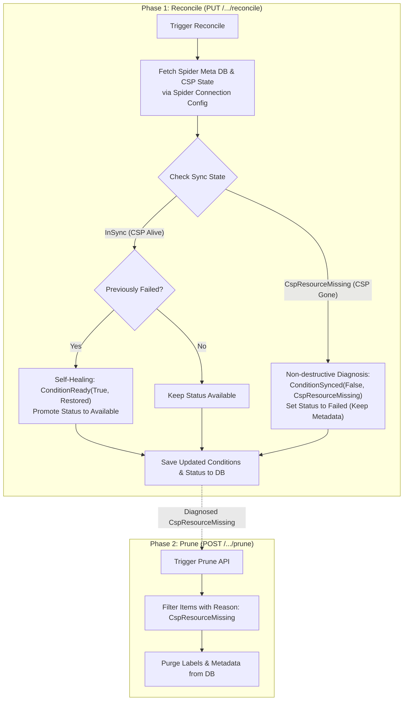

# Resource Reconcile & Prune Guide

CB-Tumblebug implements a Kubernetes-inspired **Declarative Reconciler Architecture** to maintain data consistency between Tumblebug metadata, CB-Spider, and actual CSP provider resources.

This guide details the design philosophy, terminology rationale, Spider Connection Config bulk observation mechanics, diagnostic state machine, self-healing, and metadata garbage collection (`Prune`).

---

## 💡 Design Philosophy & Terminology Rationale

During the architectural design of the Reconciler and Post-Reconcile Cleanup APIs, key operational terms and HTTP methods were checked to ensure clarity and safety:

### 1. Operation Terminology Matrix

| Term         | Operational Scope & Meaning                                                                                                                          | Decision Rationale                                                                                                                                               |
| :----------- | :--------------------------------------------------------------------------------------------------------------------------------------------------- | :--------------------------------------------------------------------------------------------------------------------------------------------------------------- |
| **`Prune`**  | **Batch Garbage Collection of Orphaned Metadata**<br/>Safely purges Tumblebug metadata for items diagnosed as missing on CSP (`CspResourceMissing`). | **SELECTED for Post-Reconcile Cleanup.** Like `git prune` or `docker system prune`, it selectively trims dead/orphaned items without affecting active resources. |
| **`Purge`**  | **Permanent Destruction**<br/>Unconditionally wipes out metadata and logs regardless of state.                                                       | Too destructive for automated cleanup routines.                                                                                                                  |
| **`Force`**  | **Override CSP Locks/Constraints**<br/>Bypasses CSP resource locks (passes `force=true` to Spider) to delete locked resources.                       | Used as an emergency deletion query parameter (`?action=force`), not for routine cleanup.                                                                        |
| **`Refine`** | **Standardization & Polishing**<br/>Normalizes raw CSP resource specs or labels into Tumblebug unified models.                                       | Used for asset normalization during resource registration, not lifecycle cleanup.                                                                                |

### 2. 2-Phase Declarative Pattern: `Reconcile` vs `Prune`

To prevent accidental data loss caused by transient CSP API timeouts or network glitches, Tumblebug separates reconciliation into two explicit phases:

- **Phase 1: Reconcile (`PUT /.../reconcile`) — Non-Destructive Diagnosis**
  - Compares expected vs. observed states.
  - If a CSP resource is missing, Tumblebug **NEVER deletes DB metadata automatically**. Instead, it marks the resource with `ConditionSynced: False` (`Reason: CspResourceMissing`) and sets Status to `Failed`.
  - Gives operators full visibility into resource drift before taking action.

- **Phase 2: Prune (`POST /.../prune`) — Operator-Triggered Batch Cleanup**
  - Executed when operators confirm that missing CSP resources were intentionally deleted outside Tumblebug.
  - Uses `POST` (Batch Action) instead of `DELETE` because it operates across a namespace filtering by condition rather than deleting a specific resource ID.

---

## 🔍 Spider Connection Config Bulk Observation

A core optimization in CB-Tumblebug Reconciler is **Spider Connection Config-based Bulk Inspection**:

Rather than making repeated individual API calls for each resource ID, Reconcile queries CB-Spider using the target resource's **Spider Connection Config** (`/alls3`, `/allvpc`, etc.):

```text
[Tumblebug Reconciler]
       │
       ▼ (Query by Connection Config)
┌──────────────┐      1. Fetch Spider Meta DB Items      ┌──────────────┐
│  CB-Spider   │ ──────────────────────────────────────> │  Spider DB   │
│  Connection  │      2. Fetch Actual CSP Provider Items  ┌──────────────┐
│    Config    │ ──────────────────────────────────────> │ CSP Provider │
└──────────────┘                                         └──────────────┘
```

### Key Advantages:

1. **Dual State Retrieval**: In a single connection call, Reconcile retrieves both **Spider Meta DB presence** (`SP Meta`) and **actual CSP provider resource presence** (`CSP Resource`).
2. **High-Performance Scaling**: Batch fetching across all resources under the same Connection Config reduces network overhead and prevents CSP API rate-limiting during large-scale reconciliation.

---

## 🏗️ Reconcile & Prune Execution Flow

The flowchart below illustrates the concise execution loop of Reconcile diagnosis, self-healing, and optional Prune cleanup:



---

## 📊 Diagnostic State Matrix & Conditions

Tumblebug uses standardized `Condition` objects following Kubernetes API conventions:

- **`ConditionReady`**: Indicates overall operational readiness (`True`, `False`).
- **`ConditionSynced`**: Tracks synchronization state with CSP (`True`, `False`).
- **`ConditionChildrenReady`**: Tracks readiness of child sub-resources (e.g., Subnets under a VNet).

### Resource Sync States (`ResourceSyncState`)

| State                    | TB Meta | Spider Meta | CSP Resource | Sync Condition Reason        | Action Taken                                                               |
| :----------------------- | :-----: | :---------: | :----------: | :--------------------------- | :------------------------------------------------------------------------- |
| **`InSync`**             |    O    |      O      |      O       | `ReasonAvailable` / `InSync` | Status set/kept as `Available`.                                            |
| **`CspResourceMissing`** |    O    |      O      |      X       | `ReasonCspResourceMissing`   | **Non-destructive diagnosis**: Status set to `Failed`, metadata preserved. |
| **`SpMetaMissing`**      |    O    |      X      |      O       | `ReasonSpMetaMissing`        | Candidate for Spider IID re-registration.                                  |
| **`TbMetaOnly`**         |    O    |      X      |      X       | `ReasonTbMetaOnly`           | Metadata-only orphan.                                                      |

---

## 🚀 Unified REST API Reference

| Resource Type              | Endpoint                                              | HTTP Method | Purpose                                     |
| :------------------------- | :---------------------------------------------------- | :---------: | :------------------------------------------ |
| **VNet (Single)**          | `/ns/{nsId}/resources/vNet/{vNetId}/reconcile`        |    `PUT`    | Reconciles single VNet & child Subnets      |
| **VNet (Batch)**           | `/ns/{nsId}/resources/vNet/reconcile`                 |    `PUT`    | Reconciles all VNets in Namespace           |
| **VNet (Prune)**           | `/ns/{nsId}/resources/vNet/prune`                     |   `POST`    | Purges orphaned VNet & Subnet metadata      |
| **ObjectStorage (Single)** | `/ns/{nsId}/resources/objectStorage/{osId}/reconcile` |    `PUT`    | Reconciles single Object Storage            |
| **ObjectStorage (Batch)**  | `/ns/{nsId}/resources/objectStorage/reconcile`        |    `PUT`    | Reconciles all Object Storages in Namespace |
| **ObjectStorage (Prune)**  | `/ns/{nsId}/resources/objectStorage/prune`            |   `POST`    | Purges orphaned Object Storage metadata     |

---

## ⚠️ Deprecated Legacy Endpoints

> [!WARNING]
> Using `DELETE` requests with `?action=reconcile` (e.g., `DELETE /ns/{nsId}/resources/vNet/{vNetId}?action=reconcile`) is **deprecated** and maintained for backward compatibility only.
>
> Please use `PUT /ns/{nsId}/resources/{resourceType}/{resourceId}/reconcile` for all single resource reconciliation tasks.
