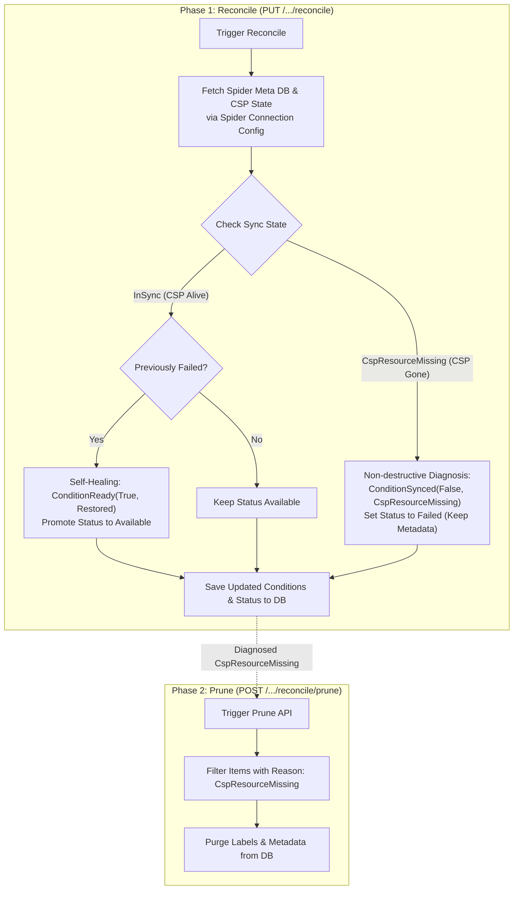

# Resource Reconciliation

## 🧭 What Reconcile Does

**Reconcile diagnoses whether a resource's Tumblebug metadata still matches its actual state in CB-Spider and the CSP, and restores Condition/Status when it can — it never deletes metadata or a CSP resource.**

## 🔍 When You Need It, and What You Get

**You need Reconcile whenever Tumblebug metadata, Spider metadata, and the real CSP resource can end up not matching each other; running it updates each resource's Condition/Status to accurately reflect what was actually observed.**

Tumblebug metadata, Spider metadata, and the CSP resource are three independent systems, so they can end up not matching each other:

- Someone deletes the resource directly on the CSP console — Tumblebug and Spider still believe it exists.
- Spider hits a CSP not-found on delete and, as part of its current behavior, also clears its own metadata (see "Spider Delete Behavior" below) — only Spider's record disappears.
- A delete in Tumblebug fails because another resource depends on it, leaving the resource stuck in `Failed` even though the CSP resource itself is fine.

Running Reconcile:

- Restores a resource stuck in `Failed` back to `Available` when the CSP resource is confirmed alive — and keeps the original failure reason in the Condition message. (A `DeletionFailed` resource that isn't auto-managed is an exception: it stays sticky, see Common Contract below.)
- Marks (but never deletes) a resource whose CSP counterpart is gone: `Failed` + a diagnostic reason, metadata preserved.
- Records any other mismatch (e.g. Spider lost its own IID while the CSP resource is still alive) truthfully, without forcing it to look like anything else.

### Diagnostic State Matrix

Tumblebug uses standardized `Condition` objects following Kubernetes API conventions:

- **`ConditionReady`**: overall operational readiness (`True`/`False`).
- **`ConditionSynced`**: whether TB metadata matches the CSP (`True`/`False`).
- **`ConditionChildrenReady`**: readiness of child sub-resources (e.g. Subnets under a VNet).

| State                    | TB Meta | Spider Meta | CSP Resource | Sync Condition Reason        | What Reconcile Does                                                        |
| :----------------------- | :-----: | :---------: | :----------: | :--------------------------- | :------------------------------------------------------------------------- |
| **`InSync`**             |    O    |      O      |      O       | `ReasonAvailable` / `InSync` | Status kept/restored as `Available` **if authorized** (see Common Contract's ownership gate); otherwise left unchanged. |
| **`CspResourceMissing`** |    O    |      O      |      X       | `ReasonCspResourceMissing`   | **Non-destructive diagnosis**: Status set to `Failed`, metadata preserved. |
| **`SpMetaMissing`**      |    O    |      X      |      O       | `ReasonSpMetaMissing`        | Candidate for Spider IID re-registration.                                  |
| **`TbMetaOnly`**         |    O    |      X      |      X       | `ReasonTbMetaOnly`           | Metadata-only orphan.                                                      |

CSP presence is always checked independently of Spider meta presence (`GetResourceSyncState` compares against the CSP-side list directly), so `SpMetaMissing` (CSP alive) is never confused with `TbMetaOnly`/`CspResourceMissing` (CSP gone) — and this Reason is recorded as-is everywhere, never folded into `InSync` just because the resource happens to be `Available` or is being restored.

## ✅ Acting on the Result

**Only items diagnosed as `CspResourceMissing` are `Prune`'s concern; anything else Reconcile reports (e.g. `SpMetaMissing`) is not something Prune touches, so decide and act on it yourself.**

| Resource Type              | Endpoint                                              | HTTP Method | Purpose                                     |
| :------------------------- | :---------------------------------------------------- | :---------: | :------------------------------------------ |
| **VNet (Single)**          | `/ns/{nsId}/resources/vNet/{vNetId}/reconcile`        |    `PUT`    | Reconciles single VNet & child Subnets      |
| **VNet (Batch)**           | `/ns/{nsId}/resources/vNet/reconcile`                 |    `PUT`    | Reconciles all VNets in Namespace           |
| **VNet (Prune)**           | `/ns/{nsId}/resources/vNet/reconcile/prune`           |   `POST`    | Purges orphaned VNet & Subnet metadata      |
| **ObjectStorage (Single)** | `/ns/{nsId}/resources/objectStorage/{osId}/reconcile` |    `PUT`    | Reconciles single Object Storage            |
| **ObjectStorage (Batch)**  | `/ns/{nsId}/resources/objectStorage/reconcile`        |    `PUT`    | Reconciles all Object Storages in Namespace |
| **ObjectStorage (Prune)**  | `/ns/{nsId}/resources/objectStorage/reconcile/prune`  |   `POST`    | Purges orphaned Object Storage metadata     |
| **RDBMS (Single)**         | `/ns/{nsId}/resources/rdbms/{rdbmsId}/reconcile`      |    `PUT`    | Reconciles single RDBMS instance            |
| **RDBMS (Batch)**          | `/ns/{nsId}/resources/rdbms/reconcile`                |    `PUT`    | Reconciles all RDBMS instances in Namespace |
| **RDBMS (Prune)**          | `/ns/{nsId}/resources/rdbms/reconcile/prune`          |   `POST`    | Purges orphaned RDBMS metadata              |

Prune always lives under `.../reconcile/prune` — the path itself shows that Prune only acts on what Reconcile already diagnosed (see Open Items for why this replaced the earlier flat `.../prune`). Not yet migrated to this framework: SecurityGroup, SSHKey, DataDisk, K8sCluster, GlobalDNS, VPN. They can adopt the same Common Contract below without new design work.

### ⚠️ Deprecated Legacy Endpoints

> [!WARNING]
> `DELETE` requests with `?action=reconcile` (VNet, Subnet) and `?option=reconcile` (ObjectStorage) have been **removed**, not just deprecated. For ObjectStorage this option called Spider delete during diagnosis, triggering the behavior described in "Spider Delete Behavior" below.
>
> Use `PUT /ns/{nsId}/resources/{resourceType}/{resourceId}/reconcile` for single-resource reconciliation instead (for ObjectStorage, follow with `POST .../reconcile/prune` to clean up what Reconcile diagnosed).
>
> VPN has not been migrated to this framework yet, so its `DELETE .../{vpnId}?option=reconcile` remains the only reconcile path for it.

### Execution Flow



`SpMetaMissing` and `TbMetaOnly` follow the same non-destructive-diagnosis pattern as `CspResourceMissing` above (see the state matrix); they're omitted from the diagram for readability. The "Previously Failed? Yes" branch is also simplified: for a `DeletionFailed` resource that isn't auto-managed, self-healing is skipped and the diagnosis is recorded without changing `Status` — see the ownership gate in Common Contract below.

---

The sections below explain _why_ Reconcile is designed this way — most useful when extending it to a new resource type or debugging its internals.

## 💡 Design Philosophy & Terminology Rationale

During the architectural design of the Reconciler and Post-Reconcile Cleanup APIs, key operational terms and HTTP methods were checked to ensure clarity and safety:

### Operation Terminology Matrix

| Term         | Operational Scope & Meaning                                                                                                                          | Decision Rationale                                                                                                                                               |
| :----------- | :--------------------------------------------------------------------------------------------------------------------------------------------------- | :--------------------------------------------------------------------------------------------------------------------------------------------------------------- |
| **`Prune`**  | **Batch Garbage Collection of Orphaned Metadata**<br/>Safely purges Tumblebug metadata for items diagnosed as missing on CSP (`CspResourceMissing`). | **SELECTED for Post-Reconcile Cleanup.** Like `git prune` or `docker system prune`, it selectively trims dead/orphaned items without affecting active resources. |
| **`Purge`**  | **Permanent Destruction**<br/>Unconditionally wipes out metadata and logs regardless of state.                                                       | Too destructive for automated cleanup routines.                                                                                                                  |
| **`Force`**  | **Override CSP Locks/Constraints**<br/>Bypasses CSP resource locks (passes `force=true` to Spider) to delete locked resources.                       | Used as an emergency deletion query parameter (`?action=force`), not for routine cleanup.                                                                        |
| **`Refine`** | **Standardization & Polishing**<br/>Normalizes raw CSP resource specs or labels into Tumblebug unified models.                                       | Used for asset normalization during resource registration, not lifecycle cleanup.                                                                                |

### 2-Phase Declarative Pattern: `Reconcile` vs `Prune`

To prevent accidental data loss caused by transient CSP API timeouts or network glitches, Tumblebug separates reconciliation into two explicit phases:

- **Phase 1: Reconcile (`PUT /.../reconcile`) — Non-Destructive Diagnosis**
  - Compares expected vs. observed states.
  - If a CSP resource is missing, Tumblebug **NEVER deletes DB metadata automatically**. Instead, it marks the resource with `ConditionSynced: False` (`Reason: CspResourceMissing`) and sets Status to `Failed`.
  - Gives operators full visibility into resource mismatches before taking action.

- **Phase 2: Prune (`POST /.../reconcile/prune`) — Operator-Triggered Batch Cleanup**
  - Executed when operators confirm that missing CSP resources were intentionally deleted outside Tumblebug.
  - Uses `POST` (Batch Action) instead of `DELETE` because it operates across a namespace filtering by condition rather than deleting a specific resource ID.
  - Nested under `.../reconcile/` (not a sibling path) so the URL itself shows Prune only acts on what Reconcile diagnosed — see Appendix for the field survey behind this choice.

## ⚠️ Spider Delete Behavior

Confirmed with CB-Spider maintainers, for a resource that exists in Spider metadata but not on the CSP:

- **List/Get**: returns the resource with name only, no CSP detail. Not an error.
- **Delete**: if the CSP call returns not-found, Spider deletes its own metadata record immediately — **regardless of `force`**.

Two consequences:

1. A first `DELETE` attempt gets a CSP-originated not-found message (e.g. "NoSuchBucket"); in that same call, CB-Spider also clears its own record — this is simply how CB-Spider currently behaves, not an incidental side effect. A retry gets a _different_ message — Spider's own "IID does not exist" error, since the record is now gone. `apierr.IsNotFound` already classifies both shapes (Spider IID pattern → CSP message pattern → HTTP 404 fallback). Every `Delete*` function must use this one shared classifier, never a resource-specific string match.
2. Reconcile/self-heal must **never call Spider `DELETE`** (with or without `force`). Doing so during diagnosis destroys the very state (`SpMetaMissing` vs `CspResourceMissing`) it is trying to observe. Diagnosis uses only the non-destructive bulk-list endpoints below.

Other infrastructure tools separate "diagnose" from "delete" the same way Tumblebug's `Reconcile`/`Prune` split does — see the Appendix at the end of this guide for a field survey. Reconcile therefore takes **no self-healing option parameter** — it always diagnoses and restores where applicable, nothing else; `Prune`/`Force` (Terminology Matrix above) already cover anything more destructive.

## 🧩 Common Contract Across Resource Types

> [!IMPORTANT]
> **Never assign `Status` directly, in any reconciler or resource function.** Update `Ready`/`Synced` via `SetCondition`, then always recompute `Status = Derive<Type>Status(Conditions)` — in every branch, with no exceptions. A reconciler that sets `Status` independently of `Ready` can silently restore a resource that isn't actually safe to restore. This exact mistake (`ApplySyncState` setting `Status` to `Available` regardless of `Ready`) let sticky, non-restorable deletion tombstones silently heal back to `Available` across VNet/ObjectStorage/RDBMS/Subnet before it was fixed.

| Aspect          | Standard                                                                                                                                                                                                                                                                                                                                                 |
| :-------------- | :------------------------------------------------------------------------------------------------------------------------------------------------------------------------------------------------------------------------------------------------------------------------------------------------------------------------------------------------------- |
| Diagnosis       | `GetCspResourceStatus` → `GetResourceSyncState` → `SetCondition` (Ready/Synced, set directly per reconciler) → `Derive<Type>Status` (`src/core/model/condition.go`) — Status is always recomputed from Conditions, never assigned independently                                                                                                                                                                                                                                         |
| Reconciler      | `reconcile/<type>Reconcile.go`, registered via `RegisterReconciler(model.Str<Type>, ...)`; no option params                                                                                                                                                                                                                                              |
| Restore         | If CSP alive and `ShouldRestoreToAvailable`, restore `ConditionReady` to `Available` — **except** for `DeletionFailed` on a user-owned (non-auto-managed) resource, which stays sticky (`IsAutoManagedResource`; VNet/ObjectStorage/RDBMS only — Subnet has no ownership gate). `ConditionSynced` is still recorded from the real sync state (`InSync` or `SpMetaMissing`), never forced to `InSync` just because Ready is being restored                                                                                              |
| Delete          | Only `Prune<Type>s(nsId)` (filter: `ConditionSynced.Reason == ReasonCspResourceMissing`) or the user's explicit `Delete<Type>` call. `Prune<Type>s` also best-effort force-deletes Spider's own IID for each pruned item (tolerating not-found), so Spider's orphaned metadata doesn't outlive the TB record that was the only remaining way to reach it |
| Not-found check | `apierr.IsNotFound(err)` only, no per-resource string matching                                                                                                                                                                                                                                                                                           |
| REST shape      | `PUT .../{type}/{id}/reconcile`, `PUT .../{type}/reconcile`, `POST .../{type}/reconcile/prune`; no hidden destructive option on `DELETE`. Prune is a path segment under `reconcile`, never a query param — see Appendix for why.                                                                                                                         |

## 🔍 Spider Connection Config Bulk Observation

A core optimization in CB-Tumblebug Reconciler is **Spider Connection Config-based Bulk Inspection**:

Rather than making repeated individual API calls for each resource ID, Reconcile queries CB-Spider using the target resource's **Spider Connection Config** (`/alls3`, `/allvpc`, `/allrdbms`, etc.):

```text
┌────────────────────────┐
│  Tumblebug Reconciler   │
└────────────┬────────────┘
             │ GET /all* ?ConnectionName=...
             ▼
┌──────────────────────────────────┐
│  CB-Spider (Connection Config)    │
│  compares its own metadata with   │
│  the CSP's actual resource list   │
└───────┬───────────────────┬───────┘
        │ reads              │ calls
        ▼                    ▼
┌───────────────┐   ┌────────────────────┐
│   Spider DB    │   │    CSP Provider     │
│ (Spider's own  │   │  (the real cloud —  │
│   metadata)    │   │  AWS/GCP/Azure/...) │
└───────────────┘   └────────────────────┘
```

Tumblebug never talks to the CSP Provider directly — it only ever calls CB-Spider, which itself is the one comparing its own DB against the CSP and returning the diff (`MappedList`/`OnlySpiderList`/`OnlyCSPList`).

### Key Advantages:

1. **Dual State Retrieval**: In a single connection call, Reconcile retrieves both **Spider Meta DB presence** (`SP Meta`) and **actual CSP provider resource presence** (`CSP Resource`).
2. **High-Performance Scaling**: Batch fetching across all resources under the same Connection Config reduces network overhead and prevents CSP API rate-limiting during large-scale reconciliation.

---

## 📝 Open Items

Known gaps and deferred decisions, kept here so they aren't lost between sessions:

1. **`force` query-parameter inconsistency.** The same "bypass CSP lock, pass `force=true` to Spider" concept is exposed three different ways: `?option=force` (ObjectStorage, RDBMS, K8sCluster), `?action=force` (VNet, Subnet), and a bare `?force=true` (DataDisk, and a shared helper in `interface/rest/server/resource/common.go`). Standardizing on one shape is deferred; not part of the ObjectStorage/RDBMS reconcile work.
2. **`HasDependency` Reason classification.** A delete that fails because another resource depends on it (e.g. a VNet with an attached VM) currently gets the same generic `ReasonDeletionFailed` as any other delete failure. `ReasonHasDependency` is already defined (`src/core/model/condition.go`) but unused. Distinguishing it requires a new CSP-message classifier at the same tier as `apierr.IsNotFound`/`IsConflict` (e.g. `apierr.IsDependencyViolation`), which needs real error text samples validated per CSP before it can be trusted.
3. **Real `reconcileCreating`/`reconcileDeleting` implementation.** All three Reconcilers (VNet, ObjectStorage, RDBMS) currently ship these as skeletons that only log — they don't yet recover a resource stuck mid-creation or mid-deletion. This is exactly the failure mode most in need of reconciliation, but doing it right needs per-CSP verification and a retry policy, which is a larger, separate design effort.
4. **Periodic automatic Reconcile via the existing Job Scheduler.** `src/core/infra/scheduler.go` already runs recurring jobs (currently `registerCspResources`/`registerCspResourcesAll` `JobType`s); adding a `reconcileAll` `JobType` would let Reconcile run on a schedule instead of only on explicit API calls. Following Argo CD's precedent (`syncPolicy.automated.prune` requires an extra opt-in beyond `automated` itself — see Appendix), an eventual auto-Prune must require its own explicit opt-in separate from enabling auto-Reconcile; scope (namespaces, interval) is otherwise still open.
5. **`kvstore` package lacks a Compare-And-Swap primitive.** Every `Prune<Type>s` re-reads and re-checks a resource's condition immediately before deleting it (mitigating, not eliminating, a snapshot-vs-delete race widened by the per-item Spider calls added this round). The real fix is at the `kvstore` package level (`src/kvstore/kvstore`, backed by etcd): expose a `CompareAndDelete`-style call using etcd's native `Txn`/`Compare(ModRevision(key), ...)`, so the check-then-delete is atomic at the storage layer instead of two separate round-trips. `kvstore.NewLock`/`NewSession` (an etcd distributed mutex) already exist but are unused outside `examples/kvstore/main.go` — likely too heavy for a per-item lock in a batch Prune loop, and not yet proven in real code. This benefits every read-modify-write path in the codebase, not just Prune, so it should be designed at the package level rather than patched locally.
6. **VPN not yet migrated to this framework.** `DELETE /ns/{nsId}/infra/{infraId}/vpn/{vpnId}?option=reconcile` (`src/interface/rest/server/resource/vpn.go`) is VPN's only reconcile path — there is no dedicated `PUT .../reconcile` endpoint, so unlike VNet/ObjectStorage/RDBMS this option cannot simply be removed. Migrating VPN means adding a real `VPNReconciler` plus `PUT .../reconcile`/`POST .../reconcile/prune` endpoints, then retiring the `?option=reconcile` delete option the same way it was retired for the other three types.
7. **Restore API coverage/documentation — TBD.** `PUT .../{type}/{id}/restore` (`RestRestoreResource`, `src/interface/rest/server/resource/common.go`) is only registered in `server.go` for VNet, DataDisk, SSHKey, and SecurityGroup — not ObjectStorage or RDBMS, even though the handler and `resource.RestoreResource` are fully generic and would work for any type without further backend changes. Separately, the endpoint has **no Swagger annotations anywhere** (no `@Router`, no per-type dummy stub like the ones `RestDelResource` has), so it doesn't appear in `swagger.json`/`swagger.yaml` even for the types that do have a working route. Whether to extend the route to ObjectStorage/RDBMS and/or add Swagger docs for all types is not yet decided.

---

## 📎 Appendix

### Field Precedent for Diagnose vs. Delete Separation

| Tool               | Diagnose                                                          | Delete                                                                     |
| :----------------- | :---------------------------------------------------------------- | :------------------------------------------------------------------------- |
| Terraform          | `plan -refresh-only` reports drift only                           | separate `apply` / `state rm`                                              |
| AWS CloudFormation | `DetectStackDrift` is read-only                                   | no auto-remediation                                                        |
| Argo CD            | `OutOfSync`/`Missing`; `selfHeal` reverts drift but never deletes | separate `prune: true`                                                     |
| K8s Operators      | reconcile loop restores state or updates `.status`                | object deletion via `deletionTimestamp`+finalizers, not the reconcile loop |

All four separate "restore" from "delete" into independently-triggered actions, matching Tumblebug's `Reconcile`/`Prune` split.

Sources: [Terraform refresh-only](https://developer.hashicorp.com/terraform/tutorials/state/refresh) · [CloudFormation DetectStackDrift](https://docs.aws.amazon.com/AWSCloudFormation/latest/APIReference/API_DetectStackDrift.html) · [Argo CD Auto-Sync](https://argo-cd.readthedocs.io/en/stable/user-guide/auto_sync/) · [Kubebuilder: Watching Resources](https://book.kubebuilder.io/reference/watching-resources)

### Field Precedent for Action Placement (Path Segment vs. Query Parameter)

Whether an operation belongs as a **path segment** (a distinct sub-resource/action, its own URL) or a **query parameter** (a modifier on an existing call) depends on whether it changes _what kind_ of operation happens, or just _how_ an operation of the same kind behaves:

| Tool/API                                                                    | Mechanism             | Placement                                                                                                                                                                 |
| :-------------------------------------------------------------------------- | :-------------------- | :------------------------------------------------------------------------------------------------------------------------------------------------------------------------ |
| `kubectl apply --prune`                                                     | Prune                 | Flag on `apply` itself — no separate command                                                                                                                              |
| Argo CD Sync API (`POST /applications/{name}/sync`)                         | Prune                 | Body field (`prune: true`) on the same sync call; auto-sync requires a _further_ nested opt-in (`syncPolicy.automated.prune`), off by default even when `automated` is on |
| Terraform `state rm`                                                        | Metadata-only removal | Its own command group (`terraform state <subcommand>`), fully separate from `plan`/`apply`/`destroy`                                                                      |
| Kubernetes `DeleteOptions.propagationPolicy` (Foreground/Background/Orphan) | Cascade behavior      | Field on the `DELETE` call itself — same operation, different execution detail                                                                                            |

Reading across these: a query-param/field modifier is used only when the operation stays in the _same category_ (`propagationPolicy` still just deletes; `force` still just deletes locked resources — Tumblebug's own `?option=force` matches this). Where the modifier would flip a _non-destructive_ call into a _destructive_ one — Argo CD's `prune` field on `sync` — the tool still keeps it on one endpoint, but only by relying on a default-`false` flag plus an extra nested opt-in for automation. Tumblebug already tried the equivalent (`DELETE .../{osId}?option=reconcile`, removed — see Deprecated Legacy Endpoints) and found it unsafe: a query param blending diagnose and destroy is too easy to pass by mistake and too hard to reason about from logs or gateway rules alone. `Prune`'s placement as its own path segment (`.../reconcile/prune`) keeps the stricter guarantee: a destructive call is always a physically distinct URL, never a parameter away from a diagnostic one.
