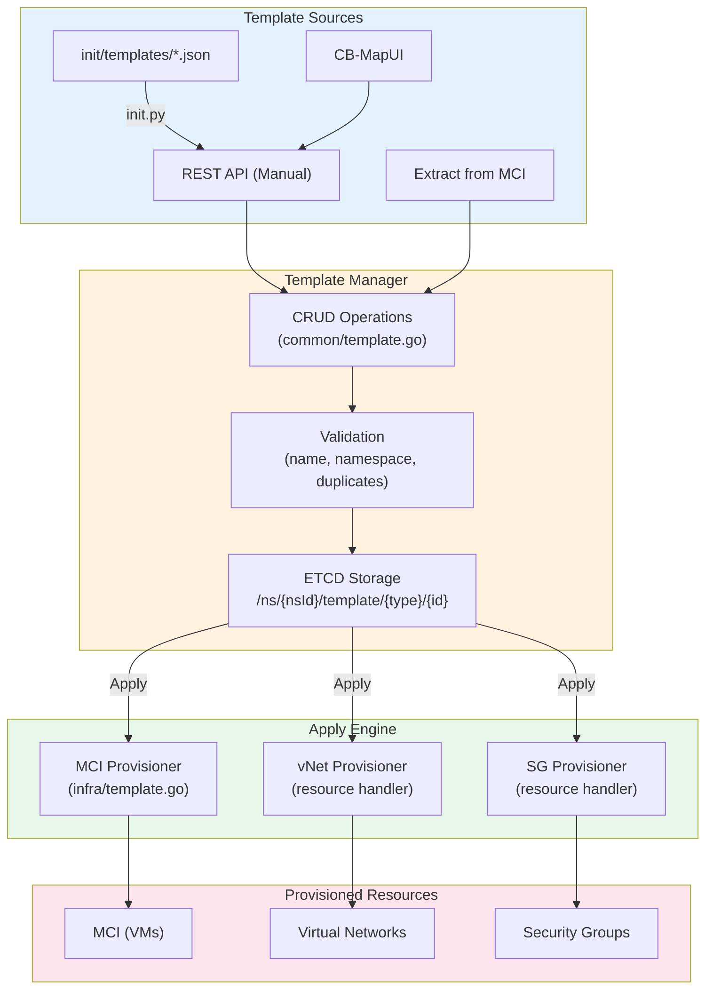
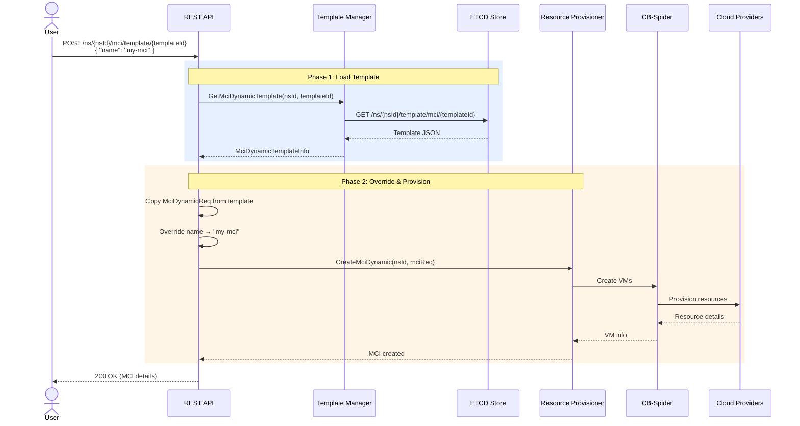
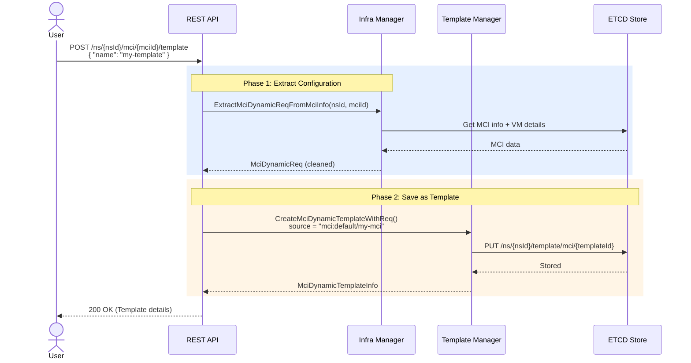
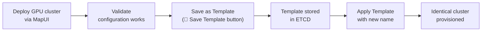
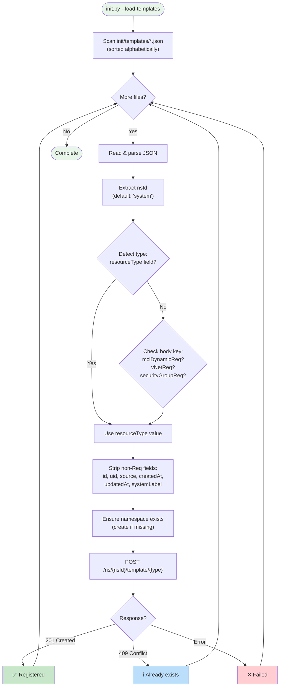

# Resource Template Management

Comprehensive guide for managing reusable resource templates and template-based provisioning in CB-Tumblebug

## 📑 Table of Contents

1. [Overview](#overview)
2. [Key Features](#key-features)
3. [Architecture](#architecture)
4. [Template Types](#template-types)
5. [API Reference](#api-reference)
6. [Usage Scenarios](#usage-scenarios)
7. [Template File Format](#template-file-format)
8. [Template Loading (init.py)](#template-loading-initpy)
9. [Best Practices](#best-practices)

---

## Overview

### What is Resource Template Management?

Resource Template Management is a system in CB-Tumblebug that enables users to **define, store, share, and reuse** infrastructure configurations as templates. Templates capture the full specification of cloud resources — MCI (Multi-Cloud Infrastructure), vNet (Virtual Network), and SecurityGroup — so that identical or similar environments can be reproduced with a single API call.

### Why Use Templates?

**Problem:**
- Provisioning multi-cloud infrastructure requires specifying many parameters (specs, images, regions, firewall rules, CIDR blocks, etc.)
- Recreating a previously deployed environment manually is tedious and error-prone
- Sharing proven configurations across teams or namespaces has no standard mechanism
- GPU-intensive or specialized workloads need carefully validated configurations that should be saved

**Solution:**
- **Define Once, Deploy Many**: Save a working configuration as a template and reuse it across namespaces
- **Extract from Running Infrastructure**: Capture the exact configuration of a live MCI into a template
- **Pre-built Templates**: Ship common configurations (web servers, GPU clusters, VPC layouts) as JSON files
- **One-Click Provisioning**: Apply a template with just a name to create real resources

### Key Highlights

✅ **Three Resource Types**: Templates for MCI, vNet, and SecurityGroup  
✅ **Full CRUD**: Create, Read, Update, Delete operations for all template types  
✅ **Apply Workflow**: Provision real resources directly from a template  
✅ **Extract from MCI**: Capture a running MCI's configuration as a reusable template  
✅ **File-based Loading**: Pre-built templates loaded from `init/templates/*.json` during initialization  
✅ **Namespace Scoped**: Templates are organized within namespaces for logical isolation  
✅ **Label Preservation**: User-defined labels (e.g., `accelerator: gpu`) are preserved in templates  
✅ **Name Override on Apply**: Template body stays intact; only the resource name and description are customized at apply time  

---

## Key Features

### 1. Template Lifecycle

```
Define → Store → Share → Apply → Provision
```

Templates follow a simple lifecycle:

1. **Define**: Specify resource configuration (manually, from JSON files, or extracted from a running MCI)
2. **Store**: Save to ETCD within a namespace scope
3. **Share**: Templates in the `system` namespace serve as globally available blueprints
4. **Apply**: Create real cloud resources from a template with a single API call
5. **Iterate**: Update template descriptions or configurations as requirements evolve

### 2. Extract from Running Infrastructure

A unique capability that bridges the gap between ad-hoc provisioning and repeatable deployments:

```
Running MCI → Extract Configuration → Save as Template → Redeploy Anywhere
```

- Captures spec IDs, image IDs, disk configurations, connection names, and user labels
- Strips runtime-specific data (UIDs, IPs, CSP resource IDs, system labels)
- Records the source as `"mci:{nsId}/{mciId}"` for traceability

### 3. Apply with Override

When applying a template, only the **name** and optionally the **description** are overridden. All other configuration comes from the template unchanged:

```json
// Apply request — minimal input
{
  "name": "my-new-mci",
  "description": "Production deployment from template"
}
```

This ensures consistency: the same template always produces the same infrastructure topology.

### 4. Pre-built Template Files

CB-Tumblebug ships with ready-to-use template files in `init/templates/`:

| File | Type | Description |
|------|------|-------------|
| `aws-small-web.json` | MCI | Single t3.small web server in AWS Seoul |
| `llm-bench-gpu.json` | MCI | Multi-cloud GPU cluster (NVIDIA L4, L40S, AMD V710) |
| `aws-standard-vpc.json` | vNet | Standard 3-subnet VPC layout |
| `aws-web-sg.json` | SecurityGroup | Web server firewall rules (SSH, HTTP, HTTPS) |

These are automatically loaded during `make init` or `./init/init.sh --load-templates-only`.

---

## Architecture

### System Components



### ETCD Key Pattern

Templates are stored in ETCD with the following key structure:

```
/ns/{nsId}/template/{templateType}/{templateId}
```

**Examples:**
```
/ns/system/template/mci/aws-small-web
/ns/default/template/vNet/aws-standard-vpc
/ns/default/template/securityGroup/aws-web-sg
```

When `templateId` is omitted, the prefix is used for listing all templates of a given type.

### Apply Workflow



### Extract Workflow



---

## Template Types

### 1. MCI Template (Multi-Cloud Infrastructure)

Captures a complete multi-cloud VM deployment specification:

```json
{
  "resourceType": "mci",
  "id": "llm-bench-gpu",
  "name": "llm-bench-gpu",
  "description": "LLM benchmarking MCI with GPU VMs",
  "source": "user",
  "createdAt": "2026-03-10T09:00:00Z",
  "updatedAt": "2026-03-10T09:00:00Z",
  "mciDynamicReq": {
    "installMonAgent": "no",
    "subGroups": [
      {
        "name": "nvidial4",
        "subGroupSize": 1,
        "label": { "accelerator": "gpu" },
        "description": "NVIDIA L4 GPU node",
        "specId": "aws+us-east-2+g6.2xlarge",
        "imageId": "ami-0503ed50b531cc445",
        "rootDiskType": "gp2",
        "rootDiskSize": 200,
        "connectionName": "aws-us-east-2"
      }
    ]
  }
}
```

**Key fields in `mciDynamicReq.subGroups[]`:**

| Field | Required | Description |
|-------|----------|-------------|
| `name` | Yes | SubGroup name (VM name prefix) |
| `subGroupSize` | No | Number of VMs in this group (default: 1) |
| `specId` | Yes | VM spec ID (e.g., `aws+us-east-2+g6.2xlarge`) |
| `imageId` | Yes | OS image ID (e.g., AMI for AWS) |
| `label` | No | User-defined labels (e.g., `{"accelerator": "gpu"}`) |
| `rootDiskType` | No | Disk type (e.g., `gp2`, `gp3`, `PremiumSSD`) |
| `rootDiskSize` | No | Disk size in GB |
| `connectionName` | No | CSP connection to use |
| `zone` | No | Availability zone for placement |

### 2. vNet Template (Virtual Network)

Captures a VPC/VNet configuration with subnets:

```json
{
  "resourceType": "vNet",
  "id": "aws-standard-vpc",
  "name": "aws-standard-vpc",
  "description": "Standard AWS VPC with 3 subnets",
  "source": "user",
  "vNetReq": {
    "connectionName": "aws-ap-northeast-2",
    "cidrBlock": "10.0.0.0/16",
    "subnetInfoList": [
      { "name": "public-subnet", "ipv4_CIDR": "10.0.1.0/24" },
      { "name": "private-subnet", "ipv4_CIDR": "10.0.2.0/24" },
      { "name": "database-subnet", "ipv4_CIDR": "10.0.3.0/24" }
    ]
  }
}
```

### 3. SecurityGroup Template

Captures firewall rules:

```json
{
  "resourceType": "securityGroup",
  "id": "aws-web-sg",
  "name": "aws-web-sg",
  "description": "Web server security group (SSH, HTTP, HTTPS)",
  "source": "user",
  "securityGroupReq": {
    "connectionName": "aws-ap-northeast-2",
    "vNetId": "default-shared-aws-ap-northeast-2",
    "firewallRules": [
      { "ports": "22", "protocol": "TCP", "direction": "inbound", "cidr": "0.0.0.0/0" },
      { "ports": "80", "protocol": "TCP", "direction": "inbound", "cidr": "0.0.0.0/0" },
      { "ports": "443", "protocol": "TCP", "direction": "inbound", "cidr": "0.0.0.0/0" }
    ]
  }
}
```

---

## API Reference

### MCI Template CRUD

| Method | Endpoint | Description |
|--------|----------|-------------|
| `POST` | `/ns/{nsId}/template/mci` | Create MCI template |
| `GET` | `/ns/{nsId}/template/mci` | List all MCI templates (`?filterKeyword=` optional) |
| `GET` | `/ns/{nsId}/template/mci/{templateId}` | Get MCI template |
| `PUT` | `/ns/{nsId}/template/mci/{templateId}` | Update MCI template |
| `DELETE` | `/ns/{nsId}/template/mci/{templateId}` | Delete MCI template |
| `DELETE` | `/ns/{nsId}/template/mci` | Delete all MCI templates |

### MCI Template Apply & Extract

| Method | Endpoint | Description |
|--------|----------|-------------|
| `POST` | `/ns/{nsId}/mci/template/{templateId}` | Apply template → create MCI (`?option=hold` optional) |
| `POST` | `/ns/{nsId}/mci/{mciId}/template` | Extract MCI config → save as template |

### vNet Template CRUD

| Method | Endpoint | Description |
|--------|----------|-------------|
| `POST` | `/ns/{nsId}/template/vNet` | Create vNet template |
| `GET` | `/ns/{nsId}/template/vNet` | List all vNet templates |
| `GET` | `/ns/{nsId}/template/vNet/{templateId}` | Get vNet template |
| `PUT` | `/ns/{nsId}/template/vNet/{templateId}` | Update vNet template |
| `DELETE` | `/ns/{nsId}/template/vNet/{templateId}` | Delete vNet template |
| `DELETE` | `/ns/{nsId}/template/vNet` | Delete all vNet templates |

### vNet Template Apply

| Method | Endpoint | Description |
|--------|----------|-------------|
| `POST` | `/ns/{nsId}/resources/vNet/template/{templateId}` | Apply template → create vNet |

### SecurityGroup Template CRUD

| Method | Endpoint | Description |
|--------|----------|-------------|
| `POST` | `/ns/{nsId}/template/securityGroup` | Create SecurityGroup template |
| `GET` | `/ns/{nsId}/template/securityGroup` | List all SecurityGroup templates |
| `GET` | `/ns/{nsId}/template/securityGroup/{templateId}` | Get SecurityGroup template |
| `PUT` | `/ns/{nsId}/template/securityGroup/{templateId}` | Update SecurityGroup template |
| `DELETE` | `/ns/{nsId}/template/securityGroup/{templateId}` | Delete SecurityGroup template |
| `DELETE` | `/ns/{nsId}/template/securityGroup` | Delete all SecurityGroup templates |

### SecurityGroup Template Apply

| Method | Endpoint | Description |
|--------|----------|-------------|
| `POST` | `/ns/{nsId}/resources/securityGroup/template/{templateId}` | Apply template → create SecurityGroup |

**Total: 21 template-related REST endpoints**

### Example: Create and Apply an MCI Template

**Step 1: Create Template**
```bash
curl -X POST "http://localhost:1323/tumblebug/ns/default/template/mci" \
  -u default:default \
  -H "Content-Type: application/json" \
  -d '{
    "name": "my-web-server",
    "description": "Simple web server template",
    "mciDynamicReq": {
      "installMonAgent": "no",
      "subGroups": [{
        "name": "web",
        "subGroupSize": 1,
        "specId": "aws+ap-northeast-2+t3.small",
        "imageId": "ami-01f71f215b23ba262",
        "rootDiskType": "gp3",
        "rootDiskSize": 30
      }]
    }
  }'
```

**Step 2: Apply Template (Provision MCI)**
```bash
curl -X POST "http://localhost:1323/tumblebug/ns/default/mci/template/my-web-server" \
  -u default:default \
  -H "Content-Type: application/json" \
  -d '{
    "name": "production-web",
    "description": "Production web server deployed from template"
  }'
```

### Example: Extract Template from Running MCI

```bash
curl -X POST "http://localhost:1323/tumblebug/ns/default/mci/llm-bench/template" \
  -u default:default \
  -H "Content-Type: application/json" \
  -d '{
    "name": "llm-bench-saved",
    "description": "Saved from running LLM benchmark cluster"
  }'
```

The resulting template will have `source: "mci:default/llm-bench"` to trace its origin.

---

## Usage Scenarios

### Scenario 1: Repeatable GPU Cluster Deployment

A researcher validates a GPU cluster configuration for LLM benchmarking and wants to recreate it later.



### Scenario 2: Standardized Network Architecture

An operations team defines a standard VPC layout (public/private/database subnets) and deploys it consistently across regions.

1. Create a vNet template with the standard CIDR layout
2. Apply the template in each region by changing the `connectionName` (future enhancement — currently the connection from the template is used)
3. All regions get identical network topology

### Scenario 3: Pre-built Templates for Quick Start

New users start with pre-built templates shipped in `init/templates/`:

```bash
# Load all pre-built templates
./init/init.sh --load-templates-only

# List available MCI templates
curl -X GET "http://localhost:1323/tumblebug/ns/system/template/mci" -u default:default

# Deploy a web server in one command
curl -X POST "http://localhost:1323/tumblebug/ns/default/mci/template/aws-small-web" \
  -u default:default \
  -d '{"name": "quick-start-web"}'
```

### Scenario 4: CB-MapUI Integration

CB-MapUI provides a visual interface for template management:

- **📄 Save Template**: Extracts the current MCI configuration and saves it as a template
- **Template Management Panel**: Browse, create, apply, and delete templates for MCI, vNet, and SecurityGroup
- **Apply with Preview**: Review the template contents before provisioning

---

## Template File Format

Template JSON files in `init/templates/` follow a simple convention:

```json
{
  "nsId": "system",
  "resourceType": "mci",
  "name": "template-name",
  "description": "Human-readable description",
  "<bodyKey>": { ... }
}
```

| Field | Required | Description |
|-------|----------|-------------|
| `resourceType` | Yes | One of: `"mci"`, `"vNet"`, `"securityGroup"` |
| `name` | Yes | Template identifier (becomes the template ID) |
| `description` | No | Human-readable description |
| `nsId` | No | Target namespace (default: `"system"`) |
| `mciDynamicReq` | * | MCI body (required if `resourceType` is `"mci"`) |
| `vNetReq` | * | vNet body (required if `resourceType` is `"vNet"`) |
| `securityGroupReq` | * | SecurityGroup body (required if `resourceType` is `"securityGroup"`) |

**Type detection fallback**: If `resourceType` is absent, the loader detects the type by the presence of `mciDynamicReq`, `vNetReq`, or `securityGroupReq` keys.

### Adding a New Template File

1. Create a JSON file in `init/templates/` following the format above
2. Run `./init/init.sh --load-templates-only` to register it
3. The template will be available via API and CB-MapUI

---

## Template Loading (init.py)

### Command Line Options

```bash
# Load templates only
./init/init.sh --load-templates-only

# Load templates as part of full initialization
./init/init.sh

# Direct Python invocation
python3 init/init.py --load-templates
```

### Loading Process



---

## Best Practices

### 1. Use the `system` Namespace for Shared Templates

Templates in the `system` namespace serve as organization-wide blueprints:

```json
{
  "nsId": "system",
  "resourceType": "mci",
  "name": "standard-web-server",
  ...
}
```

Teams can then apply these templates within their own namespaces.

### 2. Include Descriptive Labels

Labels survive the template extraction process and provide valuable metadata:

```json
{
  "name": "gpu-worker",
  "label": {
    "accelerator": "gpu",
    "role": "inference",
    "team": "ml-platform"
  },
  "specId": "aws+us-east-2+g6.2xlarge",
  ...
}
```

### 3. Use Meaningful Names and Descriptions

Template names become IDs and cannot be changed after creation:

- ✅ `llm-bench-gpu`, `aws-standard-vpc`, `web-server-3tier`
- ❌ `test1`, `temp`, `my-template`

### 4. Extract Before Deleting

Before deleting a complex MCI that was carefully configured:

1. Click **📄 Save Template** in CB-MapUI (or call the extract API)
2. Verify the template was saved
3. Then safely delete the MCI — the configuration is preserved

### 5. Version Through Naming

Since templates are immutable in name, use naming conventions for versioning:

```
gpu-cluster-v1
gpu-cluster-v2-a100
gpu-cluster-v3-h100
```

### 6. Validate Spec/Image Availability

Template specs and images are point-in-time references. Before applying an older template:

- Verify that the spec IDs are still available in the target region
- Verify that the image IDs haven't been deprecated by the CSP
- Consider using the MCI review API (`?option=hold`) to validate before full provisioning

---

## Key Files Reference

| File | Purpose |
|------|---------|
| `src/core/model/template.go` | Template data structures (Info, Req, ApplyReq, ListResponse) |
| `src/core/common/template.go` | CRUD business logic (18 functions for 3 types) |
| `src/core/infra/template.go` | MCI Apply and Extract logic |
| `src/interface/rest/server/infra/template.go` | MCI template REST handlers |
| `src/interface/rest/server/resource/template.go` | vNet and SecurityGroup template REST handlers |
| `src/interface/rest/server/server.go` | Route registration |
| `init/templates/*.json` | Pre-built template files |
| `init/init.py` | Template file loading logic |
