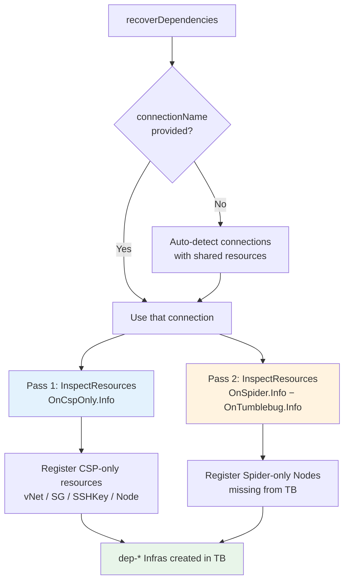
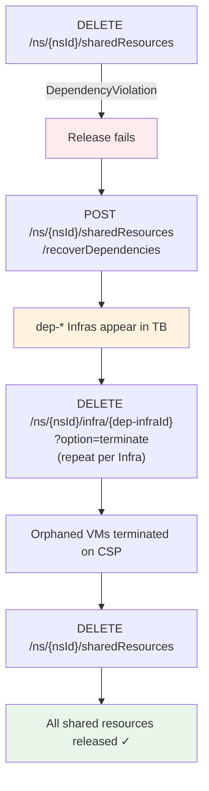

# Shared Resource Management

This document covers the concept of **Shared Resources** in CB-Tumblebug — what they are, how they are released, and how to recover from dependency violations caused by orphaned CSP resources.

## 🔑 What Are Shared Resources?

When an Infra is provisioned, CB-Tumblebug automatically creates a set of **network prerequisites** per cloud connection. These are called **Shared Resources** because multiple Infras in the same namespace can reuse them without duplication.

The three resource types are:

| Type | Role |
|---|---|
| **VNet** (+ Subnet) | Network boundary for all Nodes in the connection |
| **SecurityGroup** | Default inbound/outbound rules applied to each Node |
| **SSHKey** | Key pair used for Node access |

**Naming convention:** `{nsId}-shared-{connectionName}[-{zone}]`

Example: `default-shared-aws-ap-northeast-2`

Shared Resources are created lazily — on first Infra creation for a given connection — and persist until explicitly released.

## 🔄 Lifecycle


Shared Resources are **not** deleted when an Infra is terminated. They remain available for the next Infra on the same connection, which avoids repeated provisioning overhead.

## 🗑️ Releasing Shared Resources

When a namespace is no longer needed, or a connection's shared resources need to be cleaned up:

```
DELETE /tumblebug/ns/{nsId}/sharedResources
```

CB-Tumblebug deletes the resources in dependency order:

```
SecurityGroup  →  SSHKey  →  VNet
```

The response reports per-resource results:

```json
{
  "total": 6,
  "successCount": 6,
  "failedCount": 0,
  "results": [
    { "resourceType": "securityGroup", "resourceId": "default-shared-aws-ap-south-1", "success": true },
    ...
  ]
}
```

## ⚠️ DependencyViolation: When Release Fails

The deletion can fail with a `DependencyViolation` error if the CSP still has resources attached to the shared VNet, SG, or SSHKey:

```json
{
  "resourceType": "securityGroup",
  "resourceId": "default-shared-aws-ap-south-1",
  "success": false,
  "message": "DependencyViolation: resource sg-07507b9b17864d82d has a dependent object"
}
```

### Root Cause

This happens when a Node (VM) was removed from CB-TB's registry — for example, due to a partial failure or forced cleanup — **without being actually terminated on the CSP**. The VM continues to hold references to the shared SG, SSHKey, and VNet, blocking their deletion.

These VMs are called **orphaned resources**. They exist in one of two states invisible to CB-TB:

| State | Description |
|---|---|
| **CSP-only** | Present on the CSP but never registered in CB-Spider |
| **Spider-only** | Registered in CB-Spider but removed from CB-TB's registry |

Neither type is detected by the normal `GET /infra` listing, and neither can be cleaned up through the standard delete flow — because CB-TB has no record of them.

## 🔧 Dependency Recovery

The `recoverDependencies` API finds both orphan types and registers them into CB-TB under a `dep-` prefixed Infra, making them visible and deletable through the normal lifecycle.

```
POST /tumblebug/ns/{nsId}/sharedResources/recoverDependencies
```

### How It Works



**Pass 1** handles resources that exist on the CSP but are unknown to CB-Spider.  
**Pass 2** handles VMs that CB-Spider already knows about but CB-TB has lost track of — this is the most common source of `DependencyViolation` errors in practice.

### Request

**Path parameter:** `nsId` — namespace to scan

**Body (all fields optional):**

| Field | Default | Description |
|---|---|---|
| `connectionName` | _(empty)_ | Limit scan to one connection. If empty, all connections that have shared resources in the namespace are scanned automatically. |
| `infraNamePrefix` | `dep` | Prefix applied to registered Infra names to indicate dependency-recovery purpose. |

**Query parameter:**

| Parameter | Default | Description |
|---|---|---|
| `option` | `vNet,securityGroup,sshKey,node` | CSP resource types to scan (CSV). |

**Example — scan all connections automatically:**
```bash
curl -X POST "http://localhost:1323/tumblebug/ns/default/sharedResources/recoverDependencies" \
  -H "Content-Type: application/json" \
  -d '{}'
```

**Example — scan one specific connection:**
```bash
curl -X POST "http://localhost:1323/tumblebug/ns/default/sharedResources/recoverDependencies" \
  -H "Content-Type: application/json" \
  -d '{"connectionName": "aws-ap-south-1"}'
```

### Response

```json
{
  "elapsedTime": 9,
  "registeredConnection": 3,
  "availableConnection": 3,
  "registerationOverview": {
    "vNet": 0, "securityGroup": 0, "sshKey": 1, "node": 3, "failed": 0
  },
  "registerationResult": [
    {
      "connectionName": "aws-ap-south-1",
      "elapsedTime": 4,
      "registerationOverview": { "node": 1 },
      "registerationOutputs": {
        "output": ["node: aws-ap-south-1-i-0a844072b4f88d073"]
      }
    }
  ]
}
```

A `registerationOverview.node` count greater than 0 confirms that orphaned VMs were found and registered.

## 🚀 Full Recovery Flow



### Step-by-step

**1. Attempt release (observe which connections fail)**
```bash
curl -X DELETE "http://localhost:1323/tumblebug/ns/default/sharedResources"
```

**2. Register orphaned dependencies**
```bash
curl -X POST "http://localhost:1323/tumblebug/ns/default/sharedResources/recoverDependencies" \
  -H "Content-Type: application/json" -d '{}'
```

**3. List the registered dep-* Infras**
```bash
curl "http://localhost:1323/tumblebug/ns/default/infra"
```

**4. Terminate each orphaned VM through CB-TB**
```bash
curl -X DELETE \
  "http://localhost:1323/tumblebug/ns/default/infra/dep-i-0a844072b4f88d073?option=terminate"
```

**5. Retry the shared resource release**
```bash
curl -X DELETE "http://localhost:1323/tumblebug/ns/default/sharedResources"
```

## 📋 API Summary

| Method | Path | Description |
|---|---|---|
| `POST` | `/ns/{nsId}/sharedResource` | Create shared resources for a connection |
| `DELETE` | `/ns/{nsId}/sharedResources` | Release all shared resources in a namespace |
| `POST` | `/ns/{nsId}/sharedResources/recoverDependencies` | Register orphaned CSP resources blocking deletion |
