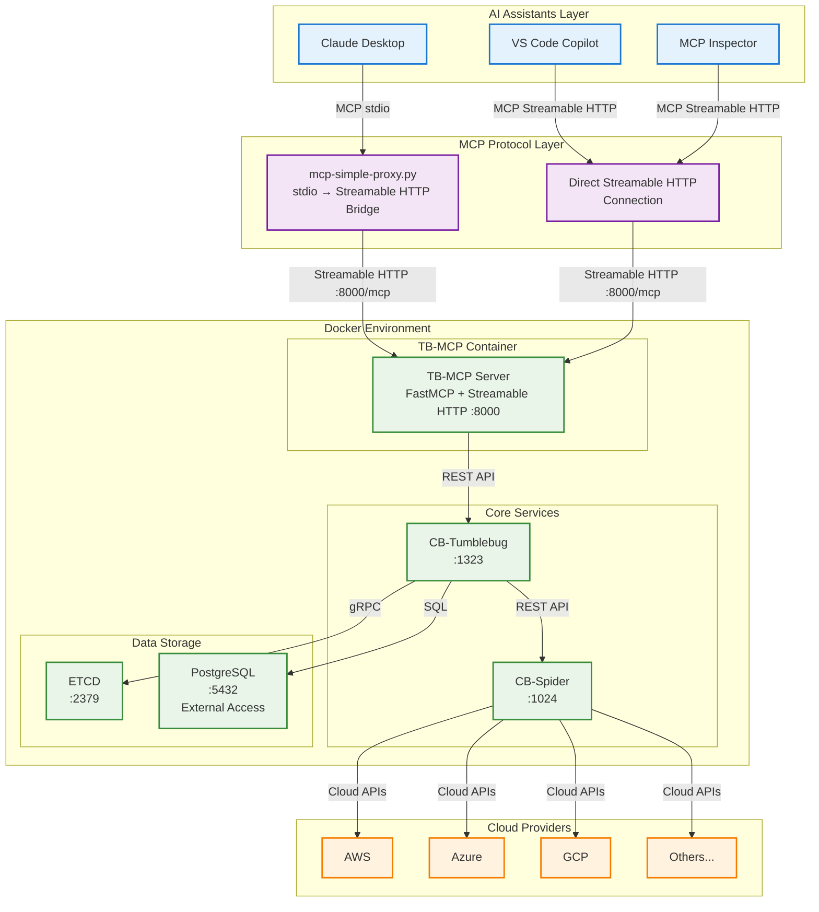
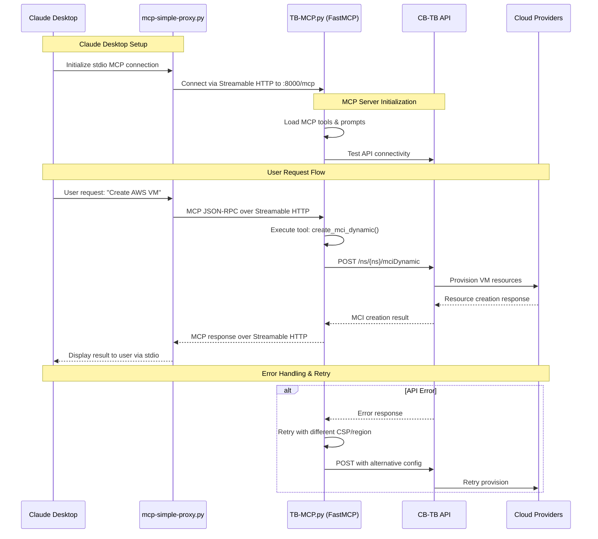
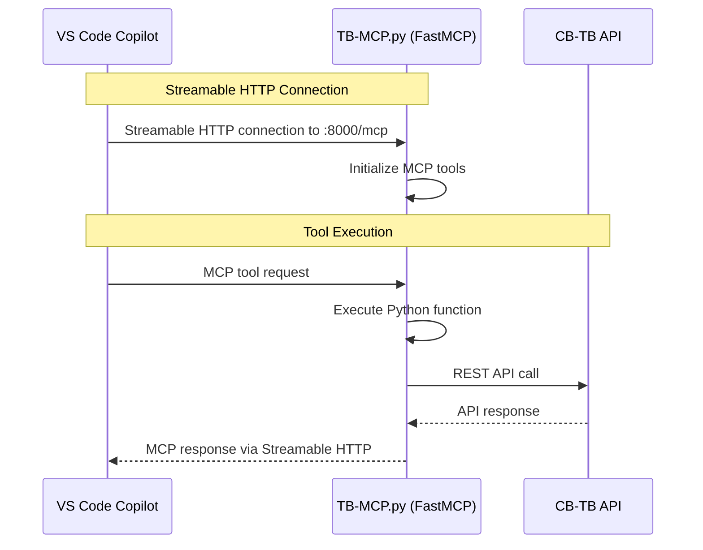
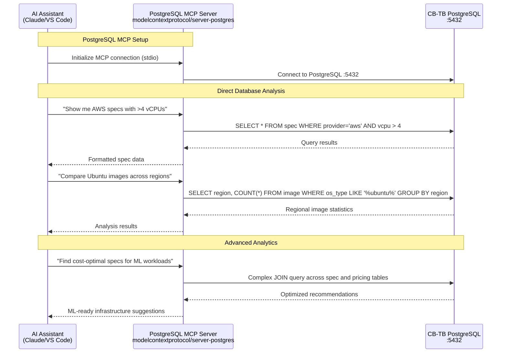
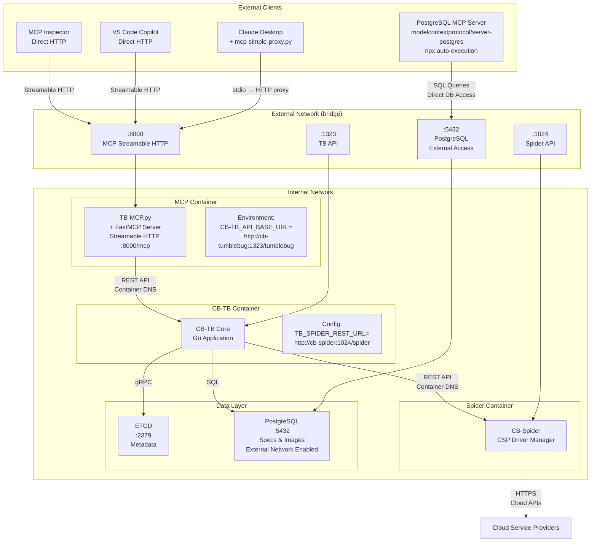
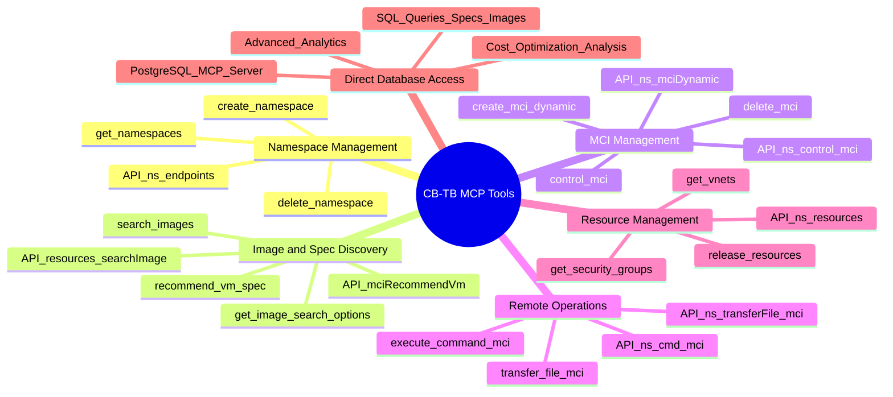
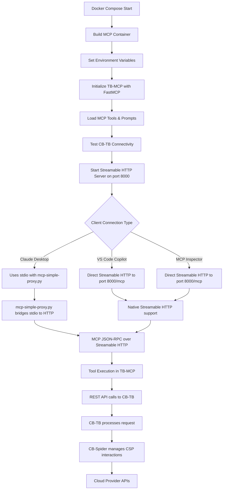

# CB-TB MCP Server Architecture Diagram

## Overall System Architecture

## MCP Protocol Flow (Streamable HTTP Transport)

## VS Code Copilot Direct Integration

## PostgreSQL MCP Server Direct Database Access

## Docker Compose Network Architecture

## MCP Tool Categories and API Mapping

## Configuration Flow

